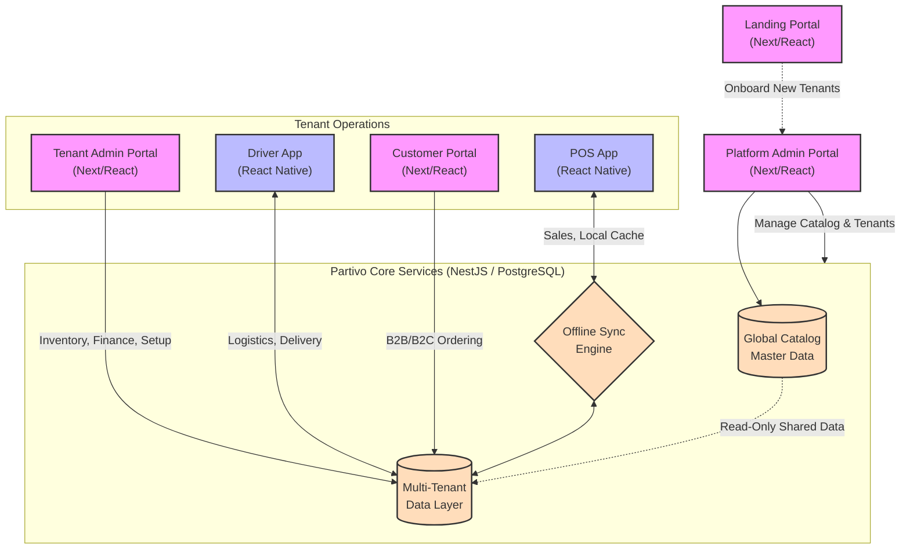

# Partivo Platform System Overview

## Overview
The Partivo platform is a multi-tenant cloud SaaS ecosystem designed specifically for the car spare parts retail industry. It integrates a central global catalog with tenant-specific operations spanning point-of-sale, inventory, and B2B/B2C online commerce.

## Portals & Apps Ecosystem

### 1. Platform Admin Portal
- **Users**: Internal Partivo Operations, Support, and Super Admins.
- **Function**: Manages the global parts catalog (the core data asset), oversees tenant subscriptions, handles billing for the SaaS product, and monitors overall system health.

### 2. Tenant Admin Portal
- **Users**: Spare Parts Retail Owners, Branch Managers, Back-Office Staff.
- **Function**: The operating system for a specific retailer. Manages tenant-specific inventory, branch setups, pricing strategies, user roles, B2B customer accounts (CRM), and financial reporting.

### 3. POS App (Point of Sale)
- **Users**: Branch Counter Staff, Cashiers.
- **Function**: A high-speed, offline-capable mobile/tablet application for processing over-the-counter sales, searching vehicle fitment, and conducting rapid checkout. Built to sustain branch operations even during internet outages.

### 4. Driver App
- **Users**: Tenant Fleet Drivers, Delivery Personnel.
- **Function**: A mobile application for managing the logistics of delivering parts to business clients (workshops) or end-consumers. Features route tracking, proof of delivery, and cash collection.

### 5. Customer Portal
- **Users**: B2B Workshops, B2C End Customers.
- **Function**: A tenant-branded commerce portal allowing a retailer's customers to search the catalog, verify stock, view their specific pricing tiers, and place orders directly to the branch.

### 6. Landing Portal
- **Users**: Prospective Retailers.
- **Function**: The public-facing marketing and onboarding website for Partivo itself. Handles lead generation, feature showcases, pricing plans, and self-serve onboarding.

## High-Level Interaction Architecture

## How They Interact
1. **Data Provisioning**: The `Platform Admin` seeds the `Global Catalog`.
2. **Tenant Configuration**: Retailers log into the `Tenant Admin` to pull items from the `Global Catalog` into their local `TenantIsolation` boundary, setting their own prices and stock levels.
3. **Execution**: The `POS App` interacts with the `Sync Engine` to execute sales against this localized data, updating `TenantIsolation` asynchronously.
4. **Logistics**: Orders from the `POS App` or `Customer Portal` are dispatched to the `Driver App` for fulfillment.
5. **Consumption**: External users access the tenant's localized catalog via the `Customer Portal` to place orders directly into the unified backend.
