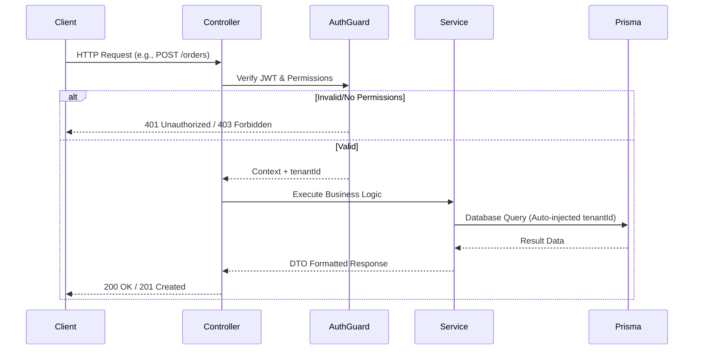

# Backend Architecture

## Overview
The Partivo backend is built using **NestJS** and operates as a unified modular monolith. It exposes a comprehensive RESTful API consumed by all frontend portals and mobile applications.

## Structural Design
The `/src` repository is strictly divided into domain-driven modules.

### Core Modules
- **`auth/`**: Manages JWT generation, session state, and password hashing.
- **`tenants/`**: Central lifecycle management for subscribing retailers.
- **`roles/`**: RBAC (Role-Based Access Control) definition engine.
- **`catalog/`**: Global parts master data management.

### Operational Modules
- **`inventory/` & `warehouse/`**: Stock tracking, adjustments, and branch transfers.
- **`orders/` & `sales/`**: Multi-channel checkout handling (Web orders vs. POS counter sales).
- **`billing/` & `finance/`**: Tenant SaaS subscription billing and internal customer credit ledgers.
- **`crm/`**: B2B customer relationship management and lead tracking.
- **`logistics/`**: Driver dispatching and route tracking.

## Request Flow

## Background Processing
Heavy operations (like massive catalog imports or batch synchronization from the offline POS) are offloaded to background queues using NestJS queue integrations to keep the API layer responsive.
