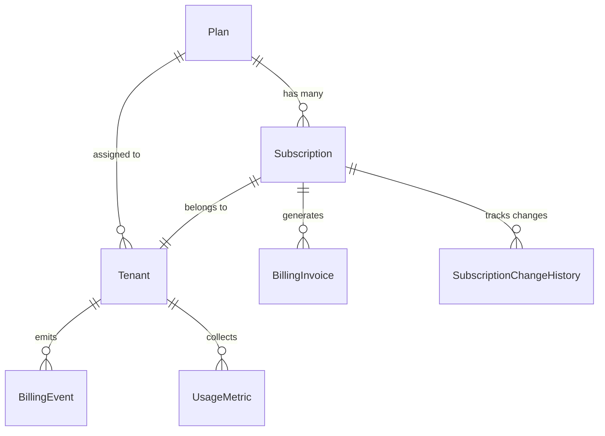
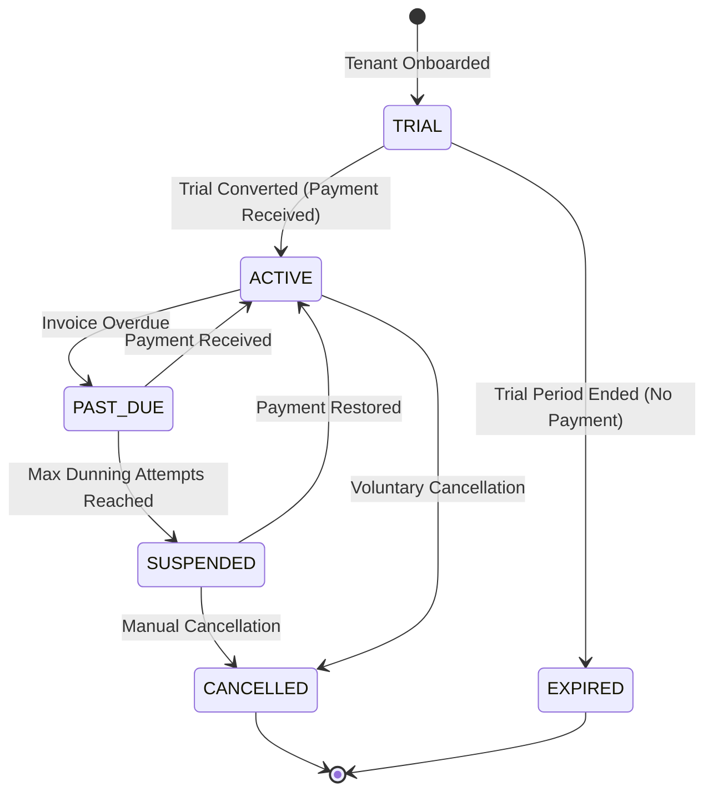

# Billing Architecture

## Overview
Partivo's billing system manages the SaaS subscription lifecycle for tenant retailers. It supports multiple payment providers, automated dunning, and invoice generation.

## Payment Providers
- **Stripe**: Primary payment processor for card-based subscriptions.
- **Paymob**: Regional payment processor for Egypt/GCC markets.
- Provider selection is stored per `Subscription.provider`.

## Core Models

### Plan
- Defines pricing (`price`, `currency`, `billingCycle`).
- Feature limits stored as JSON (`features`, `limits`).
- Supports i18n (`nameAr`).

### Subscription
- One-to-one with Tenant.
- Tracks status: `TRIAL`, `ACTIVE`, `PAST_DUE`, `CANCELLED`, `SUSPENDED`, `EXPIRED`.
- Grace period logic: `gracePeriodDays`, `isGracePeriodActive`.
- Links to external provider IDs: `stripeSubscriptionId`, `paymobSubscriptionId`.

### BillingInvoice
- Auto-generated per billing period.
- Contains `subtotal`, `taxAmount`, `amount`.
- Statuses: `DRAFT`, `SENT`, `PAID`, `OVERDUE`, `CANCELLED`, `VOID`.
- Dunning support: `dunningCount`, `lastDunningAt`, `nextRetryAt`.

## Billing Lifecycle

## Backend Services
- **`billing.service.ts`**: Core subscription lifecycle (create, upgrade, downgrade, cancel, renew).
- **`dunning.service.ts`**: Automated retry logic for failed payments with exponential backoff.
- **`invoice-generator.service.ts`**: Creates billing invoices at period boundaries.
- **`billing-email.service.ts`** + **`billing-email.processor.ts`**: Email notifications for invoices and payment failures.
- **`webhook-retry.service.ts`**: Handles failed webhook deliveries from Stripe/Paymob.
- **`providers/`**: Abstracted payment provider adapters (Stripe adapter, Paymob adapter).

## Webhook Processing
External payment events are received through webhook endpoints:
1. Webhook arrives → stored in `WebhookEvent` table with status `PENDING`.
2. Idempotency check via `eventId` uniqueness.
3. Process payload → update `Subscription`, generate `BillingEvent`.
4. Mark webhook as `PROCESSED` or `FAILED`.
