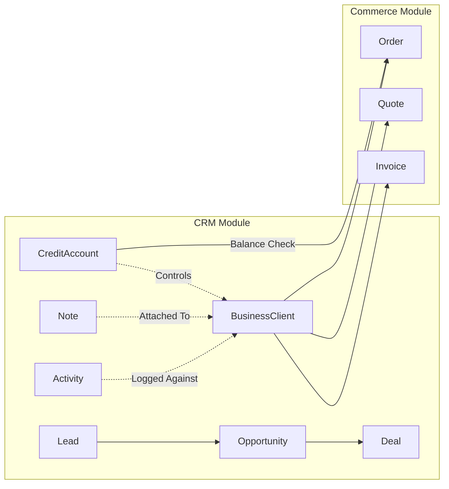

# CRM Architecture

## Overview
Partivo includes a B2B Customer Relationship Management (CRM) module integrated with the commerce and finance systems. It enables tenant retailers to manage sales pipelines, track customer interactions, and control credit limits.

## Core Models

### Lead
- Represents a potential business client.
- Tracks source, status, and conversion to Opportunity.

### Opportunity
- Sales pipeline stage tracking.
- Links to a `BusinessClient`.
- Fields: expected revenue, probability, stage, close date.

### Deal
- Finalized business agreements.
- Links Opportunities to concrete financial outcomes.

### Activity
- Timeline of interactions with business clients.
- Types: Call, Meeting, Email, Note, Task.
- Tracks due dates and completion status.

### Note
- Free-form text notes attached to business clients.
- Supports internal documentation and context sharing.

### CreditAccount
- Manages B2B credit lines for business clients.
- Fields: `creditLimit`, `currentBalance`, `paymentTermsDays`.
- **Automatic Order Blocking**: When `currentBalance` exceeds `creditLimit`, the system blocks new orders for that client.

## Integration Points

## Backend Service
- **`crm.service.ts`**: CRUD operations for leads, opportunities, activities, and notes. Handles pipeline stage transitions and credit account management.
- **`crm.controller.ts`**: REST endpoints under `/crm/*` routes.
- All CRM data is tenant-scoped via `tenantId`.

## Frontend Integration
The CRM module surfaces in the **Tenant Admin Portal** under `/crm/`:
- Lead management views.
- Opportunity pipeline (kanban or list).
- Activity timeline on client detail pages.
- Credit account visualization with balance indicators.
