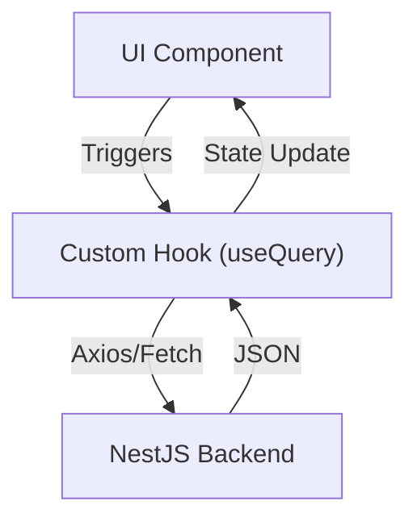

# Frontend Architecture

## Overview
Partivo utilizes a robust **React + Next.js** stack for all web-based interfaces. The ecosystem comprises four distinct web portals, allowing for optimal bundle sizes and targeted user experiences.

## Portals
1. **Platform Admin Portal**: Standalone Next.js app for system administration.
2. **Tenant Admin Portal**: The massive back-office ERP system for retailers.
3. **Customer Portal**: The B2B/B2C storefront for placing orders.
4. **Landing Portal**: The marketing and SaaS onboarding gateway.

## Technology Stack
- **Framework**: Next.js (App Directory / React Server Components where applicable).
- **Styling**: Tailwind CSS for rapid UI development and consistent design tokens.
- **State Management**: React Hooks (useState/useReducer) and context providers for local state; standard fetch/axios bindings for server state.
- **Routing**: Next.js file-system based routing.

## Global Design Pattern
All portals adhere to a unified UI/UX library.
- **Layout Shells**: High-level layout components (Sidebars, Topbars) wrap internal page content.
- **Component Anatomy**: Reusable atomic UI components (Buttons, Modals, Data Tables) are heavily standardized to maintain a premium enterprise feel across all screens.
- **Localization**: An integrated i18n layer exists to seamlessly swap between Arabic (RTL) and English (LTR) layouts globally.

## Data Fetching

Client-side fetching is heavily utilized for highly interactive ERP panels (Tenant Admin), while Server-Side Rendering (SSR) is utilized on the Landing Portal and Customer Portal for SEO and initial load speed.
