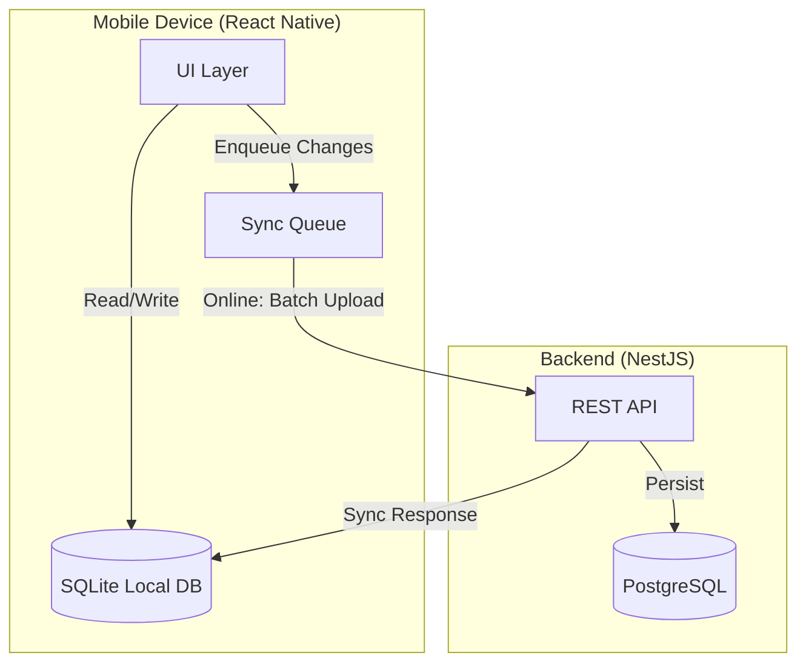

# Mobile Architecture

## Overview
Partivo's mobile layer is built with **React Native** (Expo managed workflow) and serves three distinct user personas through separate screen flows within a single application bundle.

## App Modules

### 1. POS Module (Counter Sales)
Screens: `POSLoginScreen`, `POSHomeScreen`, `ProductSearchScreen`, `CartScreen`, `CheckoutScreen`, `SalesHistoryScreen`.

**Capabilities**:
- Vehicle fitment search to find the correct part.
- Product search with barcode scanning support.
- Cart management with quantity adjustments.
- Multi-payment checkout (Cash, Card, Transfer).
- Cash session management (open/close).
- Sales history review.

### 2. Driver Module (Delivery & Logistics)
Screens: `DriverLoginScreen`, `DriverHomeScreen`, `TripDetailScreen`.

**Capabilities**:
- View assigned delivery trips and stop sequences.
- Navigate through trip stops (Customer, Supplier, Branch).
- Mark stops as Delivered or Failed with reasons.
- Capture Proof of Delivery (signature, photo, GPS coordinates).
- Report delivery exceptions (damaged, refused, customer unavailable).

### 3. Warehouse Module (Pick & Pack)
Screens: `WarehouseLoginScreen`, `WarehouseHomeScreen`, `PickListScreen`, `StockLookupScreen`.

**Capabilities**:
- View and process pick lists for confirmed orders.
- Pick items by bin location.
- Handle shortages and substitution requests.
- Look up real-time stock levels by branch.

## Offline-First Architecture
The POS module is designed for offline-first operation:

### Sync Protocol
- **Local-First Writes**: All POS sales, payments, and inventory changes are written to SQLite first.
- **Batch Synchronization**: When connectivity is restored, the sync engine pushes queued events to the backend in order.
- **Idempotency**: Each synced record carries an `offlineSyncId` (UUID generated on-device) to prevent duplicate processing on the server.
- **Conflict Resolution**: Last-Write-Wins (LWW) with server authority. The server's version is final if conflicts arise.
- **Device Identification**: Each device is tracked to support audit trails during offline operation.
- **Optimistic Concurrency**: Critical models (Sale, Payment, Inventory, CashSession) use a `version` field. The server rejects stale updates.

## Technology Stack
- **Framework**: React Native + Expo.
- **Local Storage**: SQLite (via `expo-sqlite`).
- **Navigation**: React Navigation (Stack + Tab navigators).
- **State Management**: React Context + useReducer for cart/session state.
- **Networking**: Axios with interceptors for JWT refresh and retry logic.
