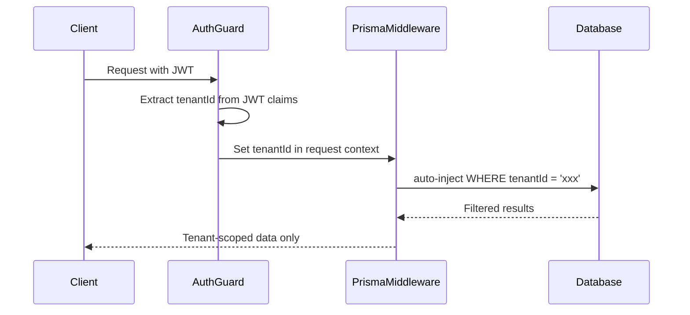
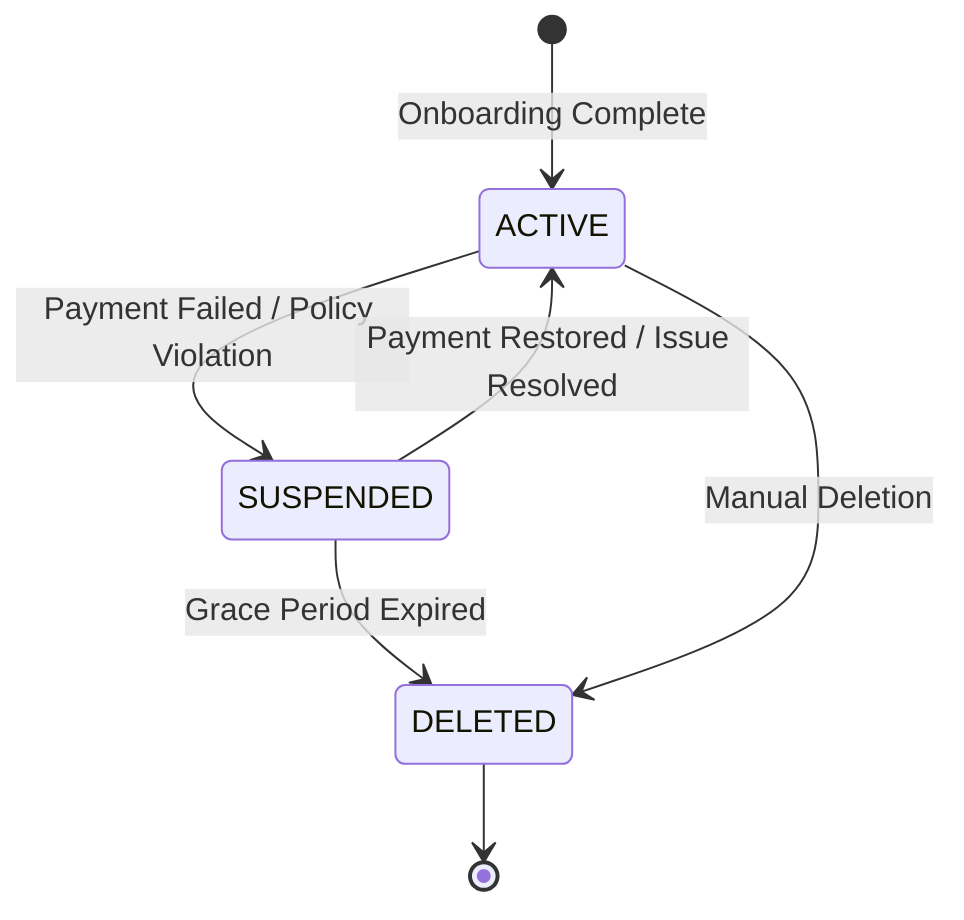

# Multi-Tenancy Architecture

## Isolation Model
Partivo implements **Column-Based Multi-Tenancy** within a single shared PostgreSQL database. Every tenant-scoped table contains a `tenantId` column that acts as the isolation boundary.

## How It Works

### 1. Tenant Entity
The `Tenant` model is the root of isolation:
- `id` (UUID): Primary identifier.
- `subdomain` (String, unique): Each tenant has a unique subdomain.
- `status`: `ACTIVE`, `SUSPENDED`, `DELETED`.
- `planId`: Links to the SaaS subscription plan.
- `baseCurrency`: The tenant's primary currency.
- `supportedLanguages`: Array of language codes (`EN`, `AR`).
- `vatPercentage`: Tax configuration.

### 2. Data Flow Enforcement

### 3. Global vs. Tenant Data
| Scope | Models | Access |
|---|---|---|
| **Global** (Platform-Owned) | `Product`, `Brand`, `ProductCategory`, `VehicleMake`, `VehicleModel`, `ProductFitment`, `Currency` | Read by all tenants; Write by Platform Admins only |
| **Tenant-Scoped** | `Inventory`, `Sale`, `Order`, `Customer`, `BusinessClient`, all financial models | Strictly filtered by `tenantId` |

### 4. User Isolation
- Users with `isPlatformUser = true` can access platform-admin routes. They have no `tenantId`.
- Users with `tenantId` set are scoped to that tenant. Their roles are further scoped by `branchId` when applicable.
- The `UserRole` junction table enforces `(userId, roleId, tenantId, branchId)` uniqueness.

## Tenant Lifecycle

## Branch-Level Scoping
Within a tenant, data is further partitioned by `branchId`:
- `Inventory` is per-branch per-product.
- `CashSession` and `Sale` belong to a specific branch.
- `UserRole` can be scoped to a specific branch, allowing branch-level access control.
