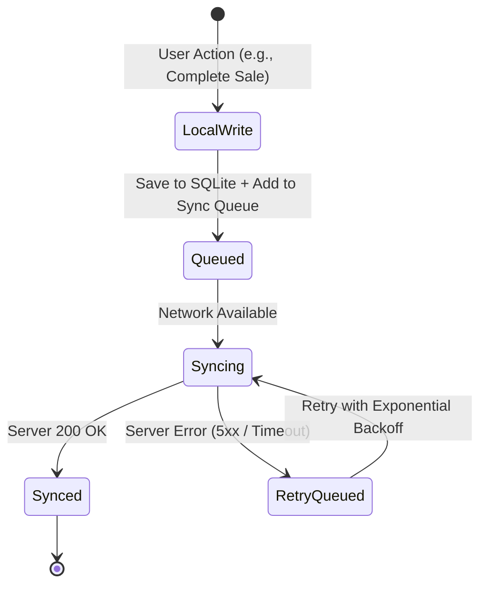
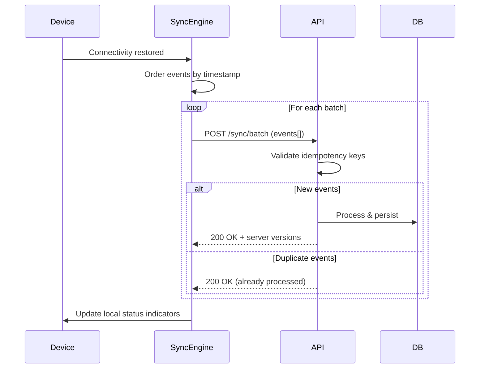

# Offline-First Architecture

## Overview
The Partivo POS and Warehouse mobile apps are designed for **offline-first** operation. Branches in the target markets (Egypt, GCC) frequently experience unstable internet, so the system guarantees zero data loss during outages.

## Core Principles
1. **Local-first writes**: All mutations (sales, payments, inventory changes) write to SQLite before any network request.
2. **Eventual consistency**: Data syncs to the server when connectivity is restored.
3. **Idempotent replay**: Every locally created record carries a unique `offlineSyncId` to prevent duplicate processing.
4. **Server authority**: In case of conflict, the server version wins (Last-Write-Wins policy).

## Sync Lifecycle

## Batch Sync Protocol

## Models Supporting Offline Sync
The following models carry `offlineSyncId` for device-originated creation:
- `Sale`, `Inventory`, `InventoryLedger`, `Order`, `PickList`, `Pack`, `DeliveryTrip`, `TripStop`

## Concurrency Control
- Every mutable model uses optimistic concurrency via a `version` field.
- Updates include the expected version; the server rejects stale versions with a `409 Conflict`.
- The client must re-fetch and re-attempt the operation on conflict.

## Retry & Backoff Strategy
- Failed sync batches are retried with **exponential backoff** (1s, 2s, 4s, 8s... up to 60s max).
- After max retries, the batch is flagged for manual intervention.
- Device identification ensures traceability of all offline-originated data.

## User Experience
- A sync status indicator in the app shows: `✅ Synced`, `🔄 Syncing`, `⚠️ Pending`, `❌ Error`.
- Users can continue operating normally regardless of sync state.
- Cash sessions can be opened and closed entirely offline.
