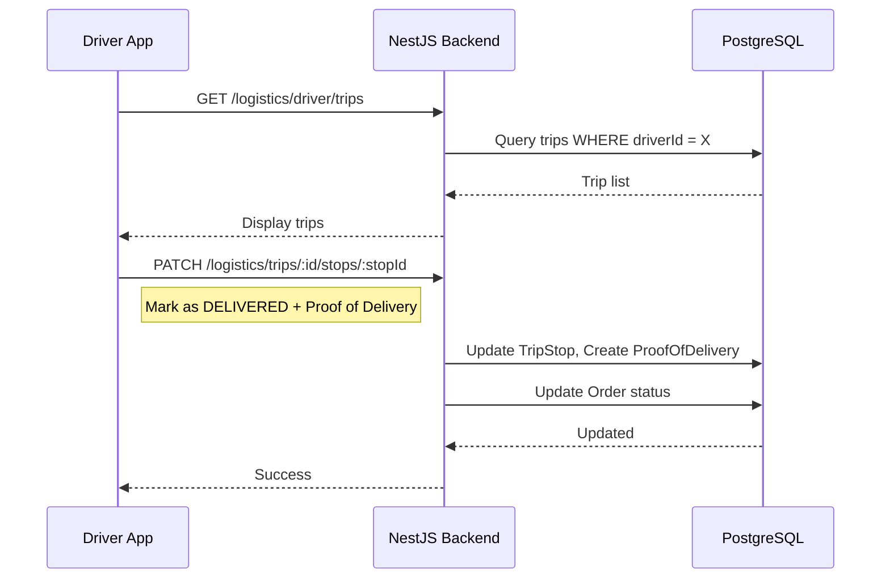

# Driver App — Technical Specification

## Technology Stack
- **Framework**: React Native + Expo.
- **Language**: TypeScript.
- **Navigation**: React Navigation (Stack Navigator).
- **API Communication**: Axios with JWT interceptor.
- **Location Services**: Expo Location for GPS capture.
- **Camera**: Expo Camera / Image Picker for proof of delivery photos.

## Project Structure
```
mobile-app/src/screens/driver/
├── DriverLoginScreen.tsx     # Authentication
├── DriverHomeScreen.tsx      # Trip list
└── TripDetailScreen.tsx      # Trip detail with stop management
```

## Authentication
1. Driver logs in with email/password.
2. Backend validates credentials and returns JWT with `tenantId` and driver context.
3. All subsequent API calls include the JWT in headers.

## Data Flow


## Offline Considerations
- The Driver App supports `offlineSyncId` fields on `DeliveryTrip` and `TripStop` models.
- Basic offline capability: trip data is cached locally for viewing during connectivity loss.
- Stop completions are queued and synced when connectivity returns.

## Key Libraries
- `react-navigation`: Screen routing.
- `expo-location`: GPS coordinates for proof of delivery.
- `expo-image-picker`: Photo capture.
- `axios`: HTTP client.
