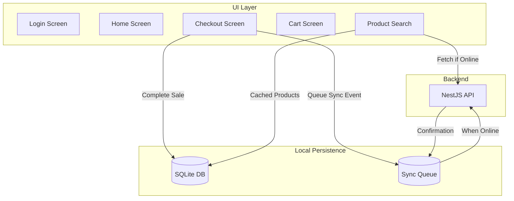

# POS App — Technical Specification

## Technology Stack
- **Framework**: React Native + Expo.
- **Language**: TypeScript.
- **Local Database**: SQLite (via `expo-sqlite`) for offline persistence.
- **Navigation**: React Navigation (Stack + Tab).
- **State Management**: React Context + useReducer for cart and session state.
- **API Communication**: Axios with offline queue interceptor.

## Project Structure
```
mobile-app/src/screens/pos/
├── POSLoginScreen.tsx         # Authentication + branch selection
├── POSHomeScreen.tsx          # Dashboard + cash session mgmt
├── ProductSearchScreen.tsx    # Product/fitment search
├── CartScreen.tsx             # Active sale management
├── CheckoutScreen.tsx         # Payment + sale completion
└── SalesHistoryScreen.tsx     # Transaction history
```

## Supporting Directories
```
mobile-app/src/
├── components/     # Reusable UI components
├── config/         # App configuration
├── i18n/           # Localization
├── locales/        # Translation files (en, ar)
├── navigation/     # Navigation stack definitions
└── services/       # API clients, sync engine, SQLite service
```

## Offline-First Architecture



### SQLite Tables (Local)
- `products_cache`: Cached product catalog for offline search.
- `sales_queue`: Pending sales to sync.
- `payments_queue`: Pending payments.
- `inventory_cache`: Local branch inventory state.
- `sync_events`: Ordered event log for batch upload.

### Sync Engine
1. On sale completion: Write to SQLite → Enqueue sync event.
2. Connectivity monitor checks network status.
3. When online: Push events in chronological order.
4. Server validates `offlineSyncId` for idempotency.
5. On success: Mark event as synced in local DB.
6. On failure: Retry with exponential backoff (1s → 2s → 4s → ... → 60s max).

## Key Design Decisions
- **Cart state** is held in React Context, not SQLite, as it's transient.
- **Cash session** is persisted both locally and remotely.
- **Product catalog** is periodically synced from server and cached locally.
- **Inventory** counts are cached but treated as approximate when offline.
