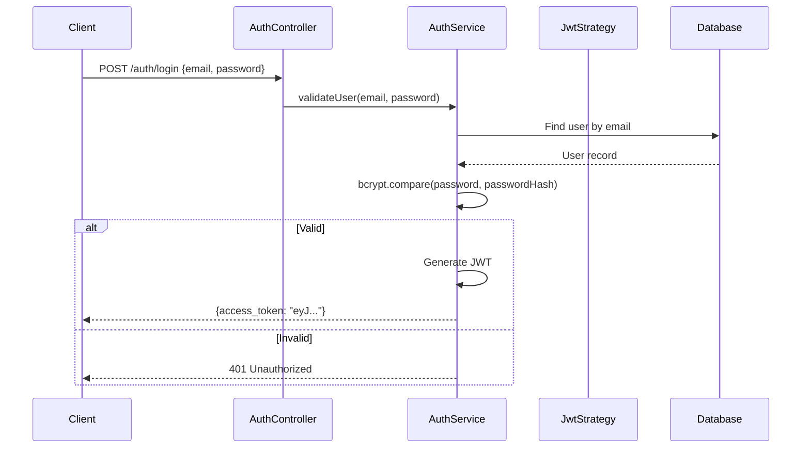

# Authentication

## Overview
Partivo uses **JWT (JSON Web Token)** based authentication across all portals and mobile apps. The authentication layer is implemented in the NestJS backend using Passport.js with a JWT strategy.

## Authentication Flow



## JWT Token Structure
```json
{
  "sub": "user-uuid",
  "email": "user@example.com",
  "tenantId": "tenant-uuid",
  "isPlatformUser": false,
  "roles": ["OWNER", "MANAGER"],
  "iat": 1711000000,
  "exp": 1711086400
}
```

## Token Lifecycle
- **Expiration**: Tokens expire after 24 hours.
- **Refresh**: Frontend must re-authenticate on expiration (login again).
- **Header**: All authenticated requests must include `Authorization: Bearer <token>`.

## Backend Implementation
- **`auth.controller.ts`**: Exposes `POST /auth/login`.
- **`auth.service.ts`**: Validates credentials and issues JWT.
- **`jwt.strategy.ts`**: Passport strategy that validates and decodes JWT from request headers.
- **`jwt-auth.guard.ts`**: NestJS guard applied to protected routes.

## User Types
| Type | `isPlatformUser` | `tenantId` | Access |
|---|---|---|---|
| Platform Admin | `true` | `null` | Platform Admin Portal |
| Tenant User | `false` | Set | Tenant Admin, POS, Driver |
| Business Client Contact | `false` | Set | Customer Portal |
