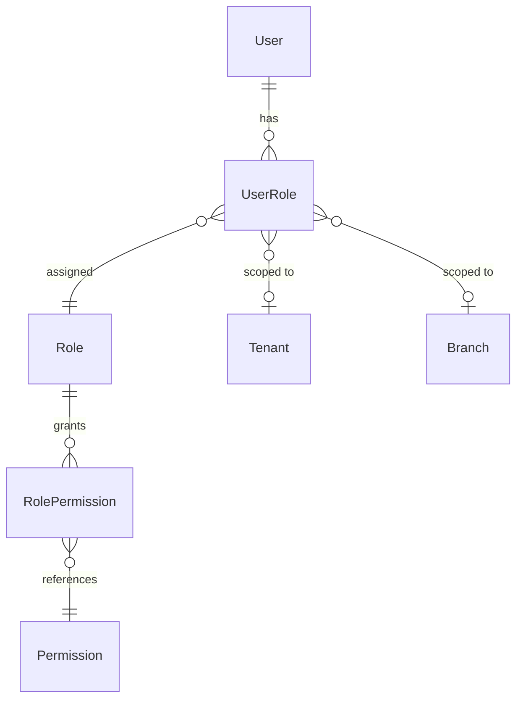

# Role-Based Access Control (RBAC)

## Overview
Partivo implements a granular RBAC system using `Role`, `Permission`, `RolePermission`, and `UserRole` models. Access control is enforced at both the API layer (guards) and the UI layer (conditional rendering).

## Architecture

## Role Scopes
| Scope | Description | Example |
|---|---|---|
| `PLATFORM` | System-wide roles for Partivo internal staff | Super Admin, Support Agent |
| `TENANT` | Tenant-wide roles for retailer staff | Owner, Manager, Clerk |

## Permission Model
Permissions are granular operation codes:
- Example: `inventory.read`, `inventory.write`, `sales.create`, `users.manage`.
- Each permission is a single record in the `permissions` table with a unique `code`.

## Role-Permission Assignment
- Roles are linked to permissions via the `RolePermission` junction table.
- A single role can have many permissions.
- Custom roles can be created by tenant owners.

## User-Role Assignment
- Users are assigned roles via `UserRole`.
- Assignments can be:
  - **Tenant-wide**: `tenantId` set, `branchId` null → Access to all branches.
  - **Branch-scoped**: `tenantId` + `branchId` set → Access only to that branch.

## Backend Enforcement
- **`permissions.guard.ts`**: A NestJS guard that:
  1. Extracts the user's roles from the JWT context.
  2. Looks up associated permissions from the database.
  3. Checks if the required permission (specified via `@RequirePermissions()` decorator) is present.
  4. Returns `403 Forbidden` if the user lacks the required permission.

- **`permissions.decorator.ts`**: Custom decorator `@RequirePermissions('permission.code')` applied to controller methods.

## Frontend Enforcement
- The frontend receives the user's roles in the JWT claims.
- Components conditionally render based on role checks.
- Navigation items are hidden if the user lacks access.
- This is a UI convenience only — the backend is the source of truth for access control.
