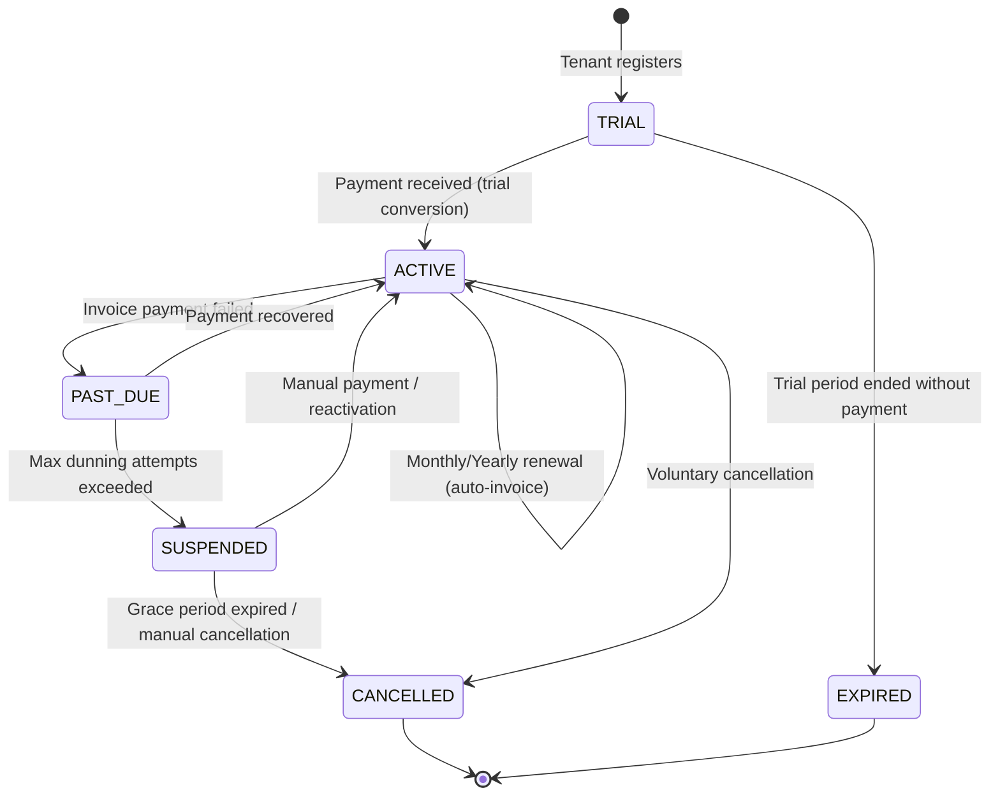

# Billing Lifecycle

## Overview
The billing lifecycle manages the SaaS subscription journey of a tenant from onboarding through ongoing billing, dunning, and potential cancellation.

## Actors
| Actor | Role |
|---|---|
| Prospective Retailer | Signs up via Landing Portal |
| System | Manages subscription state, invoicing, and dunning |
| Platform Admin | Manual intervention for exceptions |
| Payment Provider | Stripe / Paymob processes payments |

## Lifecycle Flow

## Step-by-Step Flow

### 1. Onboarding (Trial)
- **Trigger**: Retailer registers via Landing Portal signup.
- **System Actions**:
  - `Tenant` created with status `ACTIVE`.
  - `Subscription` created with status `TRIAL`.
  - `trialEndDate` set (typically 14 or 30 days).
  - Default branch and admin user created.

### 2. Trial Conversion
- **Trigger**: Retailer adds payment method during trial.
- **System Actions**:
  - Stripe/Paymob customer created.
  - First invoice generated and charged.
  - Subscription status → `ACTIVE`.
  - `SubscriptionChangeHistory` logged.

### 3. Recurring Billing
- **Trigger**: Billing period end reached.
- **System Actions**:
  - `BillingInvoice` generated with `periodStart`/`periodEnd`.
  - Invoice sent to payment provider.
  - On success: Invoice status → `PAID`, subscription period extended.
  - `BillingEvent` logged.

### 4. Failed Payment (Dunning)
- **Trigger**: Payment provider returns failure.
- **System Actions**:
  - Subscription status → `PAST_DUE`.
  - `dunning.service.ts` initiates retry cycle:
    - Retry 1: After 3 days.
    - Retry 2: After 7 days.
    - Retry 3: After 14 days.
  - Email notifications sent via `billing-email.processor.ts`.
  - `BillingInvoice.dunningCount` incremented.

### 5. Suspension
- **Trigger**: All dunning attempts exhausted.
- **System Actions**:
  - Subscription status → `SUSPENDED`.
  - Tenant status → `SUSPENDED`.
  - Tenant users lose access to operational features.
  - Grace period begins (`gracePeriodDays`).

### 6. Cancellation
- **Trigger**: Voluntary cancellation or grace period expiry.
- **System Actions**:
  - Subscription status → `CANCELLED`.
  - If `cancelAtPeriodEnd`: Access continues until period end.
  - `canceledAt` timestamp recorded.
  - `SubscriptionChangeHistory` logged with type `CANCEL`.

### 7. Reactivation
- **Trigger**: Suspended tenant makes payment or Platform Admin intervenes.
- **System Actions**:
  - Outstanding invoice marked as `PAID`.
  - Subscription status → `ACTIVE`.
  - Tenant status → `ACTIVE`.
