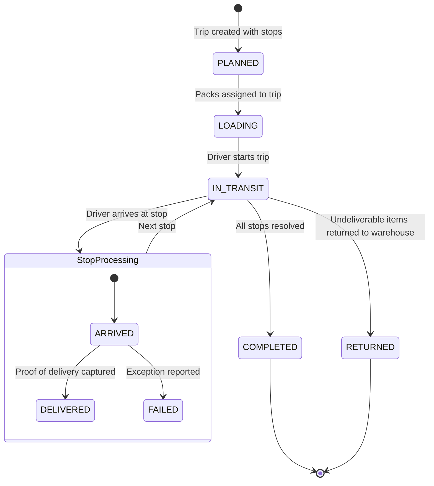

# Delivery Lifecycle

## Overview
The delivery lifecycle covers the logistics flow from order dispatch through trip planning, driver execution, and final resolution.

## Actors
| Actor | Role |
|---|---|
| Tenant Admin | Creates delivery trips and assigns drivers |
| Driver | Executes the trip and captures proof of delivery |
| System | Updates order statuses and handles exceptions |
| Customer | Receives goods and signs for delivery |

## Lifecycle Flow

## Step-by-Step Flow

### 1. Trip Planning
- **Trigger**: Tenant Admin creates a delivery trip.
- **System Actions**:
  - `DeliveryTrip` created with status `PLANNED`.
  - `TripStop` records created with sequence numbers.
  - Each stop linked to an `Order` and/or `Customer`/`Supplier`.
  - Driver and Vehicle optionally assigned.

### 2. Loading
- **Trigger**: Packed orders are loaded onto the trip vehicle.
- **System Actions**:
  - `TripPack` records created linking sealed packs to the trip.
  - Trip status → `LOADING`.
  - `totalPacks` counter updated.

### 3. Trip Start (In Transit)
- **Trigger**: Driver taps "Start Trip" in the Driver App.
- **System Actions**:
  - Trip status → `IN_TRANSIT`.
  - `startedAt` timestamp recorded.
  - Related orders status → `OUT_FOR_DELIVERY`.

### 4. Stop Execution
For each stop in sequence:

#### Successful Delivery
- Driver arrives → Taps "Mark Arrived" → `TripStop.status` = `ARRIVED`.
- Driver completes delivery → Captures Proof of Delivery:
  - Signer name, digital signature, photo, GPS coordinates.
- `TripStop.status` → `DELIVERED`.
- `ProofOfDelivery` record created.
- Order status → `DELIVERED`.

#### Failed Delivery
- Driver taps "Report Failure" → Selects exception type.
- `DeliveryException` created.
- `TripStop.status` → `FAILED`.
- Order status → `DELIVERY_FAILED`.
- Resolution initiated (return, replacement, or refund).

### 5. Trip Completion
- When all stops are processed (DELIVERED or FAILED):
  - Trip status → `COMPLETED`.
  - `completedAt` timestamp recorded.
- If undeliverable packs: `ReturnToWarehouse` record created.
  - Trip status → `RETURNED`.

### 6. Post-Delivery Resolution
| Exception Type | Resolution Options |
|---|---|
| Customer Unavailable | Reschedule, Return to Warehouse |
| Address Incorrect | Update address, Reschedule |
| Refused Delivery | Return, Refund |
| Damaged in Transit | Chargeback, Replacement Order |
| Lost in Transit | Chargeback, Refund |
