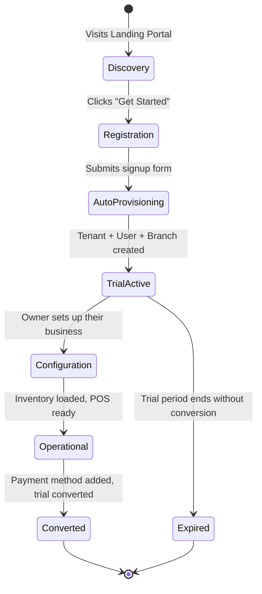

# Onboarding Lifecycle

## Overview
The onboarding lifecycle describes how a new spare parts retailer goes from discovering Partivo to becoming a fully operational tenant on the platform.

## Actors
| Actor | Role |
|---|---|
| Prospective Retailer | Signs up for the platform |
| System | Auto-provisions tenant resources |
| Platform Admin | Reviews, supports, and monitors tenants |

## Lifecycle Flow

## Step-by-Step Flow

### 1. Discovery
- Retailer visits the Partivo Landing Portal.
- Reviews features, pricing, testimonials, and FAQs.
- Decides to try the platform.

### 2. Registration
- Retailer fills out the signup form:
  - Business Name
  - Admin Email
  - Phone
  - Password
  - Selected Plan (optional, defaults to trial)

### 3. Auto-Provisioning
On successful registration, the system automatically creates:

| Resource | Details |
|---|---|
| `Tenant` | Status: ACTIVE, subdomain auto-generated from business name |
| `User` | Admin user with Owner role |
| `Subscription` | Status: TRIAL, plan assigned, trial end date set |
| `Branch` | Default "Main Branch" created |
| `Role` assignments | Owner role assigned to admin user |
| `ChartOfAccount` | Default chart of accounts seeded |
| `Default Permissions` | Standard permission set activated |

### 4. Trial Phase — Configuration
The new tenant owner logs into the Tenant Admin Portal and configures:

| Task | Action |
|---|---|
| **Branches** | Add additional branch locations |
| **Users** | Create staff accounts (managers, clerks, drivers) |
| **Inventory** | Add products from global catalog, set selling prices |
| **Customers** | Register B2B business clients |
| **Suppliers** | Add supplier records for procurement |
| **Tax Rates** | Configure VAT/tax rates |

### 5. Going Operational
- Staff download the POS App and log in.
- Cash sessions are opened at each branch.
- First sales are processed.
- Drivers are registered and delivery trips begin.

### 6. Trial Conversion
- Tenant adds payment method (Stripe/Paymob).
- System charges the first invoice.
- Subscription transitions from `TRIAL` → `ACTIVE`.

### 7. Ongoing Operations
Post-conversion, the tenant is fully operational:
- Daily POS sales across branches.
- B2B order management via Customer Portal.
- Procurement through purchase orders.
- Financial reporting and accounting.
- Delivery logistics management.
