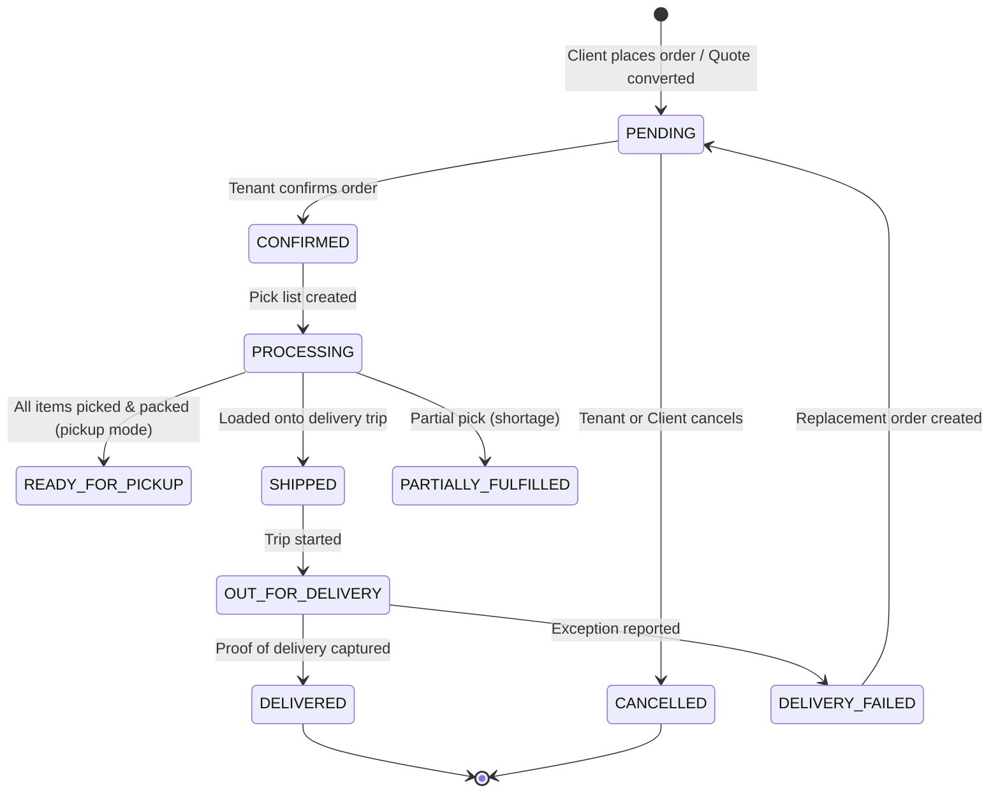

# Order Lifecycle

## Overview
The order lifecycle tracks a B2B order from initial placement through fulfillment, delivery, and potential post-delivery resolution.

## Actors
| Actor | Role |
|---|---|
| Business Client | Places the order (via Customer Portal or contact with sales) |
| Tenant Admin / Clerk | Confirms and manages the order |
| Warehouse Staff | Picks and packs the order |
| Driver | Delivers the order |
| System | Automates status transitions and inventory operations |

## Lifecycle Flow

## Step-by-Step Flow

### 1. Order Placement
- **Trigger**: Client submits order from Customer Portal cart, or Tenant Admin creates order.
- **System Actions**:
  - `Order` record created with status `PENDING`.
  - `OrderItem` records created for each line item.
  - Inventory is **allocated** (not deducted) — `Inventory.allocated` incremented.
  - If client has credit account: balance is checked against credit limit.

### 2. Order Confirmation
- **Trigger**: Tenant Admin reviews and confirms the order.
- **System Actions**:
  - Status → `CONFIRMED`.
  - `PickList` auto-generated with items and bin locations.
  - Assigned to warehouse staff.

### 3. Picking & Packing
- **Trigger**: Warehouse staff processes the pick list.
- **System Actions**:
  - `PickListItem` statuses: `PENDING` → `PICKED` (or `SHORTAGE`).
  - If shortage: `ShortageSubstitution` offered.
  - Once picked: Items grouped into `Pack` records.
  - Pack sealed → `PackStatus.SEALED`.
  - Order status → `PROCESSING`.

### 4. Dispatch
- **Trigger**: Packs loaded onto a `DeliveryTrip`.
- **System Actions**:
  - `TripPack` created linking pack to trip.
  - `TripStop` created for order's delivery address.
  - Order status → `SHIPPED`.
  - Inventory **committed** — `InventoryLedger` entry created, `Inventory.quantity` deducted.

### 5. Delivery
- **Trigger**: Driver completes delivery stop.
- **System Actions**:
  - `ProofOfDelivery` captured (signature, photo, GPS).
  - `TripStop.status` → `DELIVERED`.
  - Order status → `DELIVERED`.
  - `RevenueLedger` entry created.
  - Accounting event triggers journal entry.

### 6. Post-Delivery (Exception Path)
- **Trigger**: Delivery fails or goods have issues.
- **System Actions**:
  - `DeliveryException` recorded.
  - Resolution options: Replacement Order, Return, Refund, Chargeback.
  - Order status → `DELIVERY_FAILED`.
