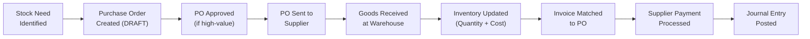
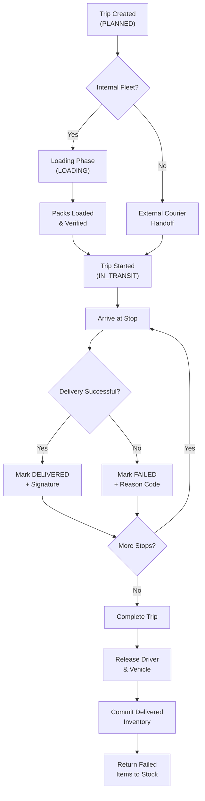

# Antigravity Commerce Platform — Product Documentation

> **Multi-Tenant Commerce Platform for Automotive Spare Parts Distribution**
> Version 2.0 · February 2026

---

## Table of Contents

- [1. Product Overview](#1-product-overview)
- [2. Platforms Breakdown](#2-platforms-breakdown)
- [3. Feature Catalog](#3-feature-catalog)
- [4. Business Flows](#4-business-flows)
- [5. User Roles and Personas](#5-user-roles-and-personas)
- [6. Competitive Advantages](#6-competitive-advantages)
- [7. Expansion and Integration](#7-expansion-and-integration)

---

## 1. Product Overview

### What the System Is

Antigravity Commerce Platform is a **vertical SaaS platform** purpose-built for the automotive spare parts industry. It provides distributors, retailers, and multi-branch businesses with a unified digital operating system that covers everything from product catalog management and point-of-sale to warehouse operations, delivery logistics, and financial compliance — all within a secure, multi-tenant architecture.

Unlike generic e-commerce or ERP platforms that require extensive customization to fit the spare parts business, Antigravity is designed from the ground up with the unique challenges of this industry in mind: high SKU counts (often 50,000+ parts), complex vehicle fitment relationships (which part fits which car?), OEM cross-referencing (the same part sold under different brand names), and the need for real-time inventory visibility across multiple physical locations such as branches, warehouses, and delivery vehicles.

The platform operates as a **fully managed cloud service** — tenants (businesses) sign up, configure their branches, import or select products from the global catalog, and begin transacting within minutes. There is no software to install, no servers to manage, and no IT department required. Every tenant benefits from continuous platform improvements, security updates, and new feature releases without any action on their part.

Think of it as **Shopify + Square + TecDoc**, reimagined specifically for spare parts — combining e-commerce capabilities, point-of-sale functionality, and automotive catalog intelligence into a single, cohesive platform.

#### Why Product Overview Matters

The automotive spare parts industry has historically relied on fragmented, disconnected tools: paper catalogs for part lookup, spreadsheets for inventory tracking, WhatsApp for customer orders, and manual ledgers for financial records. This fragmentation leads to overselling (promising parts you don't have), stockouts (not knowing you're running low until it's too late), revenue leakage (lost quotes, forgotten invoices), and audit risk (untraceable financial transactions). Antigravity eliminates these problems by unifying every operational workflow into a single, real-time platform.

### Target Market

| Segment | Description | Typical Size | Key Pain Points Solved |
| :--- | :--- | :--- | :--- |
| **Spare Parts Distributors** | Regional and national distributors managing high-SKU catalogs across multiple warehouses. These businesses typically carry 20,000–100,000+ unique SKUs from dozens of brands and serve hundreds of downstream retailers and workshops. | 3–20 warehouses, 50–500 employees | Catalog complexity, multi-warehouse stock sync, B2B quoting, delivery logistics |
| **Spare Parts Retailers** | Counter-based retailers selling to workshops, mechanics, and end consumers. These range from single-counter shops to chain retailers with multiple branches across a city or region. | 1–50 branches, 5–200 employees | Fast POS transactions, fitment lookup ("does this fit my car?"), customer price tiers, cash reconciliation |
| **Multi-Branch Businesses** | Companies operating across 2–50+ physical locations needing centralized control over inventory, pricing, staff, and reporting. Each branch operates semi-independently but reports to a central administration. | 2–50+ locations, 20–500 employees | Branch-level inventory visibility, inter-branch stock transfers, consolidated reporting, unified pricing rules |
| **B2B Wholesalers** | Businesses that primarily supply other retailers or workshops rather than end consumers. They need professional quoting workflows, credit terms management, bulk pricing, and account-level relationship management. | 1–10 locations, 10–100 employees | Formal quote lifecycle, tiered pricing, credit limit management, bulk order fulfillment |

#### Why the Target Market Matters

Each of these segments has been underserved by existing technology. Generic retail POS systems don't understand vehicle fitment. Generic ERP systems are too complex and expensive for mid-market spare parts businesses. And industry-specific solutions that do exist are typically on-premise, single-tenant, and lack modern capabilities like online buyer portals, mobile driver apps, or real-time delivery tracking. Antigravity fills this gap by offering enterprise-grade functionality at SaaS pricing, accessible to businesses of all sizes.

### Core Value Proposition

| Value | Outcome | Real-World Impact |
| :--- | :--- | :--- |
| **Instant Catalog Access** | Retailers don't enter parts manually — they select from a global, shared catalog with vehicle fitment intelligence. The catalog includes real parts from manufacturers like Denso, Brembo, Mahle, and Mann-Filter, pre-loaded with OEM cross-references, brand associations, and vehicle compatibility data. | A retailer who previously spent 2 weeks manually entering products into their system can now be operational in minutes by selecting from the global catalog. When a customer asks "do you have brake pads for a 2019 Toyota Camry?", the system instantly shows all compatible parts across all brands. |
| **Real-Time Inventory Accuracy** | Every sale, return, transfer, and delivery updates stock in real time across all branches. The system uses an immutable inventory ledger that records every stock movement with a timestamp, actor, reason, and reference. Available stock is calculated as quantity-on-hand minus allocated (reserved) quantities, ensuring that customers are never promised parts that are already committed to other orders. | A distributor with 5 warehouses previously relied on end-of-day phone calls between branches to know stock levels. Now, every warehouse, every branch, and even the online buyer portal shows the exact same, real-time available quantity — eliminating overselling and enabling confident customer commitments. |
| **Operational Digitization** | Replace paper, WhatsApp, and memory with structured workflows for sales, purchasing, warehousing, and delivery. Every operation — from creating a purchase order to picking a warehouse order to confirming a delivery — follows a defined workflow with status tracking, role-based permissions, and automatic record-keeping. | A business that previously managed deliveries via WhatsApp messages to drivers now has a structured delivery trip system with sequenced stops, loading verification, delivery confirmation with proof (signature/photo), and automatic inventory commitment upon delivery. Nothing is left to memory or informal communication. |
| **Financial Compliance** | Built-in chart of accounts, journal entries, tax handling, audit trails, and period locking. The financial backbone is designed to satisfy external auditors, tax authorities, and investors by providing a complete, immutable, double-entry bookkeeping system with segregation of duties and period-based controls. | A business preparing for a bank loan or investor meeting can produce professional financial statements, prove that every transaction has a corresponding journal entry, demonstrate audit-compliant controls, and show tamper-proof records — all generated automatically by the platform. |
| **Professional Online Presence** | Each tenant gets a branded buyer portal with product search, ordering, and contact information. The portal is automatically customized with the tenant's logo, name, branch locations, and pricing — providing a professional e-commerce experience without any web development effort. | A retailer who previously relied on walk-in traffic and phone orders now has a 24/7 online storefront where workshops can browse products, check fitment, see real-time availability, place orders, and track deliveries — dramatically expanding their sales reach without additional staff. |

### Key Differentiators

| Differentiator | Why It Matters | Deeper Explanation |
| :--- | :--- | :--- |
| **Industry-Specific Catalog** | Pre-loaded with real parts, brands, OEM references, and vehicle fitment — no generic product databases | Unlike generic platforms where every retailer builds their product database from scratch, Antigravity maintains a centralized, curated global catalog of automotive spare parts. This catalog includes real manufacturer data (part numbers, specifications, images), brand hierarchies, product categories specific to automotive (filters, brakes, suspension, electrical, etc.), OEM cross-reference tables (the same part sold under different brand names), and vehicle fitment matrices (which parts work with which makes, models, years, and engines). Every tenant benefits from this shared catalog — when a new manufacturer is added or a new vehicle model is mapped, all tenants gain access immediately. |
| **Multi-Tenant by Design** | Full tenant isolation at the data layer, with a shared global catalog that all tenants benefit from | The platform enforces strict data isolation at every level: every database query is filtered by tenant ID, every API request is validated against the authenticated tenant, and no tenant can ever access, view, or modify another tenant's data. This isolation extends to inventory, sales, customers, suppliers, financial records, and user accounts. At the same time, the global product catalog is shared across all tenants, creating a network effect: the more tenants on the platform, the richer and more comprehensive the catalog becomes, benefiting everyone. |
| **End-to-End Coverage** | From supplier purchase orders through warehouse picking to last-mile driver delivery — every step is digitized | Most competing solutions cover only one or two functions (e.g., POS only, or inventory only). Antigravity covers the entire operational chain: procurement (purchase orders, goods receipt, supplier returns), warehousing (pick lists, pack management, bin locations), sales (POS, B2B quoting, buyer portal), logistics (fleet management, trip planning, delivery confirmation), and finance (invoicing, receipts, journal entries, audit trails). This eliminates the need for multiple disconnected systems and the data synchronization problems that come with them. |
| **Commercial Safety Mode** | Inventory is allocated, not decremented, until physically committed — preventing phantom stock and revenue fraud | This is a foundational safety mechanism that prevents the most common inventory and financial errors in commerce. When an order is placed, inventory is allocated (reserved) but not decremented. The physical stock count doesn't change until a driver physically confirms delivery. This means that if a delivery fails, the stock automatically returns to available without any manual intervention. It also means that revenue is only recognized at the point of physical commitment, preventing businesses from booking revenue for orders that haven't been fulfilled — a practice that would create serious audit and compliance issues. |
| **Audit-Grade Financial Backbone** | Immutable journal entries, accounting period locking, segregation of duties, and full action-level audit logging | The financial system is built to satisfy the requirements of external auditors, banks, tax authorities, and investors. Journal entries, once posted, cannot be edited or deleted — they can only be reversed with a new, equally immutable entry. Accounting periods can be locked to prevent retroactive changes to closed months or quarters. Every action (create, update, delete, void, approve) is logged with the acting user, timestamp, affected entity, and changes made. Role-based permissions enforce segregation of duties — the person who creates a transaction cannot be the same person who approves it. |

---

## 2. Platforms Breakdown

The Antigravity Commerce Platform is not a single application — it is a **suite of five purpose-built platforms**, each tailored to a specific user group and operational context. Together, they form a complete digital operating system that covers every touchpoint in the spare parts value chain: from the platform operator managing tenants at the top, through the business managing operations in the middle, to the end-customer placing orders and the driver delivering goods at the last mile.

Each platform shares the same underlying data layer, meaning that an action taken in one platform (e.g., a driver confirming a delivery) is instantly reflected in all others (e.g., the buyer portal shows "delivered", the tenant portal updates inventory, the financial ledger records the revenue). This real-time synchronization across platforms is what eliminates the data silos and communication gaps that plague businesses using disconnected tools.

### 2.1 Platform Owner Control Portal (SaaS Admin)

#### Architectural Mandate

The mission control for the Antigravity ecosystem. This platform is not used by individual shops or garages, but by the **Platform Owner** to manage the entire multi-tenant universe. It is the layer where global rules are set, new businesses are onboarded, and the integrity of the global parts catalog is maintained. It provides a "God-eye view" of the entire system, allowing for the configuration of tax regimes, currencies, and technical defaults that provide the framework within which every tenant operates.

#### Commercial Logic

In a multi-tenant environment, scaling is the primary challenge. The Platform Owner Portal solves this by centralizing the governance of thousands of independent businesses. It provides the "Operating System" for the SaaS owner to run their platform business — managing the economics of subscriptions, the quality of the global catalog, and the overall security of the system. This central control point is what enables Antigravity to grow from its first ten tenants to ten thousand without an equivalent increase in administrative overhead.

#### Platform Stakeholders

- **SaaS Platform Owners** — The principal operators of the Antigravity system who manage the business of the platform
- **System Administrators** — Technical staff responsible for tenant onboarding, subscription management, and platform-wide configuration
- **Catalog Managers** — Domain experts who maintain the global part catalog, mapping millions of SKUs and vehicle fitment data
- **Executive Leadership** — Decision-makers who use platform-wide analytics to drive growth and expansion strategy

#### Platform Capabilities

| Capability | Description | Detailed Explanation |
| :--- | :--- | :--- |
| **Multi-Tenant Architecture** | Securely host thousands of independent businesses on a single infrastructure | The platform's foundation is a true multi-tenant database schema. This architecture ensures that while all companies share the same application code, their data (customers, stock, sales, financial records) is strictly isolated at the database level. Tenant Alpha can never see Tenant Beta's data. This allows for massive scalability and rapid updates — when we improve the platform, every tenant benefits instantly while maintaining total security and data privacy. |
| **Global Catalog Engine** | A centralized master repository of millions of spare parts with vehicle fitment data | Instead of every shop typing in their own product data, we provide a pre-built global catalog. This includes standardized part numbers, brand data, technical specifications, and most importantly, vehicle fitment (which part fits which car). Tenants simply "subscribe" to parts from the global catalog into their local inventory. This eliminates data entry errors, ensures consistency across the platform, and allows for instant search and cross-referencing between brands. |
| **Tenant Administration** | Master controls for onboarding, managing, and suspending businesses on the platform | The platform owner has access to a dedicated administration console for managing the tenant lifecycle. This includes creating new tenants, assigning them to subscription plans (Standard, Professional, Enterprise), monitoring their usage metrics, managing billing, and suspending access for policy violations or non-payment. This centralized control is essential for managing the business of the platform itself. |

### Zero-Gap Core Philosophy

The platform operates on a "Zero-Gap" policy, meaning there are no "loose ends" in the software.

- **Physical-Financial Sync**: A sale doesn't just reduce inventory; it triggers accounting entries, updates COGS, and verifies tax compliance instantly.
- **Idempotency**: All mutating operations (charging a card, updating stock) are idempotent. Retrying a failed request will never result in duplicate charges or double-deductions.
- **Allocation vs. Commitment**: Inventory is "allocated" when an order is placed (reserved) but only "committed" (permanently deducted) when physically delivered, preventing over-selling.

### Performance & Hardening

Antigravity is optimized for high-volume commerce:

- **Optimistic Concurrency Control (OCC)**: High-frequency items (like popular spare parts) use version-based updates to prevent race conditions during flash sales or heavy POS usage.
- **Automated Retry Mechanisms**: The system detects transient database deadlocks or connectivity blips and automatically retries operations using exponential backoff.
- **Linear Scalability**: Performance benchmarks show stable handling of 100+ concurrent POS sales and large-scale B2B batch processing.
| **System Configuration** | Manage tax rates, currency settings, exchange rates, and platform-wide defaults | Platform-level configuration sets the foundational parameters that apply across all tenants: default tax rates (which tenants can override for their jurisdiction), supported currencies, exchange rate tables for multi-currency transactions, and system-wide defaults for invoice numbering, receipt formatting, and accounting conventions. These configurations ensure consistency while allowing tenant-level customization where needed. |
| **Analytics Dashboard** | Monitor platform-wide metrics — total tenants, transaction volumes, catalog usage, and growth | The platform owner needs visibility into the health and growth of their SaaS business. The analytics dashboard provides real-time metrics: total active tenants, new sign-ups per period, monthly transaction volumes, catalog utilization (which products are most searched/sold), revenue per tenant, churn rates, and growth trends. These metrics drive strategic decisions about pricing, catalog investment, and market expansion. |
| **Approval Inbox** | Centralized view for approving high-value quotes, purchase orders, and refunds | Certain high-risk or high-value operations require explicit approval before they can proceed. The approval inbox aggregates all pending approvals across tenants into a single, prioritized queue. Each approval request shows the full context (who requested it, what it involves, the financial impact, and any relevant history), enabling the approver to make an informed decision quickly. This centralized approach prevents approval bottlenecks and ensures nothing falls through the cracks. |

### Blueprint Purpose

1. **Tenant Onboarding** — Create tenant → Assign subscription plan → Provision initial branches → Create admin user → Configure defaults → Activate tenant. This is the first experience a new business has with the platform, and it is designed to get them operational within minutes rather than weeks.
2. **Catalog Enrichment** — Add product → Map to brand & category → Define vehicle fitment (make/model/year/engine) → Add OEM cross-references → Upload images/specifications → Publish. Each product addition enriches the global catalog for all tenants simultaneously.
3. **Tenant Suspension** — Flag non-payment or policy violation → Suspend tenant → Block all API access for tenant's users → Notify tenant admin with reason and remediation steps. Suspension is immediate and comprehensive — no partial access is possible, preventing data corruption or unauthorized usage during the suspension period.
4. **Subscription Enforcement** — Monitor usage metrics → Compare to plan limits → Trigger upgrade prompts (soft limit) or restrict access (hard limit) → Process upgrade or downgrade → Adjust limits accordingly.

---

## 2.2 Tenant Web Portal (Business Operations System)

### User Application Purpose

The primary business management console for each tenant. This is the operational headquarters where distributors and retailers run their day-to-day business: managing inventory across branches, processing sales and returns, sending purchase orders to suppliers, handling all financial operations (invoicing, receipts, journal entries, tax), overseeing warehouse operations, and managing delivery logistics. It is the most feature-rich platform in the suite, providing a single pane of glass for everything a spare parts business needs to operate.

### Centralized Business Value

Before Antigravity, a typical spare parts business might use 5–8 different tools: a POS system for sales, a spreadsheet for inventory, a separate accounting package, WhatsApp for supplier communication, paper logs for warehouse operations, and phone calls for delivery coordination. The Tenant Web Portal replaces all of these with a single, integrated system where every action in one area (e.g., a sale) automatically triggers the correct actions in all related areas (e.g., inventory allocation, invoice generation, journal entry posting). This integration eliminates double data entry, reduces errors, and provides real-time visibility across the entire business.

### User Personas (Tenant Portal)

- **Tenant Administrators** — Business owners or operations directors responsible for overall system configuration, user management, and business oversight
- **Sales Managers & Representatives** — Staff responsible for creating quotes, managing client relationships, and monitoring sales performance
- **Inventory Managers** — Staff responsible for stock levels, inter-branch transfers, purchase order creation, and goods receipt
- **Finance / Accounting Staff** — Staff responsible for financial reporting, journal entries, tax configuration, invoice management, and period closing
- **Logistics Managers** — Staff responsible for delivery trip planning, fleet management, driver assignment, and delivery tracking

### Feature Breakdown (Tenant Portal)

| Capability | Description | Detailed Explanation |
| :--- | :--- | :--- |
| **Sales Management** | Create, view, void, and refund sales transactions with full payment tracking | Every sale flows through a structured process: product selection (from the global catalog with local pricing), cart management, payment processing (cash, card, or split-tender), and automatic document generation (invoice + receipt). Sales can be voided with a mandatory reason code, which automatically reverses inventory allocation and creates corrective journal entries. Refunds are processed against the original sale, requiring the return to be verified before the refund is issued — preventing refund fraud. |
| **Inventory Control** | Real-time stock levels per branch, adjustments, inter-branch transfers, and ledger history | The inventory system provides a real-time view of stock across all branches, showing three key numbers for each product: quantity on hand (total physical stock), allocated quantity (reserved for pending orders), and available quantity (what can actually be sold). Stock adjustments for damage, loss, or count corrections require reason codes and create immutable ledger entries. Inter-branch transfers follow a tracked lifecycle (REQUESTED → APPROVED → IN_TRANSIT → RECEIVED) to prevent stock from "disappearing" during transit. |
| **Purchase Order Management** | Create POs to suppliers, receive goods, track costs, and process purchase returns | The procurement module handles the full supplier relationship: creating purchase orders with negotiated unit costs, routing high-value POs through an approval workflow, sending confirmed POs to suppliers, receiving goods against POs with quantity verification (flagging shortfalls or overages), and processing return-to-vendor (RTV) requests for defective or incorrect goods. Every receipt updates inventory quantities and cost data, enabling accurate margin calculations. |
| **B2B Quoting** | Generate quotes for business clients with custom pricing, send for approval, and convert to orders | For business-to-business sales, formal price quotes are essential. The quoting module allows sales reps to build detailed quotes with product-specific pricing (based on the client's assigned price tier), apply discounts within their authorized limits, set validity periods (e.g., 14 or 30 days), and route quotes through an approval workflow if needed. Accepted quotes convert to sales orders with a single click, preserving all pricing and terms. Expired quotes are automatically flagged to prevent stale commitments. |
| **Financial Operations** | Chart of accounts, journal entries, tax configuration, invoicing, receipts, and period closing | The financial backbone provides a complete, audit-grade accounting system: a configurable chart of accounts (Assets, Liabilities, Equity, Revenue, Expenses), automatic double-entry journal postings for every financial event (sales, purchases, payments, refunds), tax rate configuration with automatic calculation and application, invoicing with line-level tax breakdowns, receipt generation for payments, and accounting period management with the ability to close and lock periods to prevent retroactive changes to closed months or quarters. |
| **Warehouse Management** | Pick lists, packing workflows, bin location management, and barcode scanning | The warehouse module digitizes physical operations: pick lists are automatically generated from orders with bin location guidance (Zone A, Shelf 3, Bin 12), pickers confirm each item by scanning its barcode, picked items are grouped into packs and sealed for delivery, and packs are assigned to delivery trips for loading. Bin locations help organize the warehouse for optimal pick speed, and barcode verification eliminates manual identification errors. |
| **Logistics & Delivery** | Fleet dispatch, trip planning, stop sequencing, and delivery tracking | The logistics module manages the last-mile delivery process: creating delivery trips with assigned drivers and vehicles, sequencing stops for route efficiency, verifying that all packs are loaded before dispatch, tracking trip status in real time (PLANNED → LOADING → IN_TRANSIT → COMPLETED), and recording delivery outcomes (DELIVERED with proof, or FAILED with reason). Delivered items trigger inventory commitment; failed items return to available stock automatically. |
| **Customer & Supplier CRM** | Manage business client profiles, price tiers, credit terms, and supplier contact details | The CRM module maintains detailed profiles for both customers and suppliers. Customer profiles include contact information, assigned price tier (Retail, Wholesale, Silver, Gold), credit limit and outstanding balance, purchase history, and notes. Supplier profiles include contact details, lead times, pricing history across past POs, fulfillment rates, and quality notes. These profiles enable personalized pricing, informed purchasing decisions, and better relationship management. |
| **Reporting** | Sales reports, inventory aging, margin analysis, Z-reports, and cash session reconciliation | The reporting module provides actionable business intelligence: sales breakdowns by period, branch, product, brand, and category; inventory aging analysis (identifying dead stock sitting for 90+ days); margin analysis comparing selling price vs. cost price across products, brands, and categories; daily Z-reports for POS cash session reconciliation; and financial statements aligned with the chart of accounts. Reports can be filtered, exported, and used for strategic decision-making. |
| **Branch Administration** | Multi-branch setup, user role assignments, and branch-level permissions | For businesses with multiple locations, the branch administration module provides centralized control: creating and configuring branches (address, operating hours, tax jurisdiction), assigning users to specific branches, defining what each role can do at each branch (e.g., a cashier at Branch A cannot see financial reports for Branch B), and managing branch-level inventory and pricing independently while maintaining consolidated reporting at the business level. |

### Operational Workflows

1. **Counter Sale** — Search catalog → Add items to cart → Apply pricing rules (tier-based, per-item, or manual discount with authorization) → Process payment (cash, card, or split-tender) → Generate receipt + invoice automatically → Update inventory allocation in real time
2. **Supplier Procurement** — Identify restock need (manual or from low-stock report) → Create PO with selected supplier and negotiated prices → Route through approval if above threshold → Send to supplier → Receive goods at warehouse (verify quantities) → Update inventory and cost records → Match to supplier invoice → Process payment and post journal entry
3. **Delivery Dispatch** — Group orders by geographic area → Assign driver & vehicle → Generate pick lists for warehouse → Pack and seal items → Load onto vehicle (with verification) → Dispatch trip → Track delivery progress in real time → Record outcomes at each stop
4. **End-of-Day Reconciliation** — Close cash session → System calculates expected cash (from all recorded transactions) → Cashier counts actual cash → Record closing balance → Generate Z-report showing all transactions, payment method breakdown, and any variance → Manager reviews and approves → Lock period to prevent retroactive changes

---

### 2.3 Buyer Portal (Customer-Facing Ordering System)

#### Purpose of the Buyer Portal

A branded, public-facing storefront for each tenant. Buyers — workshops, mechanics, fleet managers, and retail customers — can browse the tenant's catalog, search for parts by vehicle fitment, check real-time availability across branches, place orders, and manage their account. The portal is automatically branded with the tenant's logo, name, contact information, and branch locations, providing a professional online presence without any web development effort. It operates 24/7, enabling customers to place orders outside business hours and reducing the burden on counter staff.

#### Why the Buyer Portal Matters

In the spare parts industry, ordering has traditionally happened through phone calls, in-person visits, or WhatsApp messages. This is slow, error-prone (the wrong part number gets communicated verbally), and doesn't scale. The Buyer Portal digitizes this process: customers can search for parts using their vehicle details (ensuring fitment accuracy), see real-time availability (avoiding wasted trips to a branch that's out of stock), and place orders that flow directly into the tenant's fulfillment pipeline. For the business, this means more orders with less staff effort, fewer returns from wrong-part purchases, and a professional image that builds customer confidence.

#### Buyer Portal Target Users

- **Workshop Owners** — Professional garages that regularly order parts for vehicle repairs and maintenance. They need fast, accurate part identification and reliable delivery.
- **Independent Mechanics** — Individual mechanics who need to find and order specific parts quickly, often while diagnosing a vehicle and needing the part the same day or next day.
- **Fleet Managers** — Companies managing vehicle fleets (delivery companies, taxi services, rental agencies) that need regular maintenance parts and demand competitive pricing for volume purchases.
- **Walk-in Retail Customers** — End consumers who want to browse available parts, compare prices, or check stock before visiting a physical branch for pickup.

#### Buyer Portal Core Capabilities

| Capability | Description | Detailed Explanation |
| :--- | :--- | :--- |
| **Product Search** | Search by part number, OEM reference, vehicle make/model/engine, or keyword | The search engine supports multiple input methods to accommodate different buyer behaviors. A mechanic might search by the part number printed on the old part they're replacing. A workshop owner might search by OEM reference to find aftermarket alternatives. A fleet manager might enter a vehicle's make, model, year, and engine to see all compatible maintenance parts. Keyword search handles cases like "oil filter" or "brake pads." All search methods return results from the tenant's available catalog with real-time pricing and stock levels. |
| **Vehicle Fitment Lookup** | "Does this part fit my car?" — intelligent cross-referencing of parts to vehicles | This is the platform's most powerful customer-facing feature. The buyer enters their vehicle details (make, model, year, engine code), and the system returns all compatible parts across all brands and categories. This eliminates the #1 cause of returns in the spare parts industry: wrong parts. The fitment data is maintained centrally in the global catalog, so accuracy improves continuously as new vehicles and parts are mapped. Cross-reference tables also show equivalent parts across brands (e.g., OEM part X = Denso part Y = Bosch part Z). |
| **Real-Time Availability** | See current stock levels and pricing per branch | Unlike static catalogs or price lists, the Buyer Portal shows live availability data. Each product listing shows which branches have it in stock, the exact available quantity (accounting for allocations), and the price at the buyer's assigned tier. This transparency reduces phone calls asking "do you have this in stock?", eliminates wasted trips, and builds customer trust. Availability updates in real time as sales and deliveries occur. |
| **Order Placement** | Add items to cart, select delivery or pickup, and submit orders | The ordering process is designed for speed and ease: add items to cart, choose between branch pickup (specifying which branch) or delivery (to a saved address), review the order summary with pricing and taxes, and submit. Submitted orders immediately appear in the tenant's order management system and trigger inventory allocation. The buyer receives an order confirmation with an order number for tracking. |
| **Order Tracking** | Track order status from placement through warehouse processing to delivery | After placing an order, the buyer can track its progress through every stage: PENDING (received, awaiting processing), PROCESSING (being prepared), ALLOCATED (inventory reserved), PACKED (items sealed and ready), OUT_FOR_DELIVERY (on the delivery vehicle), and DELIVERED (confirmed by driver with proof). If a delivery fails, the buyer is notified with the reason and can arrange a redelivery. This transparency reduces "where's my order?" calls by 80%+ compared to manual tracking. |
| **Account Management** | View order history, invoices, outstanding balances, and credit terms | Business buyers with accounts can view their complete transaction history: past orders (with the ability to reorder with one click), associated invoices (downloadable as PDF), payment history, outstanding balance (for credit customers), and their assigned credit limit and terms. This self-service capability reduces the accounting workload for the tenant while giving buyers confidence and control over their account. |
| **Branded Experience** | Each tenant's portal shows their logo, name, branch locations, and contact information | The portal is automatically customized for each tenant — their logo, business name, branch addresses with maps, phone numbers, operating hours, and any custom messaging. This creates a professional, branded experience that reinforces the tenant's identity and builds customer trust. There is no "Antigravity" branding visible to the end-buyer; the portal appears as the tenant's own website. |

#### Buyer Portal Key Workflows

1. **Part Lookup** — Enter vehicle details (make, model, year, engine) → Browse all compatible parts across all brands → Compare prices between brands → See availability across branches → Select the best option
2. **Order Submission** — Add to cart → Choose delivery or branch pickup → Select delivery address or pickup branch → Review order summary with pricing and tax → Confirm order → Receive instant order confirmation with tracking number
3. **Re-ordering** — View past orders → Quick-add all items from a previous order (or select specific items) → Adjust quantities → Submit repeat order. This is particularly valuable for workshops that regularly order the same maintenance parts for common vehicles.

---

### 2.4 POS / Warehouse App (Operational Execution)

#### Purpose of the POS/Warehouse App

A fast, purpose-built interface designed for two critical in-person operations: counter sales (Point of Sale) and warehouse execution (picking, packing, and scanning). Unlike the Tenant Web Portal, which is designed for management and oversight, the POS/Warehouse App is optimized for speed and accuracy in high-volume, time-sensitive environments. Cashiers need to process transactions in seconds, not minutes. Warehouse staff need to find, scan, and pack items with zero errors. The app is built for these exact demands.

#### Why the POS/Warehouse App Matters

Speed at the counter directly impacts customer satisfaction and sales throughput — a slow POS system creates queues and drives customers to competitors. In the warehouse, accuracy is paramount — a single wrong item picked and shipped leads to a return, a reshipment, and a dissatisfied customer. The POS/Warehouse App addresses both: fast product identification (barcode scanning or instant search), streamlined transaction processing (minimal clicks to complete a sale), and scanner-verified warehouse operations (ensuring the right item, in the right quantity, goes to the right order).

#### POS/Warehouse App Target Users

- **Cashiers (POS)** — Counter staff who process walk-in sales, accept payments, handle returns, and issue receipts. They need the fastest possible transaction flow with minimal training.
- **Warehouse Staff (Picking & Packing)** — Workers who retrieve items from shelves based on pick lists, confirm items by scanning barcodes, and pack them into sealed units for delivery. They need clear location guidance and error-proof verification.
- **Warehouse Managers** — Supervisors who oversee warehouse operations, manage stock adjustments, handle goods receipt from suppliers, and ensure fulfillment targets are met.
- **Store Managers** — On-site managers who need to open/close cash sessions, approve discounts, void transactions, and review daily reconciliation reports.

#### POS/Warehouse App Core Capabilities

| Capability | Description | Detailed Explanation |
| :--- | :--- | :--- |
| **Point of Sale** | Fast product search, barcode scanning, cart management, multi-tender payment, and receipt generation | The POS is optimized for speed: scan a barcode or type 2–3 characters to find a product instantly, add to cart, adjust quantities, apply authorized discounts, and process payment. Payment supports multiple methods in a single transaction (e.g., $200 cash + $150 card). Upon completion, a receipt is printed and an invoice is automatically generated in the background. The entire flow from first scan to receipt takes under 30 seconds for a typical transaction. |
| **Cash Session Management** | Open/close cash drawers, track expected vs. actual cash, and generate Z-reports | Every POS shift starts with opening a cash session (recording the starting cash balance) and ends with closing it (counting the drawer and recording the actual balance). The system tracks every cash movement during the session and calculates the expected closing balance. Any variance (expected vs. actual) is flagged for investigation. A Z-report is generated summarizing all transactions, payment methods, refunds, and the final reconciliation. This daily discipline catches errors, discrepancies, and potential theft early. |
| **Pick List Processing** | Receive pick lists from orders, scan items, confirm quantities, and mark picks complete | When orders need fulfillment, the system generates pick lists that are sent to warehouse staff. Each pick list shows the items needed, their quantities, and their bin locations (e.g., Zone A, Shelf 3, Bin 12). The picker navigates to each location, scans the item's barcode to confirm it's the correct product, enters the quantity picked, and moves to the next item. The system prevents completing a pick if the scanned barcode doesn't match the expected product, eliminating wrong-item errors. |
| **Pack Management** | Seal picked items into packs, assign packs to delivery trips, and confirm loading | After picking, items are grouped into packs — sealed physical units (boxes, bags, crates) that are linked to specific orders. Each pack receives a unique identifier and is assigned to a delivery trip. Before a trip departs, loading verification confirms that all packs for all stops are physically loaded on the vehicle. This creates a traceable chain: Order → Pick List → Picked Items → Pack → Delivery Trip → Delivery Stop → Customer. |
| **Barcode Scanning** | Hardware scanner or camera-based barcode input for product identification and pick verification | Barcode scanning is used throughout the app for speed and accuracy: at the POS counter for instant product identification, during picking for item verification, during goods receipt for quick product matching against purchase orders, and during packing for seal verification. The app supports both dedicated hardware barcode scanners (USB or Bluetooth) and camera-based scanning from mobile devices, accommodating different hardware environments. |
| **Stock Adjustments** | Quick adjustments for damaged, lost, or miscounted inventory with ledger entries | Real-world inventory doesn't always match system records — items get damaged, go missing, or are miscounted. The stock adjustment feature allows authorized staff to increase or decrease inventory with mandatory reason codes (DAMAGE, LOSS, COUNT_CORRECTION, SHRINKAGE, FOUND). Every adjustment creates an immutable ledger entry recording who made the adjustment, when, why, and the quantity change. This maintains full traceability while accommodating the messiness of physical operations. |
| **Returns Processing** | Accept customer returns, verify against original sale, restock items, and issue refunds | Returns follow a structured process: the customer presents the item and their receipt/invoice number, the staff member looks up the original sale, verifies that the item matches (correct product, within return policy), creates a return record linked to the original sale, restocks the item (adding it back to available inventory with a ledger entry), and issues a refund via the original payment method. The system blocks refunds that aren't linked to a verified return, preventing refund fraud. |

#### POS/Warehouse App Key Workflows

1. **POS Sale** — Scan/search product → Add to cart → Adjust quantity if needed → Apply discount (if authorized — the system enforces discount limits per role) → Accept payment (cash, card, or split) → Print receipt → Invoice auto-generated in background
2. **Warehouse Pick** — Receive pick list → System shows items in optimized sequence (grouped by zone for minimal walking) → Navigate to first bin location → Scan item barcode → System verifies match → Enter quantity picked → Move to next item → Complete pick when all items scanned and verified
3. **Pack & Load** — Group picked items by order → Seal pack → Print pack label → Assign pack to delivery trip → When all packs for trip are ready → Verify all packs are loaded on vehicle → Confirm loading is complete
4. **Cash Reconciliation** — Close session → Count physical cash in drawer → Record closing balance → System calculates expected balance from all transactions → Z-report generated showing: total transactions, breakdown by payment method (cash/card), total refunds, expected vs. actual cash, variance amount → Manager reviews and signs off

---

### 2.5 Driver App (Delivery Execution)

#### Purpose of the Driver App

A mobile-first application for delivery drivers to execute assigned delivery trips, navigate to customer stops, confirm successful deliveries with proof (signature, photo), and report failed deliveries with reason codes — all while automatically updating inventory, order status, and financial records in real time. The app is designed for simplicity: drivers need to focus on driving and delivering, not on complex software interactions. Every screen is optimized for large-finger touch interaction, outdoor screen visibility, and minimal data entry.

#### Why the Driver App Matters

Delivery is the moment of truth in commerce — it's when the customer actually receives (or doesn't receive) their goods, and it's the trigger for the platform's most important safety mechanism: inventory commitment. Until a driver confirms delivery, inventory remains allocated (not committed), and revenue is not recognized. This means the Driver App isn't just a logistics tool — it's the final control point that ensures the accuracy of the entire financial and inventory system. A confirmed delivery commits inventory, recognizes revenue, and closes the order. A failed delivery returns stock to available and keeps revenue at zero. The accuracy of these driver actions determines the accuracy of the entire business.

#### Driver App Target Users

- **Delivery Drivers (internal fleet)** — Employees or contractors who drive company vehicles and deliver orders to customers. They need a simple, fast app that tells them where to go, what to deliver, and how to record the outcome.
- **Logistics Coordinators (monitoring)** — Office staff who monitor active trips in real time, respond to driver issues, and manage exception handling (failed deliveries, customer complaints, rerouting).

#### Driver App Core Capabilities

| Capability | Description | Detailed Explanation |
| :--- | :--- | :--- |
| **Trip Assignment** | Receive assigned delivery trip with sequenced stops and loaded packs | When a logistics manager creates and dispatches a trip, it appears in the driver's app with all the information needed: the list of stops in delivery sequence, the customer name and address for each stop, the contact phone number, the items and packs assigned to each stop, and any special delivery instructions. The driver reviews the trip, confirms they have the correct vehicle, and begins. |
| **Navigation** | View stop sequence with addresses and customer contact details | Each stop shows the customer address (with the option to open in Google Maps or Waze for turn-by-turn navigation), the customer's phone number (tap to call), and the order details (what items they're expecting). Stops are sequenced for route efficiency, and the driver can see how many stops remain and their estimated route. |
| **Delivery Confirmation** | Mark each stop as DELIVERED with proof of delivery (signature, photo) | At each stop, the driver marks the delivery as successful and captures proof: a digital signature from the recipient (drawn on screen), a photo of the delivered package at the customer's location, or both. This proof is permanently linked to the delivery record and can be referenced later if the customer disputes receiving the goods. Upon confirmation, the system immediately commits the inventory, recognizes the revenue, and updates the order status to DELIVERED. |
| **Failure Reporting** | Mark stops as FAILED with reason codes (refused, not home, wrong address, damaged) | Not every delivery succeeds. When a delivery fails, the driver selects a standardized reason code: REFUSED (customer rejected the delivery), NOT_HOME (no one available to receive), WRONG_ADDRESS (address is incorrect or doesn't exist), DAMAGED (items were damaged in transit), or OTHER (with a mandatory text explanation). The driver can also take a photo to document the situation. Failed deliveries do NOT commit inventory — the items remain allocated and return to available stock when the driver returns to base. The order is flagged for reattempt or cancellation by the logistics team. |
| **Trip Completion** | Finalize trip → Release vehicle → Commit delivered inventory → Return undelivered items | After all stops have been attempted (either DELIVERED or FAILED), the driver completes the trip. The system performs several automatic actions: commits inventory for all delivered items (permanent decrement), releases allocated inventory for all failed items (returning them to available stock), marks the driver and vehicle as available for the next trip, and updates all affected orders with their final delivery status. If any items were undelivered, they are logged as returned to the warehouse. |
| **Real-Time Sync** | All status updates push instantly to the Tenant Web Portal and Buyer Portal | Every action the driver takes — arriving at a stop, confirming a delivery, reporting a failure — is pushed to the server in real time. The logistics coordinator sees the live trip progress on their dashboard. The buyer sees their order status update instantly. The inventory system reflects the commit/return immediately. The financial ledger posts the revenue journal entry the moment delivery is confirmed. There is zero delay between the physical action and its digital record. |

#### Driver App Key Workflows

1. **Start Trip** — View assigned trip details → Check loaded packs against trip manifest → Confirm vehicle assignment → Begin route → First stop address opens in navigation app
2. **Execute Delivery** — Arrive at stop → Verify items against order (packs and quantities) → Hand over to customer → Collect digital signature and/or take delivery photo → Mark as DELIVERED → System commits inventory and recognizes revenue → Move to next stop
3. **Handle Failure** — Attempt delivery → Customer refuses (or is absent, or address is wrong) → Select failure reason code → Take photo documenting the situation → Add notes if needed → Mark as FAILED → System retains inventory allocation (does NOT commit) → Move to next stop
4. **Complete Trip** — All stops attempted → Review trip summary (X delivered, Y failed) → Record any undelivered packs for warehouse return → Finalize trip → Driver and vehicle released → System commits all delivered inventory and returns all failed inventory to available stock

---

## 3. Feature Catalog

The Antigravity Feature Catalog is organized into specialized domains that cover every aspect of a modern spare parts enterprise. Each feature is designed to solve a specific industry challenge — from the complexity of vehicle fitment to the high stakes of financial safety and logistics.

## 3.1 Sales

The Sales domain is built for high-velocity environments where speed at the counter and accuracy in quoting are competitive necessities.

| Feature | Description | Business Value (Why This Matters) | Real-World Impact (Example) |
| :--- | :--- | :--- | :--- |
| **Counter Sale (POS)** | Create instant sale transactions with barcode scanning, lightning-fast product search, and multi-item cart management | **Revenue Throughput:** Every second saved at the counter is more customers served per hour. The POS eliminates manual entry errors and ensures that staff can process complex multi-item orders in seconds. | A busy branch on a Saturday morning processes 80 items for 3 different customers in under 10 minutes, with zero part number errors and instant stock updates. |
| **Sale Voiding** | Cancel a completed sale with a mandatory reason code, which automatically reverses both inventory levels and financial ledger entries | **Operational Integrity:** Mistake happen, but they shouldn't corrupt your data. Voiding ensures that accidental sales are corrected cleanly, with a mandatory audit trail that prevents staff from "hiding" transaction errors. | A cashier realizes they billed for a 12V battery instead of a 24V one after the receipt prints. A manager voids the sale in 5 seconds, the 12V item returns to stock, and the correct sale is started immediately. |
| **Returns & Refunds** | Process verified customer returns against an original sale, restock items automatically, and issue verified refunds or credits | **Fraud Protection & Trust:** Returns are the biggest headache in parts. This feature ensures that a refund is ONLY issued if the item is physically returned and matches the original sale, protecting margins while keeping customers happy. | A garage returns an unused alternator from last week. The system verifies the original purchase price, marks the item as "Returned to Stock" in the ledger, and issues the exact refund amount with a linked audit trail. |
| **B2B Quoting** | Generate professional price quotes for business clients (garages, fleets) with custom pricing, validity periods, and multi-level approval workflows | **Conversion Rate:** Professional quotes win more business. The quoting engine ensures that sales reps can offer competitive but profitable prices based on the client's tier, while maintaining high visual quality. | A workshop asks for a quote for 20 suspension sets. The rep generates a PDF quote with a 15% wholesale discount and 14-day validity. The client receives it by email, clicks "Accept," and it instantly becomes a ready-to-pick order. |
| **Quote Lifecycle** | Full status management for the quoting pipeline: Draft → Sent → Accepted → Converted → (or Rejected / Expired) | **Pipeline Visibility:** No more "lost" opportunities. Managers can see exactly how many quotes are out in the market, follow up on those nearing expiry, and understand why certain quotes are being rejected. | The system flags that $50,000 worth of quotes are expiring this Friday. The sales manager assigns a rep to call those 10 customers, resulting in $22,000 of immediate conversions. |
| **Price Rules & Tiers** | Define sophisticated pricing logic (markup, margin, fixed, or discount) by brand, category, product, or client tier | **Margin Optimization:** Automating pricing takes the guesswork and "favors" out of the hands of staff. The system ensures every item is sold at the right margin for that specific customer, every single time. | A rule is set: "All Brake Pads for Gold Tier = Cost + 15%." At the counter, when a Gold client is selected, the system instantly recalculates every price in the cart to match that exact rule without the cashier doing anything. |

## 3.2 Orders

The Orders domain acts as the glue between Sales, Inventory, and Logistics. It ensures that every commitment made to a customer is tracked and fulfilled precisely.

| Feature | Description | Business Value (Why This Matters) | Real-World Impact (Example) |
| :--- | :--- | :--- | :--- |
| **Order Creation** | Unified order engine that takes inputs from POS, the Buyer Portal, or quote conversions into a single fulfillment pipeline | **Operational Efficiency:** Having one source of truth for all orders — whether they came from the web or the counter — simplifies warehouse management and ensures no order is ever forgotten. | A branch manager looks at one screen and sees 5 walk-in orders, 12 website orders, and 2 accepted quotes, all ready for the warehouse team to begin picking. |
| **Order Status Tracking** | Granular, real-time lifecycle tracking: PENDING → PROCESSING → ALLOCATED → PACKED → OUT_FOR_DELIVERY → DELIVERED | **Customer Transparency:** Dramatically reduces customer service calls. Staff and customers can see the exact location and status of an order without needing to "ask the warehouse." | A customer asks about their delivery. The staff member checks the order: "It was packed at 10:15 and is currently on the delivery truck with 3 stops to go." Customer is satisfied and hangs up. |
| **Inventory Allocation** | Smart reservation system where orders "allocate" stock at the moment of creation, preventing that stock from being sold to anyone else | **Reliability & Trust:** Prevents the "phantom stock" problem. If a customer places an order, they are guaranteed that item even if another customer comes to the counter 5 minutes later. | A buyer orders the last 5 spark plugs on the website. A walk-in customer arrives 10 minutes later; the system shows 0 available even though 5 are on the shelf, because they are already "promised" to the website buyer. |
| **Order-to-Invoice** | Automated, legal-grade invoice generation that triggers the moment an order is finalized with correct taxes and totals | **Compliance & Safety:** Eliminates manual invoicing errors and ensures that every single sale has a corresponding, audit-ready financial document attached to it for tax purposes. | When the driver marks "Delivered," the system instantly generates a final invoice PDF with the customer's tax ID, the branch's tax ID, and a detailed breakdown of VAT and totals. |

## 3.3 Inventory & Warehousing

Inventory is the single largest asset for a spare parts business. Managing it with precision is the difference between a profitable enterprise and one buried in "dead stock."

| Feature | Description | Business Value (Why This Matters) | Real-World Impact (Example) |
| :--- | :--- | :--- | :--- |
| **Real-Time Stock Levels** | Live inventory tracking across all branches showing three key metrics: On Hand, Allocated, and Available | **Capital Efficiency:** Knowing exactly what you have prevents double-ordering and ensures you never lose a sale by telling a customer you're "out" when the part is actually on a shelf in the next branch. | A salesperson in the downtown branch sees zero stock for a clutch plate but instantly identifies 2 available units in the warehouse branch, securing a $450 sale that would otherwise have been lost. |
| **Inventory Ledger** | An immutable, chronological log of every single stock movement with type, quantity, reference, and timestamp | **Auditability & Trust:** Every part that enters or leaves the building is accounted for. This prevents "leakage," simplifies year-end audits, and provides a forensic trail for investigating discrepancies. | During a monthly audit, a missing radiator is traced through the ledger to a manual adjustment made at 2:00 AM. This identifies a gap in night-shift physical security procedures. |
| **Stock Adjustments** | Increase or decrease stock levels with mandatory reason codes (Damage, Loss, Count Correction, Found) | **Data Grounding:** Keeps the digital record in sync with physical reality. Mandatory reason codes ensure that every adjustment is justified and can be analyzed for operational patterns. | A manager notices high "Damage" adjustments for delicate headlamp units. They use this data to invest in better shelving and protective packaging for high-value glass components. |
| **Inter-Branch Transfers** | Move stock between branches with a tracked lifecycle from Request → Approval → In-Transit → Received | **Network Optimization:** Balances stock levels across a branch network without losing visibility. Prevents items from "disappearing" while moving between locations. | Branch A has a 6-month supply of air filters while Branch B is sold out. A transfer moves 50 units, instantly leveling the network and maximizing sales potential across both territories. |
| **Pick List Management** | Digital pick lists generated from orders, assigned to warehouse staff, with item-by-item barcode verification | **Fulfillment Accuracy:** Dramatically reduces picking errors. The system guides the picker and verifies every item, ensuring the customer gets exactly what they ordered, the first time. | A picker tried to grab a similar-looking but different-sized oil filter. The system blocks the pick because the barcode doesn't match, preventing a guaranteed return and customer frustration. |
| **Pack Management** | Group picked items into uniquely identified, sealed packs linked to specific orders and delivery trips | **Last-Mile Traceability:** Creates a secure chain of custody. You know exactly which items are in which box, and which truck that box is on, providing 100% visibility until the customer signs. | A delivery driver is asked "are both my orders here?" They scan the two packs on their truck, confirming that all items for both orders are present and accounted for before unloading. |
| **Bin Location Tracking** | Define storage zones and specific bin locations (Zone/Shelf/Bin) within each warehouse | **Picking Speed:** Eliminates "searching" for parts. New staff become productive on day one because the system tells them precisely where to go for every single item on their list. | A new warehouse hire picks 40 items in their first hour because the system navigated them through the aisles in an optimized path, from Bin A1-10 to Bin C5-20. |
| **Product Substitution** | Intelligent linking of interchangeable parts (Cross-References) with manufacturer confidence scores | **Sale Preservation:** Never say "no." If the exact brand the customer wants is out, the system suggests a 100% compatible alternative from the global catalog, keeping the revenue in-house. | A customer asks for a Bosch spark plug (Stock: 0). The system shows a Denso equivalent with 100% fitment match. The customer accepts the alternative, and a $120 sale is saved. |
| **Barcode Scanning** | Universal support for scanning in POS, picking, receiving, and adjustment workflows | **Speed & Accuracy:** Replaces slow, error-prone manual typing with instant, 100% accurate data entry. It is the foundational technology for error-free warehouse operations. | Receiving a shipment of 500 items used to take 3 hours of manual entry; with barcode scanning, the entire shipment is verified against the PO and added to stock in under 20 minutes. |

## 3.4 Procurement

Total control over the supply chain, ensuring you buy the right parts at the right price from the right suppliers.

| Feature | Description | Business Value (Why This Matters) | Real-World Impact (Example) |
| :--- | :--- | :--- | :--- |
| **Purchase Order Creation** | Streamlined PO generation with pre-filled supplier data, negotiated costs, and expected delivery dates | **Procurement Control:** Professionalizes the relationship with suppliers and ensures that every dollar spent is backed by a formal agreement and tracked through the system. | The purchasing manager creates a PO for 200 brake pads. The system auto-calculates the total cost and alerts them if the unit price has increased by more than 5% since the last order. |
| **Goods Receipt** | Record physical arrivals against POs with quantity verification and automatic inventory updates | **Cost Accuracy:** Ensures you only pay for what you actually receive. It instantly updates stock levels and updates the "Weighted Average Cost" for accurate margin tracking. | A supplier ships 95 units instead of the 100 on the PO. The system flags the 5-unit shortage, updates stock for 95, and ensures the finance team only approves payment for the 95 received. |
| **Purchase Returns (RTV)** | Return defective/incorrect goods to suppliers with credit note tracking and automated replenishment | **Loss Prevention:** Effectively manages supplier quality issues. Ensures that defective items are removed from stock and that the business is financially credited for every return. | 10 defective alternators are found in a shipment. The manager creates an RTV; stock is decremented, and a $1,500 credit note is automatically recorded against the supplier's account. |
| **Supplier Management** | Centralized registry of suppliers with contact details, lead times, fulfillment rates, and pricing history | **Supplier Performance:** Data-driven procurement. Move beyond intuition and buy from the suppliers who provide the best combinations of price, speed, and reliability. | When reordering filters, the system shows that Supplier A is 5% cheaper but Supplier B delivers 4 days faster. They choose Supplier B to avoid an out-of-stock situation on a top-seller. |
| **PO Approval Workflow** | Rule-based routing of high-value or unusual purchase orders to senior management for sign-off | **Financial Governance:** Prevents unauthorized or excessive spending. Ensures that large capital outlays are reviewed by the right people before the commitment is made. | A junior buyer creates a $15,000 order for new stock. The system automatically holds the PO until the Director of Operations reviews and clicks "Approve" in their mobile dashboard. |
| **Cost Tracking** | Perpetual tracking of "Landed Cost" per item, including purchase price, shipping, duties, and taxes | **Profitability Insight:** You can't price correctly if you don't know your true cost. Landed cost tracking ensures your margins are calculated on the actual money spent, not just a list price. | The system reveals that while a part's purchase price stayed flat, increased shipping costs have dropped the net margin from 20% to 12%, triggering an urgent retail price update. |

## 3.5 Logistics & Delivery

The final mile is where the "physical" meets the "digital." Our logistics suite ensures that the promise made at the checkout is kept at the customer's door.

| Feature | Description | Business Value (Why This Matters) | Real-World Impact (Example) |
| :--- | :--- | :--- | :--- |
| **Delivery Trip Planning** | Create optimized delivery trips with assigned drivers, vehicles, and intelligently sequenced stops | **Operational Efficiency:** Minimizes fuel costs and driver time. Sequencing ensures that drivers take the most logical route, maximizing the number of deliveries per trip. | A dispatcher groups 15 orders from the same industrial park into a single trip. The system sequences the stops so the driver never has to backtrack, saving 40 minutes of driving time. |
| **Fleet Mode Support** | Flexible support for both internal fleet (company-owned vehicles) and external 3rd-party couriers | **Scalability:** Allows the business to scale its delivery capacity up or down instantly. Use your own drivers for local speed and couriers for long-distance or overflow capacity. | During a peak season, the business handles 70% of deliveries with its own trucks and seamlessly offloads the remaining 30% to a local courier partner, all tracked in one dashboard. |
| **Loading Verification** | A mandatory "Lock & Load" step where all packs must be scanned and verified before a trip is dispatched | **Fulfillment Guarantee:** Eliminates the "forgotten box" problem. Drivers cannot leave the warehouse unless every item for every stop on their trip is physically on the vehicle. | A driver tries to start their trip, but the system alerts them that Order #1055's pack is still on the warehouse dock. The driver retrieves it, preventing a failed delivery and a second trip later. |
| **Real-Time Trip Tracking** | Live status monitoring of every active trip from Planned → Loading → In-Transit → Completed | **Service Excellence:** Provides instant answers to customer inquiries and allows managers to spot delays before they become problems, enabling proactive communication. | A customer calls to ask where their parts are. The agent sees the driver is exactly 2 stops (approx. 12 minutes) away and provides a precise ETA, delighting the customer with the accuracy. |
| **Delivery Confirmation** | Mobile-native confirmation at the point of delivery including digital signatures and photo proof | **Dispute Resolution:** Provides undeniable proof of delivery. Protects the business from "non-receipt" claims and ensures the financial record is backed by physical evidence. | A customer claims they never received their brake pads. The manager pulls up the delivery record showing a photo of the package at the customer's reception desk with a timestamped signature. Case closed. |
| **Failed Delivery Handling** | Structured recording of delivery failures with mandatory reason codes (Refused, Not Home, Wrong Address) | **Asset Recovery:** Ensures that undelivered items are not "lost" in the system. Triggers immediate return workflows so stock is made available for sale again as quickly as possible. | A driver marks a stop as "Not Home." The system keeps the inventory allocated but does NOT recognize revenue. The parts return to the warehouse that evening and are automatically re-queued for tomorrow. |
| **Inventory Commitment** | Technical enforcement where stock is ONLY permanently decremented when the driver confirms delivery | **Accounting Accuracy:** Aligns the digital ledger with physical reality. Eliminates "phantom sales" by ensuring revenue is only booked when the customer actually has the goods. | 50 catalytic converters leave the warehouse. 45 are delivered (Revenue recognized). 5 come back (Stock restored). The inventory and financial reports are 100% accurate to the penny. |
| **Vehicle & Driver Management** | Centralized registry tracking vehicle availability, maintenance status, and driver shift assignments | **Resource Management:** Prevents double-booking and ensures that drivers are only assigned to vehicles they are authorized to drive, maintaining safety and operational control. | The system prevents a dispatcher from assigning Driver Ali to a trip because the vehicle he usually drives is flagged as "In Service" for a scheduled oil change and brake inspection. |

## 3.6 Finance & Accounting

A professional-grade financial backbone that turns a "shop" into a "compliant enterprise." Built on the principles of safety, auditability, and transparency.

| Feature | Description | Business Value (Why This Matters) | Real-World Impact (Example) |
| :--- | :--- | :--- | :--- |
| **Chart of Accounts** | A fully configurable General Ledger (GL) structure supporting Assets, Liabilities, Equity, Revenue, and Expenses | **Financial Sophusiasm:** Provides the structural foundation for professional financial reporting. Allows the business to categorize every dollar according to international accounting standards. | The CFO creates a specialized "Asset" account for "High-Value Inventory" and an "Expense" account for "Branch Utilities," allowing for granular P&L analysis across the business. |
| **Journal Entries** | Automatic, double-entry bookkeeping postings triggered by every sale, purchase, payment, and refund | **Error Elimination:** Removes manual data entry from the accounting process. The system ensures that every "credit" has a "debit," keeping the trial balance permanently in check. | A $1,200 sale is processed. The system instantly posts: DR Cash $1,200 / CR Sales Revenue $1,200 / DR COGS $800 / CR Inventory $800. No manual accounting work required. |
| **Invoice Generation** | Automated, sequential generation of legal-grade invoices with full tax compliance and line-item detail | **Tax Compliance:** Ensures the business is always ready for a government audit. Each invoice is a permanent, immutable record of a commercial exchange with the correct tax logic applied. | A large corporate client requires a VAT-compliant invoice for their 100-car fleet order. The system generates a professional PDF with all tax IDs and breakdown, ready for their accounts team. |
| **Receipt Management** | Digital generation and tracking of receipts for every payment received, linked back to specific invoices | **Payment Reconciliation:** Ensures that "Cash" in the bank matches "Sales" in the system. Provides a permanent link between a financial document (Invoice) and a payment document (Receipt). | A customer pays for 3 different invoices with one bank transfer. The system splits the payment, generates 3 receipts, and links each to the correct invoice, clearing their outstanding balance. |
| **Cash Session & Z-Reports** | End-of-day reconciliation tool for branch-level cash management, comparing expected vs. actual totals | **Fraud Deterrence:** Identifies discrepancies immediately at the end of every shift. Protects the branch from theft, cashier errors, and unauthorized discounts. | The manager closes the POS. System says $4,520 expected. Actual cash is $4,510. The $10 variance is flagged for review, and the Z-Report is locked for the day's audit. |
| **Accounting Period Locking** | The ability to "Close" monthly or quarterly periods, preventing any retroactive changes to historical data | **Audit Safety:** Once a month is closed and reported to the bank or tax authorities, it cannot be changed. This is a "must-have" for enterprise-level financial integrity. | After the January 2026 books are closed, a user tries to backdate a sale to Jan 28. The system blocks the action, forcing them to record the transaction in the current open period. |
| **Immutable Audit Trail** | A permanent, unchangeable record of who did what, when, and what changed across the entire system | **Forensic Capability:** Provides the evidence needed to investigate suspicion or error. You can see the "before" and "after" state of every single record, including the user who made the change. | An auditor notices a series of high-value manual inventory adjustments. They pull the audit trail and see exactly which user performed them and at what time, enabling a targeted internal review. |
| **Tax Configuration** | Granular tax rate engine supporting multiple jurisdictions, categories, and exempt-status rules | **Regulatory Agility:** Allows the business to adapt to changing tax laws instantly. Whether it's a VAT increase or a regional tax holiday, the system handles the math automatically. | The government raises the tax on "Luxury Parts" to 20%. The admin updates the category rule once, and every POS transaction across 50 branches is instantly compliant. |
| **Revenue Recognition** | Advanced logic that recognizes revenue ONLY when inventory is physically delivered to the customer | **Commercial Safety:** Prevents "Revenue Inflation." Ensures that the financial statements of the business reflect physical reality, an essential requirement for bank loans and investors. | At the end of the quarter, the business has $500k in "Pending Orders." Many systems would show this as revenue. Antigravity shows $0 revenue, keeping the business legally and financially safe. |

## 3.7 CRM (Customers & Suppliers)

Relationships are the lifeblood of commerce. Our CRM tools ensure you know exactly who you're dealing with, from the smallest workshop to the largest global manufacturer.

| Feature | Description | Business Value (Why This Matters) | Real-World Impact (Example) |
| :--- | :--- | :--- | :--- |
| **Business Client Profiles** | Comprehensive digital profiles for B2B customers including tax details, credit limits, and custom terms | **Customer Lifecycle Management:** Centralizes every piece of data about a client. Enables the business to offer personalized service and credit facilities with complete confidence. | A major fleet owner is added as a customer. The admin sets a $50,000 credit limit and a 30-day payment term. The system now enforces these rules across every single transaction they make. |
| **Customer Management** | Granular tracking of customer purchase history, payment patterns, and outstanding balances | **Retention & Growth:** Identifies your most valuable customers and highlights those at risk of churn. Use data to drive proactive sales calls and targeted loyalty programs. | A sales rep notices that a high-value garage hasn't placed an order in 3 weeks. They call the garage, identify a minor service issue, resolve it, and secure a new $5,000 order the same day. |
| **Supplier Registry** | A structured database of all parts suppliers with contact info, performance history, and lead-time data | **Supply Chain Resilience:** Move beyond "gut feeling" and manage your suppliers based on their actual performance. Identify who delivers on time and who provides the best quality. | When choosing where to buy oil filters, the system shows that Supplier A is 2% cheaper but Supplier B has a 99% fulfillment rate vs. Supplier A's 85%. You choose Supplier B to ensure availability. |
| **Price Tier Assignment** | The ability to segment customers into tiers (Retail, Wholesale, Gold, Silver) with automatic price rule application | **Revenue Maximization:** Automatically applies the correct pricing for every customer type. Ensures that you remain competitive for high-volume buyers while protecting retail margins. | A walk-in customer pays the standard retail price. A registered workshop customer is automatically recognized by the system and given the "Silver Tier" discount, saving them $40 without any manual entry. |
| **Supplier Credit Notes** | Automated tracking and reconciliation of credit notes issued by suppliers for returned or damaged goods | **Financial Recovery:** Ensures that the business is never short-changed by a supplier. Tracks every dollar owed back to the company, ensuring it is applied to future payments correctly. | $500 worth of parts are returned to a supplier. The system records the credit note and automatically deducts that $500 from the next invoice payment to that supplier, protecting the company's cash. |

## 3.8 Administration

The "Engine Room" of the platform. Providing the controls needed to manage complex, multi-tenant, and multi-branch operations with ease.

| Feature | Description | Business Value (Why This Matters) | Real-World Impact (Example) |
| :--- | :--- | :--- | :--- |
| **Multi-Branch Setup** | Create and manage an unlimited number of physical branches, each with its own inventory, staff, and tax settings | **Scalable Growth:** Grow from one shop to a national network without changing your software. Maintain local control over inventory while having total consolidated visibility at headquarters. | A successful retailer opens their 5th location. Within 30 minutes, the branch is created in the system, staff are assigned, and the first shipment of stock is being received and scanned into the new ledger. |
| **User & Role Management** | Create users and assign them to specialized roles (Cashier, Warehouse, Manager, Admin) with specific branch access | **Security & Accountability:** Ensures that staff only have access to the tools they need for their specific job. Prevents unauthorized access to sensitive financial or configuration data. | A new cashier is hired. They are assigned the "Cashier" role at "Branch B." They can process sales and take payments, but the "Reports" and "Inventory Adjustments" buttons are completely hidden from them. |
| **Permission Controls** | Granular, code-level permissions (e.g., VOID_SALE, MANAGE_FLEET) that can be combined into custom roles | **Least-Privilege Security:** Provides the ultimate level of control. You can decide exactly which individuals can perform high-risk actions, reducing the internal threat of fraud or error. | A manager wants a senior sales rep to be able to approve quotes but not void sales. They create a custom "Senior Sales" role and grant exactly those two specific permissions in the control panel. |
| **Tenant Lifecycle Management** | Master controls for the platform owner to manage the active status and lifecycle of every business on the platform | **Business Governance:** Enables the SaaS operator to enforce terms of service and billing compliance. Suspend accounts for non-payment and reactivate them instantly once settled. | A tenant fails to pay their subscription for 3 months. The platform owner clicks "Suspend." Every user at that tenant is instantly logged out and blocked from access until the bill is paid and the account reactivated. |
| **Audit Logging** | A comprehensive, unalterable log of EVERY action taken in the administration panel by any user | **Administrative Honesty:** Ensures that those with the highest levels of access are still held accountable. Tracks every configuration change, user creation, and permission update. | A user's permissions were mysteriously changed. The admin pulls the Audit Log and sees exactly which administrator made the change, at what time, and from which IP address, resolving the mystery instantly. |

## 3.9 Reporting & Analytics

Turning raw data into actionable intelligence. Our reporting suite provides the "Pulse" of the business, enabling data-driven decisions at every level.

| Feature | Description | Business Value (Why This Matters) | Real-World Impact (Example) |
| :--- | :--- | :--- | :--- |
| **Sales Reports** | Deep-dive analysis of revenue by period, branch, product, brand, and category with trend visualization | **Strategic Insight:** Identify your winners and losers. Know exactly which brands are driving your profit and where you need to adjust your sales strategy or inventory investment. | The report reveals that while "Brand X" has high sales volume, its margins are thin. The business decides to shift its marketing focus to "Brand Y," which has 10% higher margins, increasing overall profit. |
| **Inventory Reports** | Detailed views of stock health, including aging analysis, turnover rates, and "Dead Stock" identification | **Capital Liberation:** Identifies money tied up in parts that aren't moving. Allows you to take action (sales, returns to supplier) to free up cash for high-demand inventory. | The "Dead Stock" report identifies $20,000 worth of parts that haven't moved in 180 days. The manager runs a 50% off clearance sale, recovering $10,000 in cash that was previously "stuck." |
| **Financial Statements** | Automated generation of P&L, Balance Sheets, and Cash Flow statements aligned with the chart of accounts | **Executive Oversight:** Provides a high-level view of the company's financial health. Essential for reporting to owners, investors, and banks with confidence and transparency. | At the end of the month, the owner pulls a consolidated P&L across all 10 branches with one click, seeing a clear picture of net profit and operating expenses without waiting for an external accountant. |
| **Z-Reports** | Daily, branch-specific reconciliation reports that "Lock" the day's transactions and payment methods | **Operational Discipline:** Ensures that every day ends with a clean slate. Catches cash discrepancies immediately and provides a firm baseline for the next day's operations. | The cashier's Z-Report shows a $50 shortage in card payments. The manager investigates and finds a transaction that was processed on the card machine but not recorded in the POS, correcting it immediately. |
| **Margin Analysis** | Real-time comparison of Selling Price vs. Landed Cost across every product, brand, and category | **Profitability Protection:** Ensures you are never selling at a loss. Highlights products where costs have risen faster than prices, allowing for instant corrective action. | A cost update from a supplier shows a 15% increase in brake disc prices. The margin analysis flags that these items are now being sold at a 2% loss. The admin increases the retail price across all branches instantly. |
| **Platform Analytics** | Aggregated data for the platform owner, showing tenant growth, catalog utilization, and system-wide volume | **Platform Strategy:** Allows the SaaS owner to see where the platform is most successful. Drive decisions on which new features to build or which regions to target for expansion. | The platform owner sees that 80% of all catalog searches are for "Engine Components." They decide to invest in an even deeper technical catalog for engine parts to further attract new enterprise tenants. |

---

## 4. Business Flows

Our platform doesn't just manage data; it governs the flow of physical goods and digital money. These end-to-end flows ensure that every action is compliant, auditable, and grounded in physical reality.

## 4.1 Order-to-Cash (The Revenue Lifecycle)

The journey from a customer's need to a realized profit. This flow is governed by our "Revenue Law": revenue is never booked until the goods are physically hand-delivered.

```mermaid
flowchart LR
    A["Customer Places Order"] --> B["Order Created\n(PENDING)"]
    B --> C["Inventory Allocated\n(Reserved)"]
    C --> D["Pick List Generated"]
    D --> E["Warehouse Picks Items"]
    E --> F["Items Packed & Sealed"]
    F --> G["Loaded onto\nDelivery Trip"]
    G --> H["Driver Delivers"]
    H --> I["Delivery Confirmed\n(DELIVERED)"]
    I --> J["Inventory Committed\n(Permanently Decremented)"]
    J --> K["Revenue Recognized"]
    K --> L["Invoice Issued"]
    L --> M["Payment Collected"]
    M --> N["Receipt Generated"]
```

**Deconstruction of the Order-to-Cash Logic:**

1. **Demand Signal (Order Placement):** A customer places an order via the Buyer Portal, a sales rep at the POS, or by converting an approved Quote. The order enters the system as `PENDING`.
2. **Safety Reservation (Inventory Allocation):** The system instantly "reserves" the stock across the relevant branch. This prevents "double-selling"—the item is physically in the warehouse but digitally marked as "Allocated," so it's no longer available for other orders.
3. **Operational Hand-off (Pick & Pack):** The warehouse receives a pick list. Staff use barcode scanners to verify they are picking the exact SKU. Once picked, items are sealed into "Packs"—the atomic unit of delivery.
4. **The Final Mile (Delivery):** Packs are loaded onto a delivery trip. The driver uses the mobile app to navigate. Crucially, the order status changes to `OUT_FOR_DELIVERY`, but revenue is NOT yet recognized.
5. **Point of Truth (Delivery Confirmation):** The driver hands the parts to the customer and collects a digital signature. Only at this millisecond does the status change to `DELIVERED`.
6. **Commercial Safety Logic (Revenue Recognition):** The system performs two simultaneous atomic actions: (1) Inventory is permanently decremented from the ledger, and (2) Revenue is booked to the Income Statement. This ensures your financial reports are 100% accurate to what was physically delivered.
7. **Settlement (Payment):** An invoice is generated. When the customer pays (via cash, credit, or bank transfer), a digital receipt is issued, and the invoice is marked as `PAID`.

---

## 4.2 Procure-to-Pay (The Procurement Lifecycle)

The disciplined flow of acquiring inventory and managing supplier relationships. Built to prevent fraud, unauthorized spending, and overstocking.

**Deconstruction of the Procure-to-Pay Logic:**

1. **Strategic Sourcing (PO Creation):** Based on inventory aging or low-stock reports, a buyer creates a `DRAFT` Purchase Order. They select the best supplier based on performance history and lead times recorded in the CRM.
2. **Financial Governance (Approval Flow):** To prevent unauthorized procurement, POs exceeding specific dollar amounts are routed to a manager's inbox. They must review and "Approve" before the document can be sent to the supplier.
3. **Physical Intake (Goods Receipt):** When the delivery truck arrives, warehouse staff "Receive" the goods against the PO. The system strictly enforces quantity checks—they cannot receive more than was ordered without explicit manager override.
4. **Landed Cost Accuracy (Inventory Update):** As items are received, the inventory quantity increases, and the "Landed Cost" is updated. This ensures that your gross margin calculations for future sales are based on actual purchase prices.
5. **The Three-Way Match (Verification):** The Finance team matches the Supplier's Invoice against the original PO and the Warehouse Receipt. If all three match, the payment is authorized. This is the "Gold Standard" for audit-compliant procurement.
6. **Closing the Loop (Payment):** The payment is processed, and a journal entry is automatically posted, debiting the Accounts Payable and crediting Cash.

---

## 4.3 Delivery & Fulfillment Lifecycle

Deep precision in managing the physical movement of goods from the shelf to the street.

**Key Business Differentiators for Logistics:**

- **Lock & Load Integrity:** Drivers cannot accidentally leave a pack behind. The system requires a "Scan-to-Vehicle" step during loading, ensuring 100% of the trip's items are physically on board before the trip is marked `IN_TRANSIT`.
- **Exception Governance:** If a delivery fails (e.g., "Refused by Customer" or "Wrong Address"), the driver must select a reason code. This immediately triggers a "Reverse Logistics" workflow, notifying the sales rep to call the customer and the warehouse to expect a returned pack.
- **Resource Optimization:** Once the trip is `COMPLETED`, the vehicle and driver are instantly marked as "Available" in the central registry, ready for the next dispatch without manual status updates.

---

## 4.4 Returns & Financial Remediation

Managing the "Reverse Flow" is as critical as the forward flow. Our system treats returns as a high-security event to prevent fraud.

### Customer Return Flow (Retail & B2B)

1. **The Handshake (Request):** The customer returns an item. The system forces the staff to find the *original sale record*. No "blind returns" are allowed.
2. **Quality Verification:** Staff check the physical condition. If accepted, the return is processed against the specific original invoice line item.
3. **Safety Law - Refund Blocking:** The system will NOT allow a cash/card refund to be processed until the inventory has been digitally "received" back into stock. This prevents "Ghost Refunds" where money leaves the business but the parts never return.
4. **Automated Bookkeeping:** A "Credit Note" is issued to the customer, and a reversing journal entry is posted to the ledger, reducing the `Sales Revenue` and restoring `Inventory Asset` value.

### Supplier Return (RTV - Return to Vendor)

1. **Defect Capture:** Damaged stock identified during Goods Receipt or later is moved to a "Quarantine" bin.
2. **Formal Claim (RTV Creation):** An RTV document is created. This digitally "locks" the stock so it cannot be accidentally sold while waiting for shipment.
3. **Status Tracking:** The return undergoes a lifecycle: `DRAFT` → `REQUESTED` → `APPROVED` → `SHIPPED` → `COMPLETED`.
4. **Commercial Settlement:** Once the supplier accepts the return, the system records the "Supplier Credit Note," directly reducing the amount the business owes that supplier.

---

## 5. User Roles and Personas

Understanding the humans behind the screens. Our platform is designed to meet the specific specialized needs of every stakeholder in the commerce ecosystem.

## 5.1 Platform Owner (The Service Provider)

The organization that owns and operates the Antigravity instance as a SaaS business.

| Attribute | Detail | Why This Matters |
| :--- | :--- | :--- |
| **Role Name** | Platform Administrator | Centralized control is the only way to scale a high-quality SaaS ecosystem. |
| **Responsibilities** | Tenant lifecycle management, global catalog curation, platform-wide analytics, and subscription billing. | Ensures that the "Gold Standard" of data quality is maintained across all customers. |
| **Goals** | Grow the subscriber base, maintain 100% platform uptime, and maximize the breadth of the shared parts catalog. | To become the "Operating System" for the automotive parts industry. |
| **Key Interactions** | **Control Portal:** Approving high-value requests, onboarding new tenants, and monitoring system-wide growth metrics. | Provides the "Bird's Eye View" needed for strategic business planning. |
| **Core Permission** | `SUPER_ADMIN` | The ability to configure the foundational "Laws" of the platform. |

## 5.2 Tenant Admin (The Business Owner)

The entrepreneur or executive running a spare parts distribution or retail business.

| Attribute | Detail | Why This Matters |
| :--- | :--- | :--- |
| **Role Name** | Business Principal / Operations Director | They need a single "Pane of Glass" to see every aspect of their company. |
| **Responsibilities** | User management, branch configuration, pricing strategy, financial period closing, and audit oversight. | Eliminates the need for 5+ different software tools to run one business. |
| **Goals** | Maximize operational efficiency, minimize inventory leakage (shrinkage), and ensure total tax and audit compliance. | To sleep soundly knowing the digital books exactly match the physical warehouse. |
| **Key Interactions** | **Tenant Portal:** Reviewing margin reports, setting credit limits for garages, and closing accounting periods. | Moves their role from "Firefighter" to "Strategist." |
| **Core Permission** | `TENANT_ADMIN` | Ultimate authority over that specific business's data and staff. |

## 5.3 Sales Specialist (The Relationship Manager)

The counter staff or field sales rep who interacts with the customer every day.

| Attribute | Detail | Why This Matters |
| :--- | :--- | :--- |
| **Role Name** | Sales Representative / Cashier | Sales staff are the primary point of friction—speed and accuracy are everything. |
| **Responsibilities** | Creating quotes, processing POS sales, looking up vehicle-specific parts, and managing client accounts. | Empowers them to provide expert-level advice by having fitment data at their fingertips. |
| **Goals** | Close sales quickly, minimize "Wrong Part" returns, and grow the average order value through suggestions. | To provide a professional, modern experience that builds customer loyalty. |
| **Key Interactions** | **POS App / Web Portal:** Cart management, payment processing, and complex B2B quoting. | Ensures they are never "guessing" about price or availability. |
| **Core Permission** | `SALES_USER` | Focused on the "Front Office" operations of the business. |

## 5.4 Warehouse Operator (The Physical Custodian)

The team on the ground, making sure the right parts get in the right boxes.

| Attribute | Detail | Why This Matters |
| :--- | :--- | :--- |
| **Role Name** | Warehouse Staff / Inventory Clerk | Physical errors are the most expensive mistakes in commerce. |
| **Responsibilities** | Receiving goods, managing bin locations, picking/packing orders, and performing count adjustments. | Digitizes their workflow, removing paper lists and manual tallying. |
| **Goals** | 100% picking accuracy, zero "lost" items, and fast processing of incoming supplier deliveries. | To have an organized, high-speed warehouse that never slows down the Sales team. |
| **Key Interactions** | **Warehouse App:** Barcode scanning for every pick/pack action and digital bin location guidance. | Eliminates the "tribal knowledge" required to find parts in a large warehouse. |
| **Core Permission** | `WAREHOUSE_USER` | Focused on the "Back Office" and physical flow of goods. |

## 5.5 Professional Driver (The Final Mile)

The face of the company at the point of delivery.

| Attribute | Detail | Why This Matters |
| :--- | :--- | :--- |
| **Role Name** | Delivery Driver / Fleet Operator | The driver is the "Guardian of the Ledger"—they confirm the revenue event. |
| **Responsibilities** | Safe delivery of packs, collection of digital signatures, and reporting of delivery failures. | Provides them with professional tools to manage routes and prove they did their job. |
| **Goals** | On-time delivery, zero damage to goods, and clear, timestamped proof of every drop-off. | To complete their route efficiently without needing to call the office for directions or updates. |
| **Key Interactions** | **Driver App:** Sequential stop navigation and digital delivery confirmation with photo proof. | Connects the field directly to the finance department in real-time. |
| **Core Permission** | `DRIVER_USER` | Restricted to logistics and delivery operations. |

---

## 6. Competitive Advantages

Why Antigravity is the superior choice for modern commerce compared to legacy ERPs or generic POS systems.

## 6.1 Unified Global Catalog vs. Fragmented Data

In legacy systems, every shop must manually type in their own product data. This leads to thousands of typos, missing images, and incorrect fitment data.

- **The Antigravity Advantage:** We use a "Shared Master Catalog." When a manufacturer like *Denso* updates a part specification, every single tenant on the platform gets that update instantly.
- **Business Impact:** Reduces SKU creation time by 95% and eliminates "Wrong Part" returns caused by bad database info.

## 6.2 Truth-at-the-Door vs. Truth-at-the-Order

Generic POS systems "decremented" stock and recognized revenue as soon as the clerk clicked "Save." If the delivery truck crashed or the customer refused the item, the inventory and financial books were instantly wrong.

- **The Antigravity Advantage:** We use atomic "Allocation" and "Commitment." Stock is only reserved at order time. It is only *removed* from the assets and *added* to the revenue when the driver's signature is timestamped at the customer's door.
- **Business Impact:** 100% audit accuracy. Your P&L represents physical reality, not "hopeful" pending orders.

## 6.3 Multi-Tenant Cloud vs. Local Servers

Local server setups are prone to crashes, data loss, and security breaches. They are expensive to maintain and impossible to update.

- **The Antigravity Advantage:** A true multi-tenant SaaS. Your data is isolated and encrypted in the cloud. We handle all backups, security, and updates.
- **Business Impact:** Zero IT maintenance costs. You focus on selling parts; we focus on the technology.

---

## 7. Expansion and Integration

Antigravity is built as an "Open Platform." We are ready to grow with your business and integrate with your existing ecosystem.

## 7.1 Regional & Multi-Country Support

| Capability | Maturity | Strategic Value |
| :--- | :--- | :--- |
| **Multi-Currency** | Roadmap | Transact with suppliers in USD/EUR while selling to customers in local currency with automated FX tracking. |
| **VAT / Tax Engine** | Available | Granular tax rules per product category and region, ensuring compliance across different legal jurisdictions. |
| **Localized UI** | Available | Portals can be served in different languages to match the workforce and customer base in new regions. |

## 7.2 Third-Party Ecosystem Integrations

| Integration Type | Strategy | Current Examples |
| :--- | :--- | :--- |
| **Financial Export** | Standardized GL Exports | Exports for QuickBooks, Xero, and Sage to streamline year-end tax reporting. |
| **Payment Gateways** | Pluggable Provider Logic | Native Stripe integration for credit cards, with hooks for local wallet providers. |
| **Logistics / 3PL** | External Courier API | Handoff orders to DHL or local couriers with real-time tracking callbacks. |
| **E-commerce Sync** | API-First Syndication | Push your inventory and prices to Shopify, Magento, or local marketplaces automatically. |

## 7.3 Data-Driven Intelligence (Roadmap)

We are building towards a future where the data works for you:

- **Predictive Procurement:** Identifying when you will run out of stock *before* it happens, based on historical seasonality.
- **Dynamic Pricing:** Automatically adjusting prices based on competitor availability and supplier cost changes.
- **Fleet Optimization AI:** Intelligent route planning that accounts for traffic patterns and delivery priority.

---

> **Document Version:** 1.0.1 (High-Detail Edition)
> **Classification:** External Product Specification
> **Drafted By:** Antigravity Architect Team
> **Confidentiality:** For Authorized Stakeholders Only
