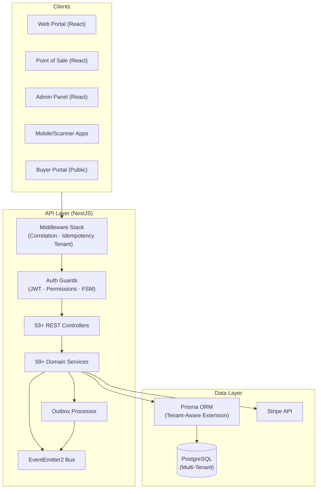
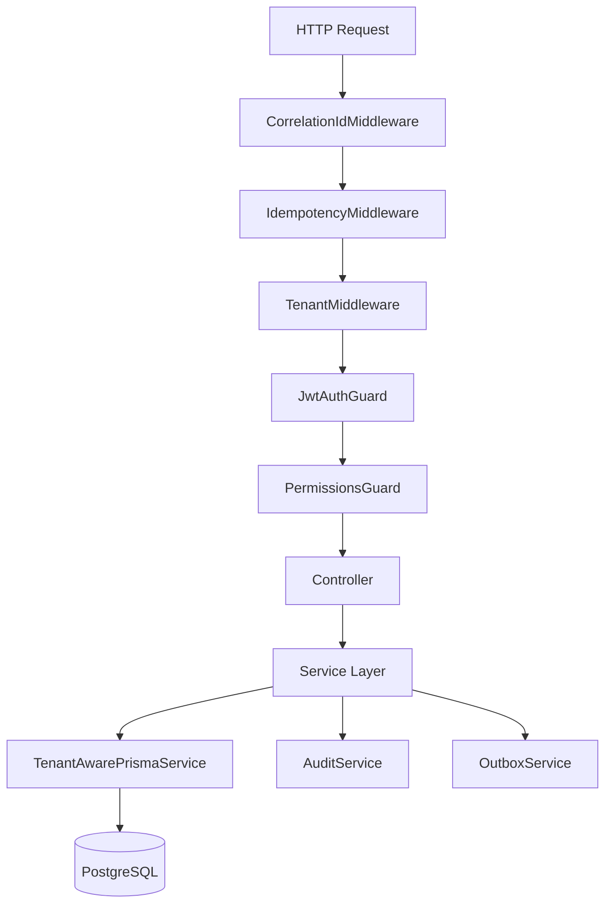
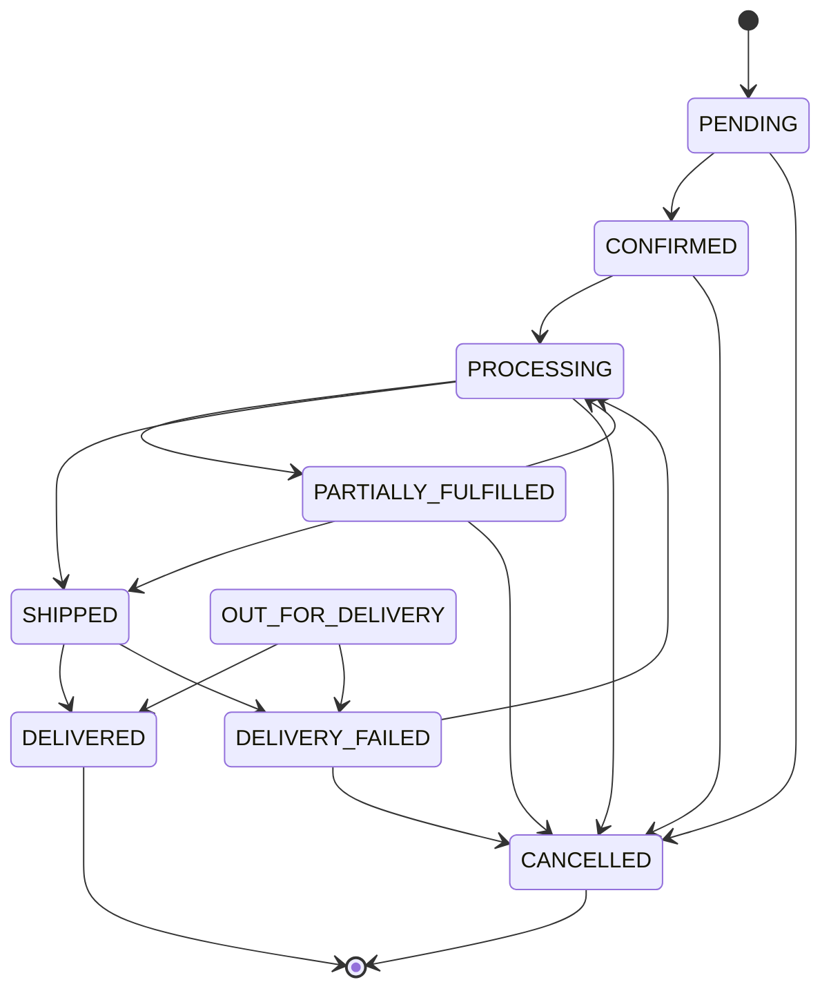
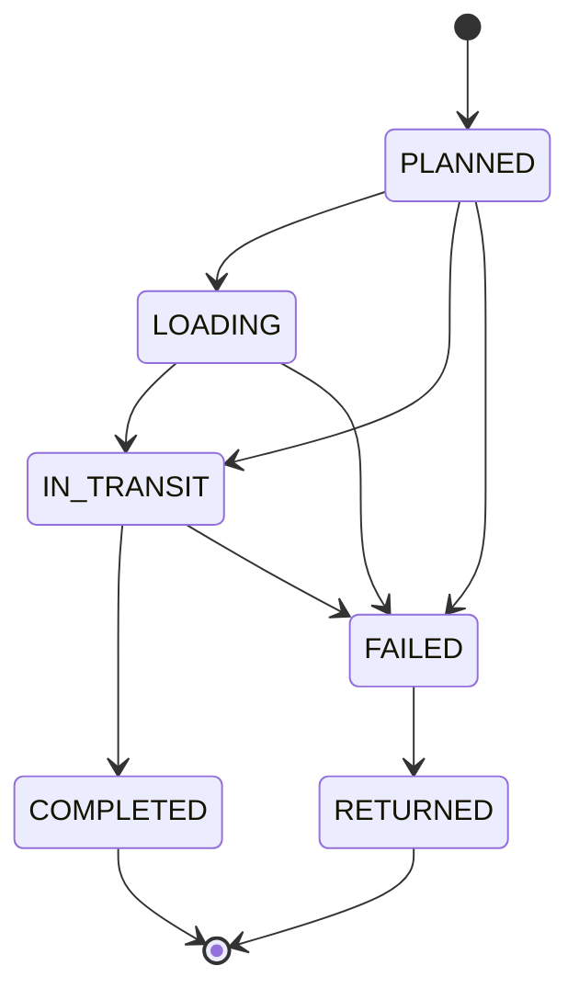
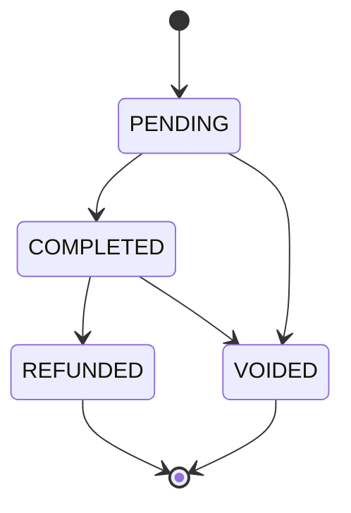
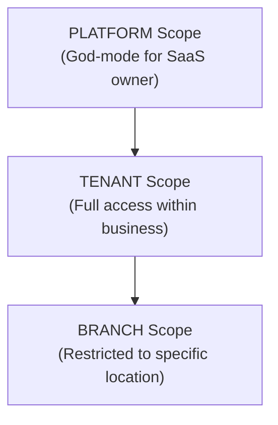
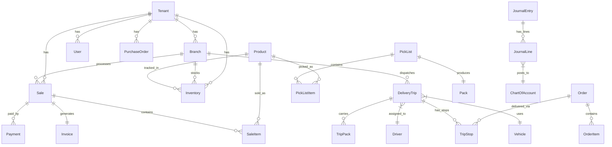

# Antigravity Technical Documentation

> **Distributed, Multi-Tenant Commerce Architecture**
> Version: 2.0.0 · Core Engineering Specification
> Perspective: Principal Cloud Architect
> Last Updated: February 2026

---

## Table of Contents

- [1. Architecture Overview](#1-architecture-overview)
- [2. Technology Stack](#2-technology-stack)
- [3. Request Lifecycle Pipeline](#3-request-lifecycle-pipeline)
- [4. Multi-Tenant Isolation](#4-multi-tenant-isolation)
- [4.1. Data Conflict Resolution (Zero-Gap Hardening)](#41-data-conflict-resolution-zero-gap-hardening)
- [5. Idempotency System](#5-idempotency-system)
- [6. Finite State Machine Framework](#6-finite-state-machine-framework)
- [7. Transactional Outbox Pattern](#7-transactional-outbox-pattern)
- [8. Inventory Ledger & Optimistic Concurrency](#8-inventory-ledger--optimistic-concurrency)
- [9. Scope-Based RBAC](#9-scope-based-rbac)
- [10. Accounting Engine](#10-accounting-engine)
- [11. Commercial Safety System](#11-commercial-safety-system)
- [12. Module Catalog](#12-module-catalog)
- [13. API Reference](#13-api-reference)
- [14. Data Model](#14-data-model)
- [15. Error Handling & Recovery](#15-error-handling--recovery)
- [16. Security Model](#16-security-model)
- [17. Scalability & Performance](#17-scalability--performance)

---

## 1. Architecture Overview

Antigravity is built as a distributed, event-driven system designed for high availability and strong consistency in multi-tenant environments. It leverages the NestJS framework with a Prisma/PostgreSQL storage layer, enforcing strict domain boundaries and transaction safety.

### 1.1 High-Level System Context



### 1.2 Architectural Principles

| Principle | Implementation | Why It Matters |
|:---|:---|:---|
| **Stateless API** | No session data stored on server nodes. JWT tokens carry all auth context. | Any API node can handle any request for any tenant, enabling horizontal scaling. |
| **Tenant Isolation at Data Layer** | `TenantAwarePrismaService` auto-injects `WHERE tenantId = X` on every query. | Even developer mistakes cannot leak cross-tenant data. |
| **Event-Driven Side Effects** | Business events use the Transactional Outbox pattern, not synchronous calls. | Side effects (emails, notifications) never block the primary transaction. |
| **Immutable Records** | Journal entries, inventory ledger entries, and audit logs cannot be modified or deleted. | Provides forensic traceability and audit compliance. |
| **Allocation Before Commitment** | Inventory is allocated (reserved) at order time, committed only upon delivery confirmation. | Prevents phantom stock and aligns revenue recognition with physical reality. |

---

## 2. Technology Stack

| Layer | Technology | Version | Purpose |
|:---|:---|:---|:---|
| **Runtime** | Node.js | 18+ | Server-side JavaScript runtime |
| **Framework** | NestJS | 10.x | Modular, decorator-based API framework with dependency injection |
| **ORM** | Prisma | 5.x | Type-safe database client with migration support |
| **Database** | PostgreSQL | 14+ | Primary relational data store, ACID-compliant |
| **Authentication** | JWT (jsonwebtoken) | — | Stateless token-based authentication |
| **Event System** | @nestjs/event-emitter (EventEmitter2) | — | In-process event bus for domain events |
| **Scheduling** | @nestjs/schedule | — | Cron-like scheduling for outbox processing and periodic tasks |
| **Payments** | Stripe SDK | — | Payment intent creation, webhook handling |
| **Configuration** | @nestjs/config (dotenv) | — | Environment-based configuration management |
| **Frontend** | React | 18.x | Single-page applications for Web Portal, Admin Panel, POS |
| **Mobile** | React Native / Expo | — | Driver App, Warehouse Scanner App |

### 2.1 Project Structure

```
src/
├── main.ts                    # Application bootstrap (port 3000)
├── app.module.ts              # Root module — imports all domain modules
├── common/                    # Shared middleware, guards, utilities
│   ├── middleware/             # CorrelationId, Idempotency, Tenant
│   ├── guards/                # FSM guard utility
│   ├── exceptions/            # Custom exception classes
│   └── utils/                 # Retry helpers, utilities
├── prisma/                    # Prisma service, tenant-aware extension
├── shared/                    # Cross-cutting services (Audit, Outbox, EventBus)
├── auth/                      # JWT authentication, permissions guard
├── accounting/                # Chart of accounts, journal entries, periods
├── sales/                     # POS sales, pricing engine, quotes
├── inventory/                 # Stock management, ledger, transfers
├── warehouse/                 # Pick lists, packs, inventory safety
├── logistics/                 # Delivery trips, drivers, vehicles, stops
├── orders/                    # Order lifecycle, partial fulfillment
├── finance/                   # Chargebacks, tax filing
├── purchase-orders/           # Supplier PO management
├── purchase-returns/          # Return to vendor (RTV)
├── returns/                   # Customer returns
├── invoices/                  # Invoice generation
├── receipts/                  # Receipt management
├── payment/                   # Payment processing
├── cash-session/              # POS cash session management
├── z-reports/                 # End-of-day reconciliation reports
├── customers/                 # Customer CRM
├── suppliers/                 # Supplier registry
├── business-clients/          # B2B client profiles
├── catalog/                   # Global product catalog
├── branches/                  # Branch management
├── analytics/                 # Platform analytics
├── reports/                   # Reporting engine
├── customer-portal/           # Buyer-facing APIs
├── mobile/                    # Mobile app APIs (driver, warehouse)
├── tenant-admin/              # Tenant lifecycle management
├── admin/                     # User offboarding
├── stripe-payments/           # Stripe integration
├── taxes/                     # Tax rate management
├── sales-extensions/          # Void, quote lifecycle
├── procurement/               # Supplier invoice matching
├── public-inventory/          # Public stock visibility
└── scripts/                   # Data seeding, migrations
```

---

## 3. Request Lifecycle Pipeline

Every mutating request undergoes a rigorous multi-stage validation pipeline before touching the database. The stages execute sequentially in this exact order:



### 3.1 Stage 1 — Correlation ID Injection

**File**: `src/common/middleware/correlation-id.middleware.ts`

Every request is tagged with a unique UUID for end-to-end traceability:

```typescript
const incoming = req.headers['x-correlation-id'] as string;
const correlationId = incoming || randomUUID();
(req as any).correlationId = correlationId;
res.setHeader('X-Correlation-ID', correlationId);
```

- **Reads** the `X-Correlation-ID` header if provided (for distributed tracing)
- **Generates** a new UUID if no header is present
- **Attaches** to the request object for downstream use (audit logs, outbox events)
- **Echoes** on the response header for client-side correlation

This allows a single user click to be traced through logs, database queries, audit entries, and outbox events using one identifier.

### 3.2 Stage 2 — Idempotency Enforcement

**File**: `src/common/middleware/idempotency.middleware.ts`

All mutating requests (POST, PATCH, PUT) require an `Idempotency-Key` header:

**Request Flow:**

1. If the request is not a mutation (GET, DELETE) → **pass through**
2. If the path is exempt (`/auth/`, `/api/platform/`, `/operations/status`) → **pass through**
3. If no `Idempotency-Key` header → **reject with 400 Bad Request**
4. Look up the key in the `IdempotencyRecord` table:
   - **Found + Expired** (> 24h): Delete record, proceed as new request
   - **Found + In-Flight** (statusCode = 0): Reject with 409 Conflict
   - **Found + Completed**: **Replay** the cached response (return stored statusCode and body)
   - **Not Found**: Create a new in-flight record and proceed

**Response Interception:**
The middleware wraps `res.json()` to capture the response body and status code, updating the `IdempotencyRecord` upon completion. If the response is a 5xx error, the record is deleted to allow retry.

**Concurrency Safety:**
If two identical requests arrive simultaneously, the database's unique constraint on `(tenantId, idempotencyKey)` causes the second attempt to throw a `P2002` error, which is caught and returned as 409 Conflict.

### 3.3 Stage 3 — Tenant Context Resolution

**File**: `src/common/middleware/tenant.middleware.ts`

Resolves the tenant context for every request:

1. **Header Check**: Looks for `X-Tenant` header (used in development and API testing)
2. **Subdomain Extraction**: Parses the `Host` header to extract the subdomain (e.g., `alpha.antigravity.io` → `alpha`)
3. **Database Lookup**: Resolves the subdomain to a `Tenant` record
4. **Suspension Check**: If the tenant's status is `SUSPENDED`, all non-exempt requests are blocked with 403 Forbidden. Only `/auth/` and `/api/platform/` paths are exempt.
5. **Context Injection**: Attaches `req.tenant` and `req.tenantId` to the request object for all downstream consumers

### 3.4 Stage 4 — JWT Authentication

**File**: `src/auth/jwt-auth.guard.ts`

Standard NestJS JWT authentication:

- Validates the cryptographic signature of the Bearer token
- Extracts and hydrates the user's `userId`, `tenantId`, `email`, and `isPlatformUser` flag
- Attaches the user payload to `req.user`

### 3.5 Stage 5 — Permission Verification

**File**: `src/auth/permissions.guard.ts`

See [Section 9 — Scope-Based RBAC](#9-scope-based-rbac) for the full details.

---

## 4. Multi-Tenant Isolation

### 4.1 The Zero-Leak Guarantee

**File**: `src/prisma/tenant-aware-prisma.service.ts`

The `TenantAwarePrismaService` is a request-scoped service (`Scope.REQUEST`) that wraps the Prisma client with automatic tenant filtering:

```typescript
@Injectable({ scope: Scope.REQUEST })
export class TenantAwarePrismaService {
    get client() {
        const tenantId = this.tenantId;
        const isPlatformUser = this.request.user?.isPlatformUser || false;

        return this.prisma.$extends({
            query: {
                $allModels: {
                    async $allOperations({ model, operation, args, query }) {
                        // Skip isolation for non-tenant models, platform users, or missing context
                        if (!tenantModels.includes(model) || isPlatformUser || !tenantId) {
                            return query(args);
                        }
                        // Auto-inject tenantId...
                    }
                },
            },
        });
    }
}
```

### 4.2 Isolation Behavior by Operation

| Operation | Behavior |
|:---|:---|
| `create` / `createMany` | Automatically sets `tenantId` on the data payload |
| `findFirst` / `findMany` / `count` | Automatically appends `WHERE tenantId = X` to the query |
| `updateMany` / `deleteMany` | Automatically appends `WHERE tenantId = X` |
| `findUnique` | Executes the query, then validates the result's `tenantId` matches the current tenant (post-fetch check) |

### 4.3 Tenant-Aware Models

The following models are subject to automatic tenant filtering:

```
User, Role, Branch, Inventory, Sale, Return, Payment, UserRole,
CashSession, Invoice, Receipt, ZReport, StripePayment, TaxRate,
Customer, Supplier, PurchaseOrder, InventoryLedger, ChartOfAccount,
JournalEntry, AccountingEvent, AccountingPeriod, AuditLog
```

All other models (e.g., `Product`, `Brand`, `Category`, `VehicleFitment`) are global and shared across all tenants.

### 4.4 Platform User Bypass

Users with `isPlatformUser = true` (Platform Administrators) bypass tenant filtering entirely. This is required for platform-wide operations such as:

- Viewing all tenants across the platform
- Managing the global product catalog
- Accessing platform-wide analytics

### 4.5 IDOR Prevention

By design, UUIDs alone are not enough to access data. Even if an attacker guesses a valid Order UUID, the `TenantAwarePrismaService` ensures that the query is always filtered by the authenticated tenant's ID. This neutralizes Insecure Direct Object Reference (IDOR) attacks at the data layer — no application-level checks are needed.

---

### 4.1. Data Conflict Resolution (Zero-Gap Hardening)

To ensure zero-gap consistency under load, the platform uses two primary strategies:

1. **Version-Based OCC**:

   ```typescript
   // Example logic in Sales/Inventory services
   const result = await tx.sku.updateMany({
     where: { id: skuId, version: currentVersion },
     data: { quantity: newQuantity, version: { increment: 1 } }
   });
   if (result.count === 0) throw new ConflictException('Inventory updated by another process');
   ```

2. **Automated Retries**:
   The `withRetry` wrapper is applied to critical service methods. It catches `ConflictException` and specific Prisma lock/unique constraint errors, retrying up to 5 times with jittered exponential backoff.

#### Infrastructure Configuration

For production-grade POS performance, the database connection pool must be scaled relative to the application instances:

- **`connection_limit`**: Minimum 20-30 per instance for high-concurrency environments.
- **`max_wait`**: Adjusted to 20s to accommodate transient contention under peak load.

## 5. Idempotency System

### 5.1 Data Model

The `IdempotencyRecord` table provides persistent, distributed-safe idempotency:

| Field | Type | Purpose |
|:---|:---|:---|
| `id` | UUID | Primary key |
| `tenantId` | String | Tenant scope for the key |
| `userId` | String | Acting user |
| `idempotencyKey` | String | Client-provided unique key |
| `statusCode` | Int | 0 = In-flight, else HTTP status of completed response |
| `responseBody` | JSON | Cached response payload for replay |
| `expiresAt` | DateTime | TTL (24 hours from creation) |

**Unique Constraint**: `@@unique([tenantId, idempotencyKey])` — ensures that the same key cannot be used concurrently within a tenant.

### 5.2 Client Integration

All clients must include the `Idempotency-Key` header on every mutation request:

```http
POST /api/v1/sales HTTP/1.1
Idempotency-Key: sale-20260226-abc123
Content-Type: application/json
Authorization: Bearer <jwt>
```

Best practice: Use a deterministic key derived from the operation context (e.g., `sale-{date}-{cartHash}`) rather than a random UUID.

### 5.3 Exempt Paths

The following paths are exempt from idempotency enforcement:

- `/auth/` — Authentication flows (login, refresh)
- `/api/platform/` — Platform admin operations
- `/operations/status` — Health checks and status endpoints

---

## 6. Finite State Machine Framework

### 6.1 Core Utility

**File**: `src/common/guards/fsm.guard.ts`

The `assertTransition()` function validates that a state transition is permitted:

```typescript
export function assertTransition(
    entityName: string,   // e.g., 'Order', 'DeliveryTrip'
    entityId: string,     // The entity's UUID
    from: string,         // Current status
    to: string,           // Desired new status
    transitions: Record<string, string[]>,  // Allowed transition map
): void {
    const allowed = transitions[from] ?? [];
    if (!allowed.includes(to)) {
        throw new ConflictException({
            entity: entityName,
            entityId,
            yourValue: to,
            currentValue: from,
        });  // HTTP 409 Conflict
    }
}
```

This ensures that business objects follow strictly defined lifecycles. An order cannot jump from `CANCELLED` to `SHIPPED`. A pick list cannot go from `PACKED` back to `PENDING`.

### 6.2 State Machine Definitions

The system defines **14 state machines** covering every lifecycle in the platform:

#### Order Lifecycle



#### Delivery Trip Lifecycle



#### Sale Lifecycle



#### Complete FSM Reference Table

| Entity | States | Terminal States |
|:---|:---|:---|
| **Order** | PENDING, CONFIRMED, PROCESSING, PARTIALLY_FULFILLED, SHIPPED, READY_FOR_PICKUP, OUT_FOR_DELIVERY, DELIVERED, DELIVERY_FAILED, CANCELLED | DELIVERED, CANCELLED |
| **PickList** | CREATED, PICKING, PICKED, PACKED, CANCELLED | PACKED, CANCELLED |
| **DeliveryTrip** | PLANNED, LOADING, IN_TRANSIT, COMPLETED, FAILED, RETURNED | COMPLETED, RETURNED |
| **PurchaseOrder** | DRAFT, SENT, RECEIVED, COMPLETED, CANCELLED | COMPLETED, CANCELLED |
| **Quote** | DRAFT, SENT, ACCEPTED, REJECTED, EXPIRED, CONVERTED, CANCELLED | REJECTED, EXPIRED, CONVERTED, CANCELLED |
| **Sale** | PENDING, COMPLETED, REFUNDED, VOIDED | REFUNDED, VOIDED |
| **PurchaseReturn** | DRAFT, REQUESTED, APPROVED, SHIPPED, COMPLETED, REJECTED | COMPLETED, REJECTED |
| **Return** (Customer) | REQUESTED, APPROVED, RECEIVED, COMPLETED, REJECTED | COMPLETED, REJECTED |
| **Refund** | PENDING, COMPLETED, FAILED | COMPLETED, FAILED |
| **BranchTransfer** | REQUESTED, APPROVED, SHIPPED, RECEIVED, CANCELLED | RECEIVED, CANCELLED |
| **Chargeback** | PENDING, RESOLVED, REJECTED | RESOLVED, REJECTED |
| **TaxFiling** | DRAFT, FILED, CANCELLED | FILED, CANCELLED |
| **Manifest** | DRAFT, SEALED, DISPATCHED, COMPLETED, CANCELLED | COMPLETED, CANCELLED |
| **Substitution** | PENDING, APPROVED, REJECTED | APPROVED, REJECTED |

---

## 7. Transactional Outbox Pattern

### 7.1 The Problem

If a Sale succeeds but the "Send Order Email" step fails, the system is inconsistent — the sale is recorded but the customer never receives confirmation. Direct synchronous side effects create fragile, tightly-coupled systems.

### 7.2 The Solution

**Files**: `src/shared/outbox.service.ts`, `src/shared/event-bus.service.ts`

The Outbox pattern ensures that domain events are only emitted if the database transaction succeeds:

```typescript
@Injectable()
export class OutboxService {
    async schedule(
        tx: Prisma.TransactionClient,  // MUST be called within a transaction
        data: {
            tenantId: string;
            topic: string;       // e.g., 'sale.created', 'delivery.confirmed'
            payload: any;        // Event data
            correlationId?: string;
        },
    ) {
        return tx.outboxEvent.create({
            data: {
                tenantId: data.tenantId,
                topic: data.topic,
                payload: data.payload,
                correlationId: data.correlationId || null,
                status: 'PENDING',
            },
        });
    }
}
```

### 7.3 Processing Pipeline

```
Service (within $transaction)
    → Creates business record (Sale, Order, etc.)
    → Calls outbox.schedule() to create OutboxEvent in SAME transaction
    → Transaction commits atomically (both succeed or both fail)

OutboxProcessor (background, @nestjs/schedule)
    → Polls OutboxEvent table for PENDING events
    → Publishes each event to EventBus
    → Marks event as PROCESSED on success
    → Retries with exponential backoff on failure
    → After 5 failures → moves to DeadLetterStore
```

### 7.4 Event Bus

The `EventBus` wraps NestJS's `EventEmitter2` for in-process event publishing:

```typescript
@Injectable()
export class EventBus {
    constructor(private eventEmitter: EventEmitter2) { }

    emit(eventName: string, payload: any) {
        this.eventEmitter.emit(eventName, payload);
    }
}
```

### 7.5 Guarantees

- **At-Least-Once Delivery**: Every event will be delivered at least once. Consumers must be idempotent.
- **Transactional Consistency**: Events are created in the same transaction as the business operation. If the transaction rolls back, the event is never published.
- **Dead Letter Recovery**: Events that fail 5 times are quarantined in the Dead Letter Store for manual investigation and replay.

---

## 8. Inventory Ledger & Optimistic Concurrency

### 8.1 Design Philosophy

**File**: `src/inventory/inventory-ledger.service.ts`

The inventory system operates on two fundamental principles:

1. **Permanent, Immutable Ledger**: Every stock movement (sale, receipt, adjustment, transfer, return) creates an `InventoryLedger` entry that can never be modified or deleted.
2. **Safety Law**: Inventory quantity cannot be modified without a corresponding ledger entry. There is no way to change stock levels without creating a traceable record.

### 8.2 Transaction Flow

```typescript
async recordTransaction(data: RecordTransactionDto, externalTx?: Prisma.TransactionClient) {
    if (externalTx) {
        return this.executeInventoryLogic(data, externalTx);
    }
    return withRetry(
        async () => {
            return await this.prisma.$transaction(async (tx) => {
                return this.executeInventoryLogic(data, tx);
            }, {
                isolationLevel: Prisma.TransactionIsolationLevel.Serializable,
            });
        },
        { maxAttempts: 3, baseDelayMs: 100, maxDelayMs: 1000 },
    );
}
```

**Key Features:**

- **Serializable Isolation**: The highest isolation level prevents phantom reads and dirty writes
- **Retry with Exponential Backoff**: Concurrency conflicts are automatically retried (up to 3 attempts, 100ms–1000ms delay)
- **External Transaction Support**: Can participate in a larger transaction (e.g., when called from `SalesService.create()`)

### 8.3 Optimistic Concurrency Control (OCC)

The inventory table uses a `version` field to detect concurrent modifications:

```typescript
const result = await tx.inventory.updateMany({
    where: {
        id: currentInventory.id,
        tenantId,
        version: currentInventory.version,  // Must match current version
    },
    data: {
        quantity: newQty,
        costPrice: newCost,
        version: { increment: 1 },  // Bump version on success
    },
});

if (result.count === 0) {
    throw new Error('CONCURRENCY_CONFLICT');  // Triggers retry
}
```

**Scenario**: Two warehouse staff try to pick the same last item at the same millisecond:

1. Both read `version: 5`
2. Staff A's update succeeds (`version: 5 → 6`)
3. Staff B's update finds no row with `version: 5` → `count === 0` → throws CONCURRENCY_CONFLICT
4. Staff B's transaction retries, reads `version: 6` with updated quantity, and either succeeds or throws "Insufficient stock"

### 8.4 Weighted Average Cost Calculation

When new inventory is received, the cost price is recalculated using the Weighted Average method:

```
New Cost = (Old Cost × Old Qty + New Unit Cost × New Qty) ÷ Total Qty
```

```typescript
if (quantityChange > 0 && transactionUnitCost) {
    const oldTotalValue = currentCost.mul(effectiveCurrentQty);
    const addedValue = transactionUnitCost.mul(quantityChange);
    const newTotalValue = oldTotalValue.plus(addedValue);
    if (newQty > 0) {
        newCost = newTotalValue.div(newQty);
    }
}
```

When inventory is sold (negative quantity change), the current cost price is used as the transaction unit cost for COGS calculations.

### 8.5 Stock Validation

The system prevents negative stock for sales:

```typescript
if (type === 'SALE' && newQty < 0) {
    throw new BadRequestException(
        `Insufficient stock for product ${productId}. Current: ${currentQty}, Requested: ${Math.abs(quantityChange)}`
    );
}
```

---

## 9. Scope-Based RBAC

### 9.1 Permission Model

**File**: `src/auth/permissions.guard.ts`

The RBAC system uses three hierarchical scopes:



| Scope | Behavior | Use Case |
|:---|:---|:---|
| **PLATFORM** | Bypasses tenant and branch filters. Sees all data across all tenants. | Platform Admin managing tenant lifecycle, global catalog |
| **TENANT** | Access scoped to the user's tenant. Must match `tenantId`. Bypasses branch filter. | Tenant Admin, Finance staff who need cross-branch visibility |
| **BRANCH** | Access scoped to the user's tenant AND specific branch. Must match both `tenantId` and `branchId`. | Cashiers, warehouse staff, drivers who operate at a single location |

### 9.2 Permission Resolution

When a request reaches the `PermissionsGuard`, the following resolution process occurs:

1. **Extract Required Permissions**: Read the `@RequirePermissions()` decorator on the controller method
2. **Resolve User Roles**: Fetch all `UserRole` records for the authenticated user, including nested `Role` → `RolePermission` → `Permission` relationships
3. **Scope-Based Filtering**:
   - **PLATFORM** roles: All permissions are granted regardless of tenant/branch context
   - **TENANT** roles: Permissions granted only if the role's `tenantId` matches the request's tenant
   - **BRANCH** roles: Permissions granted only if both `tenantId` AND `branchId` match
4. **Permission Check**: Verify the user has **any** of the required permissions (OR logic)
5. **Deny**: If no matching permission is found, throw 403 Forbidden

### 9.3 Permission Codes Reference

| Code | Description | Typical Role |
|:---|:---|:---|
| `MANAGE_CATALOG` | Create/Edit Global Products | Platform Admin |
| `MANAGE_TENANTS` | Suspend/Reactivate Tenants | Platform Admin |
| `MANAGE_PRICING` | Create/Edit Price Rules | Tenant Admin |
| `MANAGE_FINANCE` | Edit Chart of Accounts and Tax Rates | Financial Admin |
| `CLOSE_PERIOD` | Lock accounting periods | Financial Controller |
| `MANAGE_BRANCH` | Create/Edit Branches | Admin |
| `VIEW_COST_PRICE` | See product cost vs selling price | Manager, Admin |
| `CREATE_QUOTE` | Generate quotes for clients | Sales Rep |
| `APPROVE_QUOTE` | Approve discounts above threshold | Sales Manager |
| `MANAGE_QUOTES` | Full quote lifecycle management | Sales, Admin |
| `VOID_SALE` | Void completed sales | Manager, Admin |
| `MANAGE_FLEET` | Create trips, dispatch vehicles | Logistics Manager |
| `COMPLETE_DELIVERY` | Mark delivery stops as complete | Driver |
| `VIEW_PICKLISTS` | View warehouse pick lists | Warehouse Staff |
| `PICK_ORDERS` | Execute picking operations | Warehouse Staff |
| `CANCEL_PICKLIST` | Cancel an active pick list | Warehouse Manager |
| `CREATE_PURCHASE_RETURN` | Initiate an RTV | Inventory Manager |
| `APPROVE_PURCHASE_RETURN` | Approve/reject RTV requests | Manager |
| `MANAGE_PAYMENTS` | Configure payment gateways | Admin |
| `APPROVE_PURCHASE` | Approve high-value purchase orders | Finance Manager |
| `APPROVE_REFUND` | Authorize refund processing | Store Manager |
| `MANAGE_CLAIMS` | File/update logistics claims | Logistics Manager |
| `RESOLVE_EXCEPTION` | Close delivery exceptions | Support/Admin |

---

## 10. Accounting Engine

### 10.1 Design Philosophy

**File**: `src/accounting/accounting.service.ts`

The accounting engine implements double-entry bookkeeping at the core. Every financial event produces balanced journal entries where the sum of debits equals the sum of credits.

### 10.2 Chart of Accounts

The default chart of accounts follows standard accounting conventions:

```typescript
export const ACCOUNT_CODES = {
    CASH_ON_HAND: '1000',
    BANK_ACCOUNT: '1010',
    ACCOUNTS_RECEIVABLE: '1100',
    INVENTORY_ASSET: '1200',
    ACCOUNTS_PAYABLE: '2000',
    VAT_PAYABLE: '2100',
    CUSTOMER_DEPOSITS: '2200',
    OWNERS_EQUITY: '3000',
    RETAINED_EARNINGS: '3100',
    SALES_REVENUE: '4000',
    SERVICE_REVENUE: '4100',
    COST_OF_GOODS_SOLD: '5000',
    RENT_EXPENSE: '5100',
    SALARIES_EXPENSE: '5200',
    UTILITIES_EXPENSE: '5300',
    GENERAL_EXPENSE: '5400',
};
```

### 10.3 Automated Journal Entries

When a sale is created, the system automatically posts dual journal entries:

**Revenue Entry:**

```
DR  1000 Cash on Hand ............. $1,200.00
    CR  4000 Sales Revenue ......... $1,200.00
```

**COGS Entry:**

```
DR  5000 Cost of Goods Sold ........ $800.00
    CR  1200 Inventory Asset ........ $800.00
```

These entries are created atomically within the same database transaction as the sale itself. If the journal entry creation fails, the entire sale transaction rolls back.

### 10.4 Journal Entry Lifecycle

| Operation | Behavior |
|:---|:---|
| **Create** | Journal entry created with status `DRAFT`. Validates balanced debits/credits. |
| **Post** | Transitions to `POSTED`. Marks as immutable. Verifies accounting period is open. |
| **Reverse** | Creates a NEW entry with inverted amounts. Original entry is NOT modified. Requires a mandatory reason. |

### 10.5 Accounting Period Locking

```typescript
async closeAccountingPeriod(periodId: string) {
    // 1. Verify period exists and is currently OPEN
    // 2. Check for any pending (unposted) journal entries in the period
    // 3. Update period status to CLOSED
    // 4. Log the close action in audit trail
}
```

Once a period is closed:

- No new journal entries can be created with dates in that period
- No existing entries in that period can be modified
- Any staff attempting to post to a closed period receives a clear error message with the period's close date

### 10.6 Correctness Law

**Every transaction must have balanced journal entries.**

The system enforces: `Sum(Debits) === Sum(Credits)` for every journal entry. If the amounts don't balance, the journal entry is rejected at creation time, before it can affect any account balances.

---

## 11. Commercial Safety System

### 11.1 Allocation vs. Commitment Model

The platform distinguishes between two inventory states:

| State | Trigger | Inventory Effect | Revenue Effect |
|:---|:---|:---|:---|
| **Allocated** | Order created | Quantity reserved (Available decreases, On-Hand unchanged) | No revenue recognized |
| **Committed** | Driver confirms delivery | Quantity permanently decremented (On-Hand decreases) | Revenue recognized, journal entry posted |

**Why This Matters**: If a delivery fails, allocated inventory automatically returns to available without any manual intervention. Revenue is never booked for undelivered goods. This ensures the P&L statement reflects physical reality.

### 11.2 Commercial Safety Service

**File**: `src/logistics/commercial-safety.service.ts`

The `CommercialSafetyService` handles two critical operations:

#### Replacement Processing

```
Commercial Safety Law R1: Must have exactly one proof of loss 
(either a verified Return OR a DeliveryException, not both, not neither)
```

When processing a replacement order:

1. Validates proof of loss (return record or delivery exception)
2. Creates a replacement order linked to the original
3. Allocates inventory for the replacement
4. Creates appropriate ledger entries

#### Loss Processing

When a shipment is confirmed lost:

1. Writes off the inventory (permanent decrement)
2. Creates a LOSS ledger entry
3. Triggers a refund for the customer
4. Creates appropriate journal entries (DR Loss Expense / CR Inventory Asset)

### 11.3 Inventory Safety Service

**File**: `src/warehouse/inventory-safety.service.ts`

Provides safety-critical inventory operations used by the delivery system:

- **Commit Inventory**: Permanently decrements stock when a delivery is confirmed. This is the final, irreversible step.
- **Release Allocation**: Returns reserved stock to available when a delivery fails or an order is cancelled.

---

## 12. Module Catalog

The application comprises 40+ NestJS modules, each encapsulating a specific domain:

### Core Infrastructure

| Module | Responsibility | Key Services |
|:---|:---|:---|
| `PrismaModule` | Database connectivity, tenant-aware extension | `PrismaService`, `TenantAwarePrismaService` |
| `AuthModule` | Authentication, JWT management, permission guards | `AuthService`, `JwtAuthGuard`, `PermissionsGuard` |
| `SharedModule` | Cross-cutting concerns | `AuditService`, `OutboxService`, `EventBus` |
| `ConfigModule` | Environment-based configuration | Built-in NestJS |
| `ScheduleModule` | Background task scheduling | Built-in NestJS |

### Commerce Domains

| Module | Responsibility | Key Services |
|:---|:---|:---|
| `SalesModule` | POS sales, pricing engine | `SalesService`, `PriceEngineService`, `QuotationsService` |
| `SalesExtensionsModule` | Sale voiding, quote lifecycle | `SalesExtensionsService`, `QuoteService` |
| `OrdersModule` | Order lifecycle, fulfillment | `OrdersService`, `PartialFulfillmentService` |
| `InventoryModule` | Stock management, ledger, transfers | `InventoryService`, `InventoryLedgerService`, `BranchTransferService` |
| `WarehouseModule` | Pick lists, packs, scanning | `PickListsService`, `PacksService`, `InventorySafetyService` |
| `LogisticsModule` | Trips, stops, drivers, vehicles | `DeliveryTripsService`, `DriversService`, `VehiclesService`, `LogisticsService`, `CommercialSafetyService`, `ManifestService`, `FulfillmentProvidersService` |
| `PurchaseOrdersModule` | Supplier PO management | `PurchaseOrdersService` |
| `PurchaseReturnsModule` | Return to vendor (RTV) | `PurchaseReturnsService` |
| `ReturnsModule` | Customer returns | `ReturnsService` |

### Financial Domains

| Module | Responsibility | Key Services |
|:---|:---|:---|
| `AccountingModule` | Chart of accounts, journal entries, periods | `AccountingService`, `AuditService` |
| `AccountingReportsModule` | Financial reporting | `AccountingReportsService` |
| `FinanceModule` | Chargebacks, tax filing | `ChargebacksService`, `ChargebackResolutionService`, `TaxFilingService` |
| `InvoicesModule` | Invoice generation | `InvoicesService` |
| `ReceiptsModule` | Receipt management | `ReceiptsService` |
| `PaymentsModule` | Payment processing | `PaymentService` |
| `CashSessionModule` | POS cash sessions | `CashSessionService` |
| `ZReportsModule` | End-of-day reconciliation | `ZReportsService` |
| `StripePaymentsModule` | Stripe integration | `StripePaymentsService` |
| `TaxModule` | Tax rate management | `TaxService` |

### CRM & Catalog

| Module | Responsibility | Key Services |
|:---|:---|:---|
| `CustomersModule` | Customer CRM | `CustomersService` |
| `SuppliersModule` | Supplier registry | `SuppliersService` |
| `BusinessClientsModule` | B2B client profiles | `BusinessClientsService` |
| `CartModule` | Shopping cart management | `CartService` |
| `PublicInventoryModule` | Public stock queries | `PublicInventoryService` |

### Platform & Administration

| Module | Responsibility | Key Services |
|:---|:---|:---|
| `TenantAdminModule` | Tenant suspend/reactivate | `TenantAdminService` |
| `AdminModule` | User offboarding | `UserOffboardingService` |
| `BranchesModule` | Branch management | `BranchesService` |
| `AnalyticsModule` | Platform analytics | `AnalyticsService` |
| `ReportsModule` | Reporting engine | `ReportsService` |
| `ProcurementModule` | Supplier invoice matching | `SupplierInvoiceService` |

### Client-Facing

| Module | Responsibility | Key Services |
|:---|:---|:---|
| `CustomerPortalModule` | Buyer-facing APIs | `PortalInventoryController`, `PortalOrdersController`, `PortalFinancialsController`, `PortalSubstitutionsController` |
| `MobileModule` | Mobile app APIs | `DriverMobileController`, `WarehouseMobileController` |

---

## 13. API Reference

### 13.1 API Conventions

| Convention | Value |
|:---|:---|
| Base Path | `http://localhost:3000` |
| Authentication | Bearer JWT in `Authorization` header |
| Tenant Context | `X-Tenant` header or subdomain |
| Idempotency | `Idempotency-Key` header on all mutations |
| Correlation | `X-Correlation-ID` header (auto-generated if absent) |

- **Optimistic Concurrency Control (OCC)**: Using a `version` field for critical entities (Inventory, Sales) to handle concurrent updates without pessimistic locking.
- **Retry Pattern**: `withRetry` utility implements exponential backoff for transient errors (Prisma code `P2034`, `P2002` on conflicts).
- **Tenant Isolation**: `TenantAwarePrismaService` injects `@TenantId` filters into all queries automatically.
| Content Type | `application/json` |

### 13.2 Endpoint Groups

#### Authentication

| Method | Path | Description |
|:---|:---|:---|
| POST | `/auth/login` | Authenticate and receive JWT |
| POST | `/auth/register` | Create new user account |
| POST | `/auth/refresh` | Refresh JWT token |

#### Sales & POS

| Method | Path | Description |
|:---|:---|:---|
| POST | `/api/v1/sales` | Create a new sale (atomic: sale + items + inventory + journal) |
| GET | `/api/v1/sales` | List all sales for tenant |
| GET | `/api/v1/sales/:id` | Get sale details |
| POST | `/api/v1/sales-extensions/sales/:id/void` | Void a completed sale |
| POST | `/api/v1/sales/:id/refund` | Process a refund |

#### Quotes

| Method | Path | Description |
|:---|:---|:---|
| POST | `/api/v1/sales-extensions/quotes` | Create a new quote |
| GET | `/api/v1/sales-extensions/quotes/:id` | Get quote details |
| POST | `/api/v1/sales-extensions/quotes/:id/convert` | Convert accepted quote to order |
| POST | `/api/v1/sales-extensions/quotes/:id/reject` | Reject a quote |

#### Orders

| Method | Path | Description |
|:---|:---|:---|
| POST | `/api/v1/orders` | Create a new order |
| GET | `/api/v1/orders` | List orders |
| GET | `/api/v1/orders/:id` | Get order details |
| PATCH | `/api/v1/orders/:id/status` | Update order status |

#### Inventory

| Method | Path | Description |
|:---|:---|:---|
| GET | `/api/v1/inventory` | List inventory for branch |
| POST | `/api/v1/inventory/adjust` | Adjust stock with reason code |
| GET | `/api/v1/inventory/ledger` | View inventory movement history |
| POST | `/api/v1/inventory/transfers` | Create inter-branch transfer |
| PATCH | `/api/v1/inventory/transfers/:id` | Update transfer status |

#### Purchase Orders

| Method | Path | Description |
|:---|:---|:---|
| POST | `/api/v1/purchase-orders` | Create PO |
| GET | `/api/v1/purchase-orders` | List POs |
| POST | `/api/v1/purchase-orders/:id/receive` | Record goods receipt |

#### Purchase Returns

| Method | Path | Description |
|:---|:---|:---|
| POST | `/api/v1/purchase-returns` | Create RTV |
| POST | `/api/v1/purchase-returns/:id/approve` | Approve RTV |
| POST | `/api/v1/purchase-returns/:id/reject` | Reject RTV |
| POST | `/api/v1/purchase-returns/:id/ship` | Mark RTV as shipped |
| POST | `/api/v1/purchase-returns/:id/complete` | Complete RTV |

#### Logistics

| Method | Path | Description |
|:---|:---|:---|
| POST | `/logistics/trips` | Create delivery trip |
| POST | `/logistics/trips/:id/add-stop` | Add stop to trip |
| POST | `/logistics/trips/:id/add-pack` | Add pack to trip |
| POST | `/logistics/trips/:id/start-loading` | Begin loading phase |
| POST | `/logistics/trips/:id/start` | Dispatch trip |
| POST | `/logistics/stops/:id/arrive` | Mark arrival at stop |
| POST | `/logistics/stops/:id/complete` | Complete stop (delivered/failed) |
| POST | `/logistics/trips/:id/complete` | Complete entire trip |
| POST | `/logistics/trips/:id/fail` | Fail entire trip |
| GET | `/logistics/trips` | List trips |

#### Warehouse

| Method | Path | Description |
|:---|:---|:---|
| GET | `/warehouse/picklists` | List pick lists |
| GET | `/warehouse/picklists/:id` | Get pick list details |
| POST | `/warehouse/picklists/:id/start` | Begin picking |
| POST | `/warehouse/picklists/:id/pick-item` | Pick an item (barcode verification) |
| POST | `/warehouse/picklists/:id/cancel` | Cancel pick list |
| POST | `/warehouse/packs/:id/seal` | Seal a pack |

#### Accounting

| Method | Path | Description |
|:---|:---|:---|
| GET | `/api/v1/accounting/accounts` | Get chart of accounts |
| POST | `/api/v1/accounting/accounts` | Create account |
| POST | `/api/v1/accounting/journal-entries` | Create journal entry |
| POST | `/api/v1/accounting/journal-entries/:id/post` | Post journal entry |
| POST | `/api/v1/accounting/journal-entries/:id/reverse` | Reverse journal entry |
| POST | `/api/v1/accounting/periods/:id/close` | Close accounting period |

#### Platform Administration

| Method | Path | Description |
|:---|:---|:---|
| POST | `/api/platform/tenants/:id/suspend` | Suspend a tenant |
| POST | `/api/platform/tenants/:id/reactivate` | Reactivate a tenant |

#### Customer Portal (Buyer-Facing)

| Method | Path | Description |
|:---|:---|:---|
| GET | `/portal/inventory` | Public product availability |
| POST | `/portal/orders` | Place an order |
| GET | `/portal/orders/:id` | Track order status |
| GET | `/portal/financials` | Account balance and invoices |
| GET | `/portal/substitutions` | Compatible product alternatives |

---

## 14. Data Model

### 14.1 Entity Relationship Overview



### 14.2 Key Models

| Model | Key Fields | Tenant-Scoped | Purpose |
|:---|:---|:---|:---|
| `Tenant` | id, name, subdomain, status, suspensionReason | No (global) | Multi-tenant business entity |
| `User` | id, email, tenantId | Yes | System user |
| `Branch` | id, name, address, phone, tenantId | Yes | Physical business location |
| `Product` | id, name, brandId, categoryId, unitOfMeasure | No (global) | Global catalog item |
| `Inventory` | id, tenantId, branchId, productId, quantity, costPrice, sellingPrice, version | Yes | Per-branch stock record with OCC |
| `InventoryLedger` | id, tenantId, branchId, productId, type, quantityChange, costPrice, referenceType, referenceId | Yes | Immutable stock movement log |
| `Sale` | id, tenantId, branchId, status, totalAmount, voidReason | Yes | POS transaction record |
| `Order` | id, tenantId, branchId, status, customerId | Yes | Fulfillment order |
| `PurchaseOrder` | id, tenantId, supplierId, status, totalCost | Yes | Supplier procurement document |
| `DeliveryTrip` | id, tenantId, branchId, status, mode, driverId, vehicleId | Yes | Logistics trip with stops |
| `PickList` | id, tenantId, branchId, status | Yes | Warehouse pick assignment |
| `Pack` | id, tenantId, status | Yes | Sealed delivery unit |
| `Quote` | id, tenantId, quoteNumber, status, businessClientId, validUntil | Yes | B2B price quotation |
| `JournalEntry` | id, tenantId, reference, date, status | Yes | Double-entry accounting record |
| `ChartOfAccount` | id, tenantId, code, name, type, isSystem | Yes | GL account definition |
| `AccountingPeriod` | id, tenantId, startDate, endDate, isClosed | Yes | Financial period with lock |
| `AuditLog` | id, tenantId, userId, action, entityType, entityId, oldValue, newValue, correlationId | Yes | Immutable action log |
| `IdempotencyRecord` | id, tenantId, idempotencyKey, statusCode, responseBody, expiresAt | Yes | Idempotency tracking |
| `OutboxEvent` | id, tenantId, topic, payload, status, correlationId | Yes | Transactional outbox queue |

---

## 15. Error Handling & Recovery

### 15.1 Custom Exception Types

| Exception | HTTP Status | When Thrown |
|:---|:---|:---|
| `BadRequestException` | 400 | Invalid input, insufficient stock, missing required field |
| `ForbiddenException` | 403 | Missing permissions, suspended tenant, unauthorized access |
| `NotFoundException` | 404 | Entity not found in database |
| `ConflictException` | 409 | Invalid state transition (FSM violation), idempotency conflict, OCC conflict |

### 15.2 Compensation Flows

When a complex operation fails partially, the system uses compensating transactions rather than manual cleanup:

**Sale Voiding (Mathematical Inverse):**
The `SalesService.voidSale()` method is designed as the exact mathematical inverse of `SalesService.create()`:

| Create Step | Void Step |
|:---|:---|
| Decrement inventory (allocation) | Increment inventory (restoration) |
| Post revenue journal entry | Post reversing journal entry |
| Generate invoice | Cancel invoice |
| Mark sale as COMPLETED | Mark sale as VOIDED with mandatory reason |

All void steps execute within a single `$transaction`. If any step fails, the entire void rolls back and the sale remains in its original state.

### 15.3 Retry Strategy

**File**: `src/common/utils/retry.helper.ts`

The `withRetry` utility provides configurable retry logic:

```typescript
withRetry(operation, {
    maxAttempts: 3,       // Maximum retry attempts
    baseDelayMs: 100,     // Initial delay between retries
    maxDelayMs: 1000,     // Maximum delay cap
});
```

Used for:

- Inventory ledger transactions (OCC conflicts)
- Outbox event processing (external service failures)
- Database connection transients

### 15.4 Dead Letter Recovery

Events that exhaust their retry budget (5 attempts) are moved to the Dead Letter Store:

1. **Detection**: System administrators are alerted via the Dead Letter dashboard
2. **Investigation**: Each dead letter shows the original topic, payload, failure reason, and retry count
3. **Resolution**: Once the root cause is fixed (e.g., external API restored), dead letters can be manually replayed
4. **Prevention**: Recurring dead letters for the same topic indicate a systemic issue requiring engineering investigation

---

## 16. Security Model

### 16.1 Authentication

- **JWT-Based**: Stateless authentication using signed JWT tokens
- **Token Payload**: `{ userId, tenantId, email, isPlatformUser }`
- **Token Validation**: Cryptographic signature verified on every request via `JwtAuthGuard`
- **No Server Sessions**: No session data stored on API nodes, enabling seamless horizontal scaling

### 16.2 Tenant Suspension Enforcement

When a tenant is suspended (`status = 'SUSPENDED'`):

- `TenantMiddleware` blocks ALL API requests for the tenant's users with 403 Forbidden
- Only `/auth/` and `/api/platform/` paths are exempt (to allow login and platform admin operations)
- The suspension reason is included in the error response
- Suspension takes effect immediately — active sessions are blocked on their next request

### 16.3 Audit Service

**File**: `src/shared/audit.service.ts`

Every mutation in the system is audited with:

| Field | Description |
|:---|:---|
| `tenantId` | Which business |
| `userId` | Who performed the action |
| `action` | What was done (CREATE, UPDATE, DELETE, VOID, APPROVE, etc.) |
| `entityType` | What type of record was affected (Sale, Order, Inventory, etc.) |
| `entityId` | Which specific record |
| `oldValue` | State before the change (JSON snapshot) |
| `newValue` | State after the change (JSON snapshot) |
| `correlationId` | Request correlation ID for end-to-end tracing |
| `ipAddress` | Origin IP address |
| `createdAt` | Timestamp |

**Key Properties:**

- **Non-Repudiation**: Logs are immutable and timestamped — they serve as evidence in financial disputes
- **Transaction Safety**: When called within a Prisma transaction (`tx` parameter), audit log failure causes the entire transaction to roll back, ensuring no mutation occurs without a corresponding audit record
- **Graceful Degradation**: When called outside a transaction, audit log failure is caught and logged but does NOT crash the business operation

### 16.4 IDOR Prevention (Defense in Depth)

The system implements IDOR prevention at three layers:

1. **Data Layer**: `TenantAwarePrismaService` auto-injects tenant filtering on every query
2. **Auth Layer**: `PermissionsGuard` validates scope-based access (Platform/Tenant/Branch)
3. **Application Layer**: Services validate entity ownership before performing operations

Even if all auth checks were bypassed, the data layer would still prevent cross-tenant data access.

---

## 17. Scalability & Performance

### 17.1 Index Strategy

Every tenant-scoped table is indexed on `(tenantId, ...)` to ensure that multi-tenant lookups remain `O(log N)` as the platform grows to millions of records:

```sql
-- Example: Inventory queries are always filtered by tenant + branch + product
CREATE INDEX idx_inventory_tenant_branch ON inventory(tenant_id, branch_id, product_id);
```

### 17.2 Statelessness

No session data is stored on individual server nodes. The entire request context is carried in:

- JWT token (user identity, tenant identity)
- Request headers (tenant subdomain, correlation ID, idempotency key)
- Database (persistent state)

Any API node can handle any request for any tenant, enabling:

- Seamless horizontal scaling during high-traffic events
- Zero-downtime deployments (rolling restarts)
- Load balancer distribution without sticky sessions

### 17.3 Connection Pooling

Prisma manages PostgreSQL connection pooling automatically:

- Connections are shared across requests within a node
- Transaction isolation (Serializable for inventory, default for others) is managed per-transaction
- Connection limits are configured based on expected concurrent load

### 17.4 Request-Scoped Services

The `TenantAwarePrismaService` is `Scope.REQUEST` — a new instance is created for each HTTP request with the correct tenant context. This ensures:

- No tenant context leakage between requests
- Clean isolation without global state
- Automatic garbage collection after request completion

### 17.5 Event Processing

The Outbox Processor runs as a background scheduled task:

- **Polling Interval**: Configurable (default: every 5 seconds)
- **Batch Size**: Processes events in batches to avoid overwhelming external services
- **Backpressure**: Failed events are retried with exponential backoff, preventing thundering herd effects
- **Dead Letter Threshold**: After 5 failures, events are quarantined to prevent infinite retry loops

---

> **Document Version:** 2.0.0 (Complete Technical Specification)
> **Classification:** Internal Engineering Document
> **Drafted By:** Antigravity Architecture Team
> **Confidentiality:** For Engineering Staff Only
