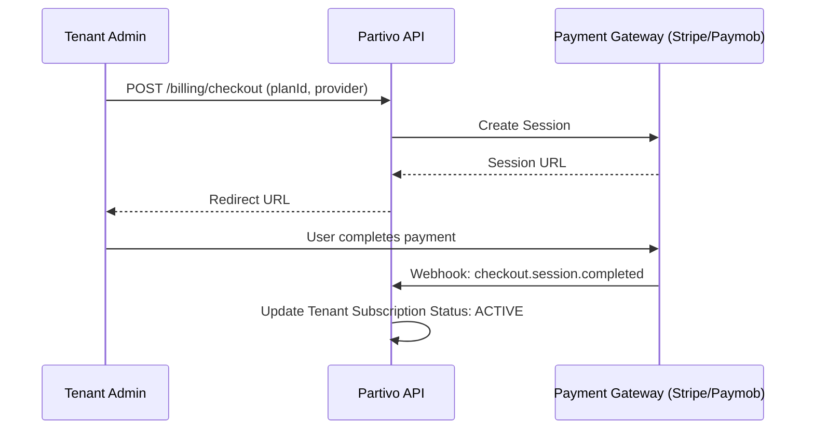
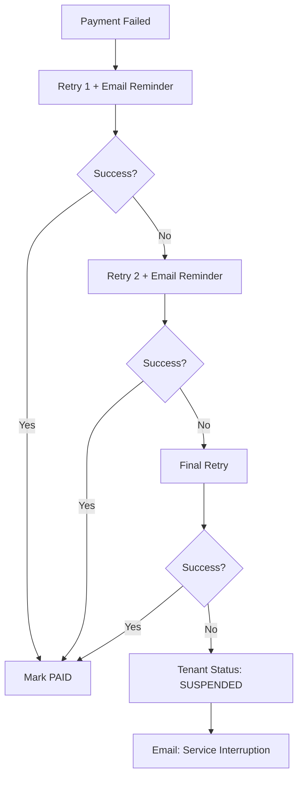

# Partivo SaaS Billing Flow

## 1. Subscription Creation

## 2. Invoicing & Renewal

- `Cron Job` runs every hour.
- Identifies expiring subscriptions.
- Creates `BillingInvoice` (ISSUED).
- Triggers `Charge` via Stripe/Paymob.
- Success -> Webhook `invoice.paid` -> `invoiceNumber` Generated.

## 3. Dunning & Suspension (Failed Payments)

## 4. Self-Service Portal

- `GET /billing/plan`: Returns active plan and usage.
- `GET /billing/invoices`: List history.
- `GET /billing/invoices/:id/pdf`: Direct PDF download.
- `PATCH /billing/subscription`: Update plan (Stripe/Paymob portal redirect).
