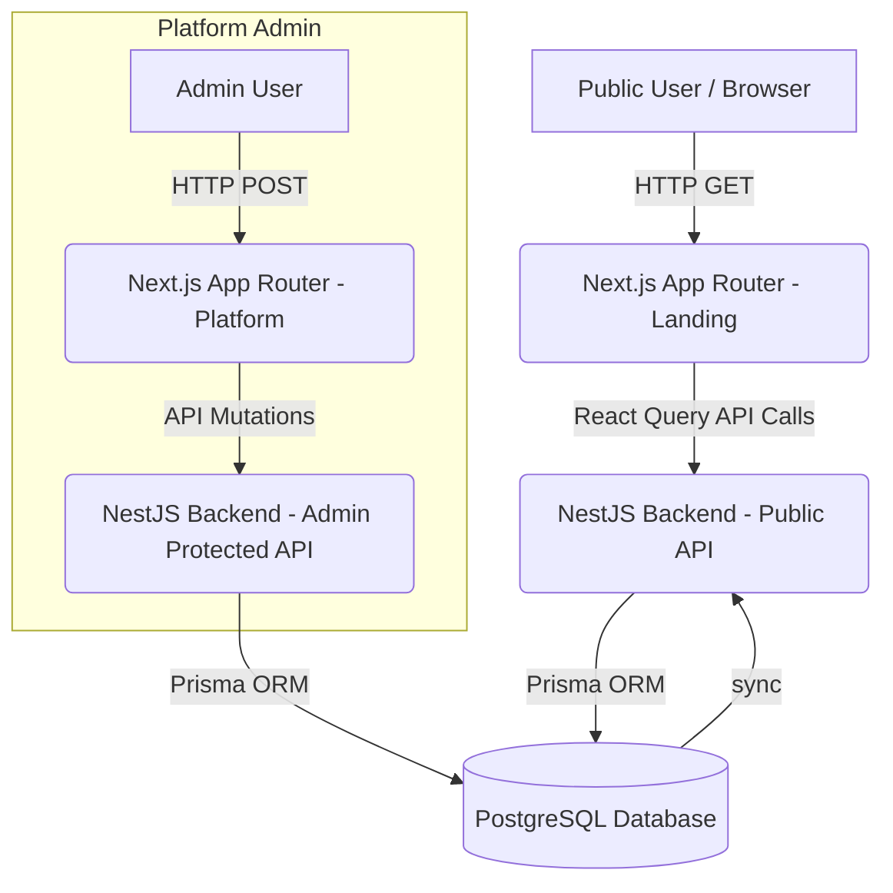

# Landing Portal Architecture Overview

## 1. High-Level Overview
The Landing Portal is the public-facing facet of the Partivo SaaS platform. It acts as an orchestrator for dynamic content managed internally via the Platform Admin CMS module.

## 2. System Architecture

## 3. Data Flow Diagrams

### Content Resolution Flow
1. **User requests route** (e.g., `/en/landing`).
2. **Next.js** renders the Layout and page components.
3. **React Query** hooks (`useCMSContent`) initiate requests to `/api/public/content/:key`.
4. **Backend `PublicInfoController`** routes request to `PublicInfoService`.
5. **Prisma** fetches the active document for the requested key.
6. Data is returned; **React Query caches the response** for 5 minutes.
7. The component re-renders, replacing the local skeleton loader with the hydrated data.

## 4. CMS Entity Relationships
- **LandingPageContent**: Key-value pair configuration for structured UI sections (Hero, CTA, Features, Footer) handling JSON payloads for LTR and RTL configurations.
- **LandingTestimonial**: Structured records storing quotes, authors, roles, and ordering fields for carousel integration.
- **LandingFAQ**: Question-answer pairings designated for public support portals and landing page accordion sections.
- **LegalContent**: Markdown or HTML-structured data storing compliance policies (e.g., Privacy Policy, Terms and Conditions).

## 5. Infrastructure Notes
- Application relies heavily on client-side fetching due to the highly dynamic nature of the multi-lingual landing page requirements.
- Ensure reverse proxy (e.g., Nginx or Traefik) and caching layers do not overly aggressively cache the `/api/public/*` routes, mapping caching rules to respect language headers or queries when applicable, keeping in mind React Query handles state application-side.
