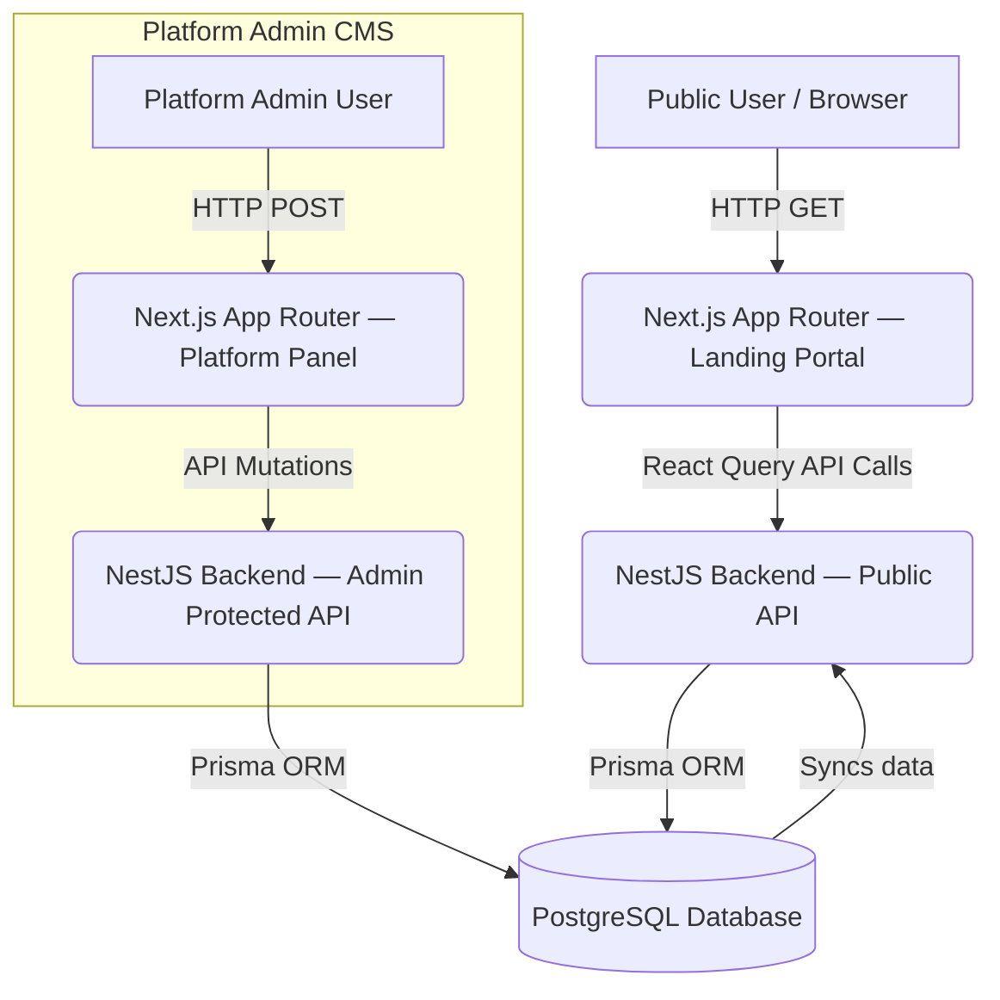

# Partivo Landing Portal — Master Reference Document

> **Version**: 1.0.0 — March 2026  
> **Status**: Living Document — reflects both original specifications and codebase-verified current implementation  
> **Audience**: Architects, Business Analysts, Product Owners, Frontend Engineers, QA, Marketing  

---

## Table of Contents

1. [Product Vision & Business Context](#1-product-vision--business-context)
2. [Target Personas & Conversion Funnel](#2-target-personas--conversion-funnel)
3. [Portal Structure & Page Inventory](#3-portal-structure--page-inventory)
4. [System Architecture](#4-system-architecture)
5. [Technical Specification](#5-technical-specification)
6. [CMS Integration & Data Model](#6-cms-integration--data-model)
7. [Self-Service Onboarding — Functional Specification](#7-self-service-onboarding--functional-specification)
8. [Non-Functional Requirements](#8-non-functional-requirements)
9. [Product Epics & User Stories](#9-product-epics--user-stories)
10. [Localization & RTL Strategy](#10-localization--rtl-strategy)
11. [Infrastructure & Operations Notes](#11-infrastructure--operations-notes)
12. [Known Gaps & Open Items](#12-known-gaps--open-items)

---

## 1. Product Vision & Business Context

The **Partivo Landing Portal** is the public-facing gateway of the Partivo SaaS platform — a multi-tenant commerce solution for automotive spare parts businesses. It serves as the primary vehicle for:

- **Marketing**: Converting anonymous visitors into paying tenants.
- **Onboarding**: Enabling self-service tenant account creation without Platform Admin intervention.
- **Transparency**: Providing accessible pricing, legal, and FAQ content.
- **Brand Trust**: Communicating the platform's mission through testimonials, a feature showcase, and dynamic statistics.

### Marketing Copy Guidelines

- Use actionable, benefit-driven language.
- Keep headlines under 8 words.
- Maintain a tone that is **professional, concise, and trustworthy** ("Production-grade").
- All CMS-managed content must be provided in both English and Arabic.

---

## 2. Target Personas & Conversion Funnel

### Target Personas

| Persona | Description | Primary Goal |
|---|---|---|
| **Small Business Owner** | Lean operation needing quick, cost-effective digitalization | Get started with the Free plan immediately |
| **Enterprise Manager** | High-volume operation needing scalable, customizable modules | Evaluate Professional/Enterprise plans |
| **Public User** | Visitor exploring legal documents or assessing social proof | Read Privacy Policy, Terms, or Testimonials |

### Conversion Funnel — Page-to-Stage Mapping

| Stage | Portal Section | Role |
|---|---|---|
| **Awareness** | Hero Section | Captures attention; presents value proposition and primary "Start Free" CTA |
| **Interest** | Features Section | Educates on 6+ platform modules matching user pain points |
| **Consideration** | About Section + Testimonials | Builds trust via mission, stats, and social proof |
| **Intent** | Pricing & FAQ | Removes objections; shows transparent plan tiers |
| **Action** | CTA Section + Signup Page | Final conversion prompt; triggers tenant account creation |
| **Retention** | Footer CTA | Re-engages visitors who scroll fully through the page |

---

## 3. Portal Structure & Page Inventory

### 3.1 Architecture: Single-Page Application with Anchor Sections

> **Implementation Note**: Contrary to early documentation proposing separate routes for `/features`, `/about`, `/contact`, and `/docs`, the **current implementation** is a single-page layout at route `/`. All content sections are rendered as scrollable anchors within `page.tsx`. Separate documentation shell (`/docs`) and standalone About/Contact pages **do not exist** as routed pages in the current codebase.

### 3.2 Main Landing Page (`/`)

The page is composed of the following sections rendered in order:

| Order | Component | Anchor ID | Purpose |
|---|---|---|---|
| 1 | `Hero` | — | Bold value proposition with animated Typewriter headline and dual CTA buttons |
| 2 | `Features` | `#features` | Six-card grid showcasing key platform modules |
| 3 | `About` | `#about` | Mission statement, platform stats, and the Ecosystem Matrix animation |
| 4 | `HowItWorks` | `#how-it-works` | Step-by-step process walkthrough |
| 5 | `Pricing` | `#pricing` | Three-tier plan comparison with feature checklists |
| 6 | `Testimonials` | `#testimonials` **(CMS-driven)** | Dynamic user testimonial carousel |
| 7 | `FAQ` | `#faq` **(CMS-driven)** | Dynamic accordion-style FAQ list |
| 8 | `Contact` | `#contact` | Get-in-touch form and contact information display |
| 9 | `CTA` | — | Final conversion call-to-action |

### 3.3 Dedicated Routes

| Route | Component/Page | Purpose | Auth Required |
|---|---|---|---|
| `/signup` | Signup Page | Self-service tenant registration form | No |
| `/login` | Login Page | Tenant administrator authentication gateway | No |
| `/privacy` | Privacy Policy Page | CMS-driven legal content | No |
| `/terms` | Terms & Conditions Page | CMS-driven legal content | No |

### 3.4 Shared Layout Components

- **`Navbar`** (`navbar.tsx`): Fixed glassmorphism navigation bar. Highlights the active section via `useScrollSpy`. Nav items: Features, Pricing, About, FAQ, Contact. Includes `LanguageSwitcher` and Login/Start Free action buttons. Fully responsive with a slide-in mobile drawer.
- **`Footer`**: Defined in `(public)/layout.tsx`. CMS-driven via `useCMSContent('footer')` hook. Displays tagline, description, address, email, phone, and legal page links. Supports EN/AR content fallback.
- **`ScrollToTop`** (`scroll-to-top.tsx`): Floating button that appears after scrolling down; smooth-scrolls the user to the top of the page.

---

## 4. System Architecture

### 4.1 High-Level Overview



### 4.2 Key Actors

| Actor | Role |
|---|---|
| **Anonymous Visitor** | Browses the public landing page; may initiate signup |
| **Platform Admin** | Manages CMS content (Hero copy, Testimonials, FAQs, Legal docs) via the internal platform panel |
| **System** | Automatically provisions tenant environments upon self-service signup |

### 4.3 Content Resolution Data Flow

```
1. User requests "/" (or any public route)
2. Next.js renders the shared PublicLayout and page sections
3. React Query hooks initiate calls to /api/public/* endpoints
4. NestJS PublicInfoController routes requests to PublicInfoService
5. Prisma fetches the active document for the requested key from PostgreSQL
6. Response returned; React Query caches it for 5 minutes (staleTime: 300,000ms)
7. Component re-renders, replacing Skeleton loaders with live CMS content
```

---

## 5. Technical Specification

### 5.1 Component Architecture

- **Framework**: Next.js (App Router) with TypeScript.
- **Styling**: Tailwind CSS v4 with custom configuration (`tailwind.config.ts`).
- **Animations**: `framer-motion` used in Hero, Features, About, Pricing, and section transition components.
- **Component Strategy**: Client-side components (`'use client'`) hydrated selectively for interactivity; static assets via CDN pattern.

### 5.2 Key Landing Components

| File | Description |
|---|---|
| `hero.tsx` | Typewriter headline animation, gradient CTAs, scroll-prompt indicator |
| `features.tsx` | Six-card feature grid with icons and descriptions; framer-motion entrance |
| `about.tsx` | Mission copy, 3 platform stats, and **EcosystemMatrix** animation |
| `ecosystem-matrix.tsx` | Animated SVG radial canvas — six module nodes (POS Sales, Inventory, Logistics, Finance, Analytics, Orders & Quotes) with glowing chip nodes, animated dashed arc connections, and particle data-stream effects |
| `how-it-works.tsx` | Numbered step walkthrough for getting started |
| `pricing.tsx` | Three-tier plan table (Free, Professional, Enterprise) with feature checklists and "Most Popular" badge |
| `testimonials.tsx` | CMS-driven testimonial carousel with graceful error boundary fallback |
| `faq.tsx` | CMS-driven accordion FAQ with graceful error boundary fallback |
| `contact.tsx` | Contact form with validation + static contact info display |
| `cta.tsx` | Final conversion section with gradient background |
| `typewriter.tsx` | Animated typewriter effect utility for hero headlines |
| `section.tsx` | Reusable padded section wrapper with consistent container sizing |
| `scroll-to-top.tsx` | Floating back-to-top button with scroll-position visibility trigger |

### 5.3 State Management & Data Fetching

| Concern | Implementation |
|---|---|
| **CMS Content** | `useCMSContent(key)` — wraps `useQuery` from React Query; fetches `/api/public/content/:key` |
| **Testimonials** | `useCMSTestimonials()` — fetches `/api/public/testimonials` |
| **FAQs** | `useCMSFAQs()` — fetches `/api/public/faqs` |
| **Cache / Stale Time** | Default: 5-minute stale window to balance freshness and database load |
| **Loading States** | Tailwind `animate-pulse` skeleton loaders prevent CLS during async hydration |
| **Error Boundaries** | `error-boundary.tsx` wraps CMS-dependent sections (Testimonials, FAQ) to prevent full-page failures |

### 5.4 Public API Contracts

| Method | Endpoint | Description |
|---|---|---|
| `GET` | `/api/public/content/:key` | Fetches CMS section data. Keys: `hero`, `features`, `cta`, `footer` |
| `GET` | `/api/public/testimonials` | Returns ordered array of testimonials |
| `GET` | `/api/public/faqs` | Returns ordered array of FAQs |
| `GET` | `/api/public/legal/:type` | Returns legal documents. Types: `privacy`, `terms` |
| `POST` | `/onboarding/signup` | Self-service tenant provisioning |
| `GET` | `/onboarding/check-subdomain` | Real-time subdomain availability check |

### 5.5 Performance Optimization

- Dynamic imports for heavy animation components where applicable.
- Image optimization via Next.js `<Image />` component.
- Skeleton UI with `animate-pulse` ensures perceived performance before CMS data hydration.
- EcosystemMatrix uses a fixed SVG canvas approach for smooth, GPU-accelerated animations.

---

## 6. CMS Integration & Data Model

All dynamic content is managed by the Platform Admin CMS module and exposed via public read-only endpoints.

### CMS Entities

| Entity | Purpose | Fields |
|---|---|---|
| **LandingPageContent** | Section-level UI content (Hero, Features, CTA, Footer) | `key`, `titleEn`, `titleAr`, `contentEn` (JSON), `contentAr` (JSON) |
| **LandingTestimonial** | User testimonials for carousel | `quote`, `author`, `role`, `order`, language fields |
| **LandingFAQ** | FAQ accordion items | `questionEn`, `questionAr`, `answerEn`, `answerAr`, `order` |
| **LegalContent** | Privacy Policy and Terms & Conditions | `type` (`privacy` / `terms`), `contentEn`, `contentAr`, `isActive` |

### Content Fallback Pattern

Frontend components implement a robust content fallback:

```
displayValue = data.contentAr || data.contentEn  // when Arabic active
displayValue = data.contentEn || data.contentAr  // when English active
```

Footer and CTA also fall back to i18n locale keys when CMS data is unavailable:

```
tagline = footerData?.titleAr || t('landing.footer.tagline')
```

---

## 7. Self-Service Onboarding — Functional Specification

### 7.1 Signup Flow

**Route**: `/signup`  
**Actors**: Anonymous Visitor → System  
**Purpose**: Atomic creation of a complete tenant environment without Platform Admin intervention.

#### Form Fields

| Field | Validation | Notes |
|---|---|---|
| Company Name | Required | Becomes tenant display name |
| Admin Name | Required | Full name of the primary account holder |
| Admin Email | Required, valid email format | Uniqueness enforced at DB level |
| Password | Required, min 8 characters | bcrypt hashed (cost factor 12) before storage |
| Subdomain | Required, 3–63 chars, lowercase alphanumeric + hyphens | RFC DNS-compliant regex |
| Preferred Language | Required, EN or AR | Sets `defaultLanguage` for the new tenant |

#### Real-Time Subdomain Validation

- Triggered after 3+ characters are typed into the subdomain field.
- Calls `GET /onboarding/check-subdomain`.
- UI shows ✓ (green, available) or ✗ (red, taken).
- Submit button is **disabled** while subdomain is taken.

#### Automated Provisioning — What Gets Created (Single Atomic Transaction)

```
1. Tenant record (with subdomain and defaultLanguage)
2. Subscription record → FREE plan (auto-resolved or auto-created)
3. Admin Role with full permissions
4. Admin User with bcrypt-hashed password
5. AuditLog entry (action: SELF_SERVICE_SIGNUP)
```

#### Success State

After successful signup, the confirmation screen displays:

- `tenantUrl` — the new tenant's direct access URL
- `adminEmail` — confirmation of registered admin email
- Navigation link to the Login page

### 7.2 Free Plan — Auto-Resolution Strategy

If no FREE plan exists in the database, the system creates one automatically via `OnboardingService.resolveFreePlan()`.

| Limit / Feature | Free Plan Default |
|---|---|
| Max Users | 2 |
| Max Branches | 1 |
| Max Products | 100 |
| Max Orders/Month | 500 |
| **Enabled Features** | Sales, Inventory |
| **Disabled Features** | Reports, Logistics, Multi-Currency |

### 7.3 User Stories — Signup

| # | Story | Acceptance Criteria |
|---|---|---|
| 1 | As a visitor, I can fill in my company details to create an account | Form collects all six required fields |
| 2 | As a visitor, I get real-time subdomain availability feedback | Subdomain check fires after 3+ chars; ✓/✗ indicator visible |
| 3 | As a visitor, I cannot submit with a taken subdomain | Submit button disabled; error message shown |
| 4 | As a visitor, I receive my tenant URL on success | API response `tenantUrl` displayed in success state |
| 5 | As a visitor, I cannot register with a duplicate email | API returns HTTP 409: "Email is already registered" |
| 6 | As a visitor, I cannot register with a taken subdomain | API returns HTTP 409: "Subdomain is already taken" |
| 7 | As a visitor, I see field-level validation errors on invalid input | class-validator decorators surface format and length errors |

---

## 8. Non-Functional Requirements

### 8.1 Security

| Requirement | Implementation |
|---|---|
| Password Storage | bcrypt with cost factor 12 |
| Email Validation | `class-validator` `@IsEmail()` decorator |
| Subdomain Validation | RFC regex `/^[a-z0-9]([a-z0-9-]{1,61}[a-z0-9])?$/` |
| Duplicate Prevention | Unique constraints on `subdomain` (Tenant) and `email` (User) tables |
| Public Endpoint Guard | `/onboarding/*` excluded from `TenantMiddleware` and `JwtAuthGuard` |
| Input Sanitization | All DTO fields validated via `class-validator` decorators |
| Sensitive Data Logging | Passwords **never** appear in logs; only email and subdomain in error context |

### 8.2 Error Handling

| Scenario | Response |
|---|---|
| Duplicate subdomain | HTTP 409 Conflict: "Subdomain is already taken" |
| Duplicate email | HTTP 409 Conflict: "Email is already registered" |
| Invalid input | HTTP 400 Bad Request with field-level details |
| Transaction failure | All changes rolled back via Prisma `$transaction`; `InternalServerErrorException` returned |

### 8.3 Performance

- Subdomain check endpoint is a lightweight single-query operation optimized for real-time form use.
- All 6 provisioning DB operations execute in a single atomic Prisma `$transaction`.
- React Query caches public content responses for 5 minutes to minimize database roundtrips.
- Near-zero CLS achieved via skeleton loaders before CMS data arrives.

### 8.4 Observability

- Every successful signup produces an `AuditLog` entry with: action, company name, subdomain, email, plan.
- `OnboardingService` emits structured NestJS `Logger` messages for tenant creation and failure events.
- CMS API backend routes are observable via standard NestJS logging pipeline.

---

## 9. Product Epics & User Stories

### Epic: Marketing Website

#### Feature: Product Showcase

| Story |
|---|
| Visitor sees the value proposition with a bold hero section, animated typewriter headline, and CTA |
| Visitor browses a six-card feature grid showcasing key platform capabilities |
| Visitor navigates between sections via a fixed navbar with scroll-spy active state |
| Visitor switches between English and Arabic with full layout direction adaptation |
| Visitor reads about the team, mission, and platform stats in the About section |
| Visitor views the animated Ecosystem Matrix illustrating module interconnection |

#### Feature: Pricing Transparency

| Story |
|---|
| Visitor compares Free, Professional, and Enterprise tiers |
| Visitor sees feature checklists with visual differentiation per plan |
| Visitor identifies the recommended plan via a "Most Popular" badge |

---

### Epic: Self-Service Onboarding *(see Section 7 for full spec)*

| Feature | Summary |
|---|---|
| **Tenant Signup Flow** | Form → real-time subdomain validation → atomic provisioning → success state |
| **Automated Tenant Provisioning** | System creates Tenant, Subscription, Role, User, AuditLog in one transaction |

---

### Epic: Free Plan Strategy

| Story |
|---|
| System resolves the FREE plan from DB if it exists |
| System creates a FREE plan with default limits if none exists |
| FREE plan includes 2 users, 1 branch, 100 products, 500 orders/month |
| FREE plan enables Sales and Inventory; disables Reports, Logistics, Multi-Currency |

---

### Epic: Security & Validation *(see Section 8)*

---

### Epic: Dynamic Content & CMS *(see Section 6)*

| Story |
|---|
| Platform Admin can update Hero, Features, CTA, and Footer content via CMS panel |
| Platform Admin can manage Testimonials with ordering and language parity |
| Platform Admin can manage FAQ items with bilingual pairings |
| Platform Admin can publish/update Privacy Policy and Terms & Conditions |
| CMS content rendered on landing page reflects changes within 5 minutes (cache TTL) |

---

## 10. Localization & RTL Strategy

| Aspect | Implementation |
|---|---|
| **Supported Languages** | English (LTR), Arabic (RTL) |
| **Language Context** | `LanguageContext` + `LanguageProvider` provide global `language`, `dir`, and `t()` function |
| **Direction Application** | `dir` attribute applied via `PublicLayout`'s wrapper `<div dir={dir}>` |
| **Arabic Typography** | Cairo font applied globally for Arabic locale |
| **CSS Logical Properties** | Tailwind v4 RTL mirroring (`rtl:` variant) used throughout components |
| **Navbar** | Mobile menu slides from opposite edge in RTL (`rtl:-translate-x-full`) |
| **Locale Keys** | 80+ keys with 1:1 EN/AR parity in locale dictionaries |
| **Tenant Language** | Signup form allows selecting preferred language → saved as `defaultLanguage` on Tenant |
| **CMS Fallback** | `contentAr || contentEn` / `contentEn || contentAr` based on active `dir` |

---

## 11. Infrastructure & Operations Notes

- **Reverse Proxy**: Nginx or Traefik should **not** aggressively cache `/api/public/*` routes. Caching rules must respect language headers (`Accept-Language`) or query parameters. React Query handles client-side state management independently.
- **Cache Invalidation**: React Query stale time is 5 minutes (`staleTime: 300,000ms`). This governs how stale the content can get on the client before re-fetching.
- **Onboarding Endpoints**: `/onboarding/signup` and `/onboarding/check-subdomain` are excluded from `TenantMiddleware` and `JwtAuthGuard` — they must remain fully public.
- **Legal Pages**: `/privacy` and `/terms` must remain publicly accessible and **must not** trigger authentication redirects (middleware must allowlist these routes).
- **Error Boundaries**: CMS-dependent sections (Testimonials, FAQ) are wrapped in `error-boundary.tsx` to prevent partial backend failures from breaking the full page.

---

## 12. Known Gaps & Open Items

> These items are observed discrepancies between earlier documentation and the current codebase, or features documented but not yet implemented.

| # | Item | Status |
|---|---|---|
| 1 | **Separate `/about`, `/contact`, `/docs` routes** documented in the User Manual — current implementation uses anchor sections on `/` instead | ⚠️ Docs outdated vs. implementation |
| 2 | **Documentation Shell** (`/docs` route with global search and article categories) mentioned in User Manual — not present in codebase | 🔴 Not implemented |
| 3 | **"Value Proposition" and "Feature Highlights cards"** in the manual list 4 modules (Sales, Inventory, Logistics, Security); current implementation shows 6 modules including Analytics and Multi-Tenancy | ⚠️ Manual partially outdated |
| 4 | **Pricing Preview** on Home page — early spec mentions a teaser of entry-level plan; current implementation embeds full pricing section as a scroll-anchor section (`#pricing`) | ⚠️ Evolved design, docs not updated |
| 5 | **Team Profiles** mentioned in the About section spec — not visible in current `about.tsx`; instead uses statistical metrics and the Ecosystem Matrix | ⚠️ Feature replaced or deferred |
| 6 | **Contact form backend API** — `contact.tsx` includes a form UI but a dedicated contact form submission API endpoint (`POST /api/public/contact`) has not been confirmed in specs | 🟡 Needs verification |
| 7 | **`/docs` route and global search** listed in User Manual — classify as a future backlog item | 🔴 Future scope |
| 8 | **HowItWorks section** — present in codebase (`how-it-works.tsx`) but absent from all pre-existing documentation | ⚠️ Undocumented addition |
| 9 | **EcosystemMatrix** — animated SVG component in `ecosystem-matrix.tsx` is not mentioned in any prior spec document | ⚠️ Undocumented feature |

---

*This document consolidates: `architecture.md`, `business-spec.md`, `landing-portal-manual.md`, `onboarding-functional-spec.md`, `onboarding-nonfunctional-spec.md`, `onboarding-product-structure.md`, and `technical-spec.md` — enriched with a live codebase audit of `frontend/app/(public)/` and `frontend/components/landing/`.*
