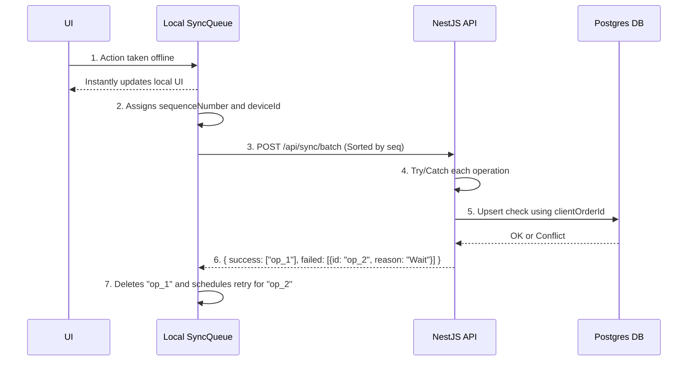

# Partivo Offline-First Architecture

Partivo apps (POS, Warehouse, Driver) use an offline-first approach to ensure reliability and data integrity.

## Core Components

### 1. Local Storage Layer
- **Web POS**: IndexedDB (via Dexie.js) for high-performance browser storage.
- **Mobile (Driver/Warehouse)**: SQLite for native performance and ACID compliance.

### 2. Synchronization Engine
A state machine that manages the lifecycle of local records:
- `PENDING`: Created locally, not yet synced.
- `SYNCING`: Currently being sent to the server.
- `SYNCED`: Successfully acknowledged by the server.
- `CONFLICT`: Server rejected the change due to version mismatch.

### 3. Queue System
Pending actions are stored in a `sync_queue` table:
```json
{
  "id": "uuid",
  "action": "CREATE_ORDER",
  "payload": { ... },
  "syncId": "client-side-unique-id",
  "timestamp": "ISO-Date",
  "retries": 0
}
```

## Data Lifecycle

1. **User Action**: Data is saved to Local DB immediately.
2. **Queue Placement**: The action is added to the `sync_queue`.
3. **Background Sync**: 
   - On network recovery or periodic heartbeat.
   - Batch sync sends multiple queue items in one request.
   - **Ordering Guarantee**: Objects are sorted by `sequenceNumber` ascending before submission to enforce strict total causal order (CREATE → UPDATE → STATUS_CHANGE).
4. **Server Acknowledgment**: 
   - Server returns mapping of `{ success: [ids], failed: [{id, reason}] }`.
5. **Partial Failures**: Client only drops successful records, incrementing `retryCount` on failures using exponential backoff (2s, 5s, 10s, 30s) up to 5 max retries.
6. **Local Update**: Client cleans up synced events from the SQLite queue.

## Business Idempotency & Sequencing

Instead of relying solely on generic UUIDs, Partivo uses strictly ordered business-level keys:
- **Orders**: `clientOrderId` with a composite unique index `@@unique([tenantId, clientOrderId])`
- **Payments**: `clientPaymentId` with a composite unique index `@@unique([tenantId, clientPaymentId])`

If a `CREATE` fails due to network termination, but is retried later, the business index prevents silent duplicates without depending entirely on generic `offlineSyncId`.

### Event Lifecycle


