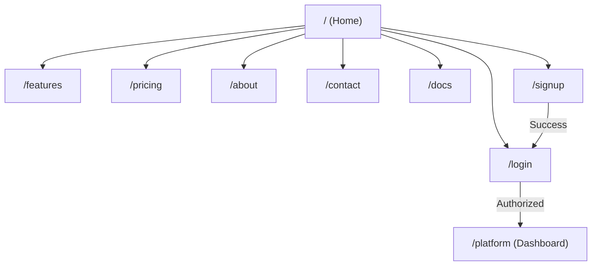
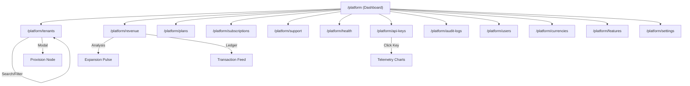

# Partivo Product Navigation Map

This document provides a visual representation of the architecture and navigation flows across both the Landing Portal and the Platform Admin Portal.

---

## 1. Landing Portal Structure
Marketing gateway and public onboarding.

---

## 2. Platform Admin Portal Structure
Internal administrative orchestration.

---

## 3. Global Navigation Flows

### Onboarding Flow
`Landing Home` -> `Pricing` -> `Signup` -> `Login` -> `Platform Dashboard`

### Support Lifecycle
`Platform Support` -> `Initiate Case` -> `Active Queue` -> `Resolution`

### Infrastructure Monitoring
`Platform Health` -> `Telemetry Scan` -> `Prisma/Redis Metrics`
