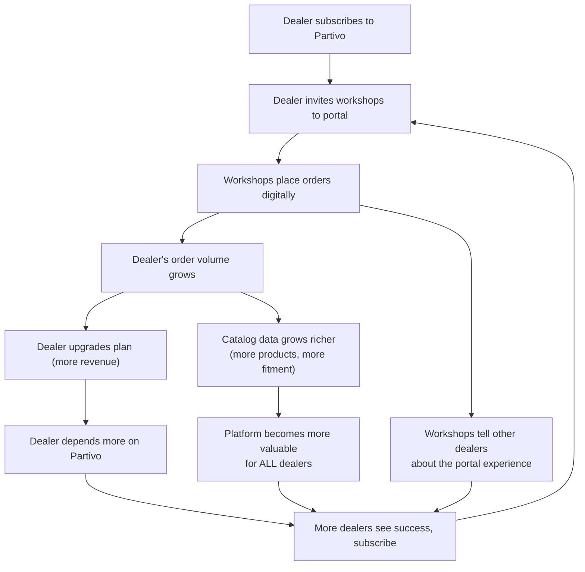

# Partivo — Business Model Canvas

This document presents two distinct Business Model Canvases for the two primary customer segments served by the Partivo platform.

---

## Business Model Canvas 1: The Dealer (Spare Parts Retailer)

> The **Dealer** is the primary paying customer of Partivo. They are multi-branch car spare parts retailers who subscribe to the SaaS platform to digitize and unify their operations.

---

### 1. Customer Segments

**Primary Segment: Multi-Branch Spare Parts Retailers**

| Sub-Segment | Profile | Size | Geography |
|---|---|---|---|
| **Solo Operators** | Family-owned single-location shops. 1–3 staff, 500–2,000 SKUs. Paper-based or early spreadsheet users. | ~35,000 in Egypt alone | Egypt, GCC |
| **Growing Chains** | Regional retailers with 3–10 branches. Dedicated managers, warehouse staff, drivers. 3,000–15,000 SKUs. Fragmented systems. | ~10,000 in Egypt + GCC | Egypt, KSA, UAE |
| **Large Retail Chains** | Established multi-city operations with 10+ branches, 20,000+ SKUs. Existing ERP (usually poorly suited). Full procurement, logistics, and accounting teams. | ~2,000 across MENA | KSA, UAE, Egypt |

**Common Characteristics:**
- Carry thousands of automotive spare part SKUs across multiple brands (OEM and aftermarket).
- Sell to both B2B clients (workshops, other retailers) and B2C walk-in customers.
- Struggle with stock accuracy, wrong-part returns, and cash flow opacity.
- Want to look professional online but lack technical capability to build digital solutions.
- Operate in markets with unreliable internet connectivity, requiring offline capability.

---

### 2. Value Propositions

| Value | Description |
|---|---|
| **Instant Catalog Intelligence** | Retailers do not build a catalog from scratch. They subscribe and immediately access a preloaded, normalized global parts database with vehicle-to-part fitment intelligence. This eliminates months of data entry and drastically reduces wrong-part returns. |
| **Unified Multi-Branch Operations** | A single platform controls inventory, sales, procurement, logistics, and finance across all branches. Opening a new branch takes hours, not months. Real-time stock visibility eliminates dead stock and missed sales. |
| **Offline-First POS** | The mobile POS application works fully offline — sales, payments, inventory changes, and cash sessions all persist locally and sync automatically when connectivity returns. Retailers in areas with poor internet never lose a transaction. |
| **Professional Digital Storefront** | Every tenant automatically receives a branded Customer Portal where their B2B workshops can browse the catalog, see stock levels, view their negotiated pricing, and place orders 24/7 — eliminating phone/WhatsApp order chaos. |
| **Financial Transparency** | Integrated cash session management with Z-reports, double-entry accounting, tax filing preparation, and supplier invoice matching replace manual bookkeeping. Cash discrepancies surface at close of business, not at year-end audit. |
| **B2B Credit Control** | Automated credit limit management blocks orders when clients exceed their limits. No more extending untracked credit to workshops that don't pay. |
| **Zero IT Requirements** | Cloud-native SaaS with no installation, no servers, no IT staff needed. Updates are automatic. The retailer focuses on selling parts, not managing software. |

---

### 3. Channels

| Channel | Stage | Description |
|---|---|---|
| **Landing Portal** | Awareness → Acquisition | Public-facing marketing website with features, testimonials, FAQs, and pricing. SEO-optimized in EN/AR. Primary conversion funnel for self-serve signups. |
| **Self-Serve Onboarding** | Acquisition | Retailers sign up directly, receive a trial subscription, and can be operational within hours. No sales call required for Free/Pro tiers. |
| **Direct Sales** | Acquisition (Enterprise) | For large retail chains (10+ branches), a direct sales engagement handles custom onboarding, API integration, SLA negotiation, and Enterprise contract execution. |
| **Industry Events & Trade Shows** | Awareness | Presence at automotive aftermarket exhibitions (Automechanika Cairo, Automechanika Dubai, MIMS Moscow) to build brand credibility in the dealer community. |
| **Word-of-Mouth & Referrals** | Awareness → Acquisition | In tightly-knit dealer communities, successful implementations create organic referrals. Workshop-to-dealer interactions via the Customer Portal expose non-Partivo dealers to the platform's value. |
| **WhatsApp & Social Media** | Awareness | Targeted campaigns on WhatsApp Business and Facebook/Instagram, reaching retailers where they already communicate (particularly effective in Egypt and GCC markets). |
| **Onboarding Tutorials & In-App Guides** | Activation → Retention | Guided setup flows, contextual help, and localized tutorial content ensure retailers achieve "time to first sale" within 3 days. |

---

### 4. Customer Relationships

| Relationship Type | Description |
|---|---|
| **Self-Service (Primary)** | Free and Pro tier retailers manage their own onboarding, configuration, and daily operations through intuitive portals. The platform is designed so that a non-technical retailer can go from signup to first sale without human assistance. |
| **Automated Engagement** | System-generated emails for billing events (invoices, payment failures, trial expiration warnings). Usage-based upgrade prompts when tenants approach their plan limits. |
| **Community Support** | Knowledge base, FAQ documentation, and localized tutorial content (EN/AR). |
| **Dedicated Account Management** | Enterprise clients receive a dedicated account manager for onboarding, training, periodic business reviews, and escalation handling. |
| **Platform Admin Support** | Internal support team monitors tenant health via the Platform Admin Portal. Support tickets submitted by tenants are tracked and resolved through the built-in ticketing system. |
| **Feedback Loop** | Feature flags and usage metrics inform product development. High-usage patterns from leading tenants drive roadmap prioritization. |

---

### 5. Revenue Streams

| Revenue Stream | Model | Description |
|---|---|---|
| **SaaS Subscription Fees** | Recurring (Monthly / Yearly) | Primary revenue source. Tiered pricing (Free / Pro / Enterprise) with yearly billing offering a discount incentive. Revenue recognized monthly as MRR. |
| **Plan Upgrades** | Expansion Revenue | Tenants upgrade from Free → Pro when they hit feature limits (branches, products, users). Pro → Enterprise when they need custom integrations or SLA. |
| **Usage Overages** (Future) | Metered | Potential future stream: charging for usage beyond plan limits (extra branches, extra users, extra API calls) without requiring a full tier upgrade. |
| **Payment Processing Margin** (Future) | Transaction Fee | Margin on B2B payment processing through Stripe/Paymob when tenants process customer payments for orders through the platform. |
| **Catalog Data Licensing** (Future) | Licensing | Licensing the enriched, fitment-mapped catalog data to insurers, fleet operators, or industry analytics providers — a derivative value of the catalog moat. |
| **Marketplace Commissions** (Future) | Commission | If Partivo introduces a cross-tenant marketplace (retailers selling to each other), a commission on inter-tenant transactions becomes viable. |

---

### 6. Key Resources

| Resource | Category | Description |
|---|---|---|
| **Global Parts Catalog** | Intellectual Asset | The preloaded, normalized product database with vehicle fitment mappings. This is the single most valuable asset — it is the competitive moat. It grows richer with every tenant's product data contributions. |
| **Platform Technology Stack** | Technology | NestJS backend, Next.js web portals, React Native mobile apps, PostgreSQL database, Prisma ORM. The offline-first sync engine and multi-tenant data architecture are core technical IP. |
| **Engineering Team** | Human Capital | Full-stack developers capable of maintaining and evolving the backend, frontend, mobile, and infrastructure layers. Arabic localization and RTL expertise are specialized skills. |
| **Domain Expertise** | Knowledge | Deep understanding of the spare parts retail workflow — from counter sales to procurement to delivery. Understanding fitment logic (Make → Model → Year → Part) is domain-specific knowledge. |
| **Payment Provider Relationships** | Partnerships | Active integrations with Stripe (international) and Paymob (Egypt) for billing and payment processing. |
| **Cloud Infrastructure** | Infrastructure | Scalable hosting, database, and CDN infrastructure supporting multi-tenant SaaS operations across MENA. |

---

### 7. Key Activities

| Activity | Description |
|---|---|
| **Platform Development & Maintenance** | Continuous development of backend services, frontend portals, and mobile applications. Feature releases, bug fixes, performance optimization, and security patches. |
| **Catalog Enrichment** | Ongoing normalization, deduplication, and expansion of the global parts catalog. Adding new brands, categories, and vehicle fitment data. Integrating data from external sources (TecDoc, manufacturer databases). |
| **Tenant Onboarding** | Self-serve provisioning (automated), guided onboarding for Pro tenants, and white-glove onboarding for Enterprise clients. Ensuring rapid "time to first sale." |
| **Customer Support** | Monitoring tenant health, resolving support tickets, handling billing issues, and providing operational guidance. Localized support in Arabic and English. |
| **Sales & Marketing** | Landing portal optimization, content marketing, industry event presence, direct sales for Enterprise accounts, and managing the self-serve conversion funnel. |
| **Billing Operations** | Automated invoice generation, dunning management, payment processing, and subscription lifecycle management. Handling payment failures and reactivations. |
| **Infrastructure Operations** | Database maintenance, backup/recovery, monitoring, CI/CD pipeline management, and ensuring uptime and performance SLAs. |

---

### 8. Key Partnerships

| Partner | Role | Value Exchange |
|---|---|---|
| **Stripe** | International payment processing | Enables card payments and subscription billing for GCC tenants. Partivo sends billing volume; Stripe provides payment infrastructure. |
| **Paymob** | Egypt-specific payment processing | Enables local payment methods (cards, mobile wallets, Fawry) critical for Egyptian market adoption. |
| **Automotive Data Providers** | Catalog data sourcing | Sources like TecDoc, manufacturer databases, and local distributors provide fitment data and product catalogs. Partivo normalizes and integrates this data. |
| **Cloud Hosting Providers** | Infrastructure | Provide scalable compute, storage, and networking. Critical for multi-tenant performance and data residency compliance. |
| **Industry Associations** | Market access | Automotive aftermarket trade associations in Egypt and GCC provide credibility, event access, and direct introductions to large dealer networks. |
| **Local Distributors** | Channel & Data | Major spare parts distributors can act as channel partners, recommending Partivo to their retail networks. Their product catalogs can enrich Partivo's database. |

---

### 9. Cost Structure

| Cost Category | Type | Description |
|---|---|---|
| **Engineering Salaries** | Fixed | Largest cost center. Full-stack developers, mobile developers, QA engineers, DevOps. |
| **Cloud Infrastructure** | Variable | Hosting, database, CDN, and storage costs. Scales with tenant count and data volume. |
| **Payment Processing Fees** | Variable | Stripe and Paymob transaction fees on subscription payments (typically 2.9% + $0.30 per transaction). |
| **Catalog Data Acquisition** | Fixed / Semi-Variable | Costs associated with sourcing, normalizing, and maintaining fitment data from external providers. |
| **Sales & Marketing** | Semi-Variable | Digital advertising, content production, industry event participation, sales team compensation. |
| **Customer Support** | Semi-Variable | Support team salaries and tooling. Scales with tenant base but partially offset by self-serve design. |
| **Third-Party Services** | Fixed | Email delivery (transactional emails), monitoring tools, analytics platforms, development tools. |
| **General & Administrative** | Fixed | Office, legal, accounting, HR. |

**Cost Model Characteristic**: Partivo operates a **high gross margin SaaS model**. The primary costs are human capital (engineering, support) and infrastructure. Per-tenant marginal cost is very low due to the multi-tenant architecture and shared catalog.

---
---

## Business Model Canvas 2: The Workshop / Retail Buyer (B2B Customer)

> The **Workshop** (or Retail Buyer) is the end customer of the dealer. They are automotive repair shops, service centers, or smaller retailers who purchase spare parts from Partivo-powered dealers via the Customer Portal. They do **not pay Partivo** — but their adoption is critical to dealer retention and platform stickiness.

---

### 1. Customer Segments

**Primary Segment: Automotive Workshops and Service Centers**

| Sub-Segment | Profile | Relationship to Dealer |
|---|---|---|
| **Independent Workshops** | Small auto repair shops, 2–5 technicians. Handle general maintenance and repair. Order parts daily. | Purchase 50–200 SKUs/month from 3–5 preferred dealers. Highly price-sensitive. |
| **Specialized Service Centers** | Shops focused on specific services (AC, electronics, body work). Need specific, accurate part fitment. | Purchase fewer but more specialized parts. Fitment accuracy is critical — wrong parts cause rework. |
| **Fleet Maintenance Operations** | Companies maintaining vehicle fleets (taxis, delivery companies, rental agencies). High volume, recurring demand. | Place regular bulk orders. Need credit terms and predictable pricing. Often negotiate volume discounts. |
| **Smaller Retailers** | Neighborhood shops that buy from larger retailers/distributors and resell to walk-in customers. | Act as a downstream reseller tier. Need wholesale pricing and reliable stock availability. |

**Common Characteristics:**
- Order parts frequently (daily or multiple times per week).
- Currently rely on phone calls, WhatsApp messages, or in-person visits to check stock and place orders.
- Have no visibility into the dealer's real-time inventory.
- Are frustrated by wrong parts, delayed deliveries, and opaque pricing.
- Most are not technologically sophisticated but are comfortable using mobile apps and web browsers.

---

### 2. Value Propositions

| Value | Description |
|---|---|
| **24/7 Self-Service Ordering** | Workshops can browse the dealer's catalog, check real-time stock availability, and place orders at any hour — no more calling during business hours, waiting on hold, or sending WhatsApp messages that go unanswered. |
| **Accurate Vehicle Fitment** | The catalog is enriched with vehicle fitment data (Make → Model → Year → Compatible Parts). Workshops can search by the vehicle they're servicing and trust that the parts shown will fit. This eliminates wrong-part orders and the costly delays of returns. |
| **Transparent, Personalized Pricing** | Each workshop sees their specific negotiated pricing tier when logged in. No ambiguity, no need to call for a quote. Volume discounts and client-specific price rules are automatically applied. |
| **Order Tracking & History** | Workshops can track their order status from placement through confirmation, dispatch, and delivery. Full order history provides a searchable record for repeat purchases and warranty reference. |
| **Credit Visibility** | Workshops with B2B credit accounts can see their current balance, credit limit, and payment terms directly in the portal. No surprises about blocked orders due to exceeded credit. |
| **Delivery Proof & Accountability** | When orders are delivered, the proof of delivery (signature, photo, GPS timestamp) is tied to the order record. Disputes about "we never received this" are eliminated with objective evidence. |
| **Digital Relationship with Supplier** | The portal replaces fragmented phone/WhatsApp communication with a structured digital channel. Order confirmations, delivery updates, and invoices are centralized in one place. |

---

### 3. Channels

| Channel | Stage | Description |
|---|---|---|
| **Dealer Invitation** | Awareness → Acquisition | The primary acquisition channel. Dealers invite their existing workshops to register on the Customer Portal. This is a dealer-driven, bottom-up growth loop — every new dealer potentially brings dozens of workshops. |
| **Customer Portal URL** | Acquisition → Activation | Each dealer's portal has a unique URL (e.g., `acme-parts.partivo.com`). Workshops access it directly via browser on desktop or mobile. |
| **Self-Serve Registration** | Acquisition | Workshops register themselves on the dealer's portal with business name, type, email, and phone. No installation required. |
| **WhatsApp / SMS Notification** | Retention | Dealers share their portal link via WhatsApp (the dominant business communication tool in MENA). System-generated order confirmations and delivery updates keep workshops engaged. |
| **Repeat Usage** | Retention | Once a workshop places their first successful order, the convenience of self-service ordering creates habitual repeat usage. Searching their own order history for re-orders reduces friction. |

---

### 4. Customer Relationships

| Relationship Type | Description |
|---|---|
| **Dealer-Mediated** | The primary relationship is between the workshop and the dealer, not with Partivo directly. Partivo's role is invisible to the workshop — they interact with the dealer's branded portal. |
| **Self-Service** | Workshops independently browse, search, cart, and order. No human interaction is required for the typical order flow. |
| **Automated Notifications** | Order confirmations, status updates, and delivery notifications are automatically sent to the workshop's registered contact. |
| **Dealer Support** | If a workshop has an issue with an order (wrong part, damage, delay), they contact the dealer, who manages the resolution through the Tenant Admin Portal (returns, refunds, replacements). |
| **Credit Relationship** | B2B workshops with established credit relationships see their credit status in the portal. This transparency strengthens the business relationship and reduces payment disputes. |

---

### 5. Revenue Streams

The workshop does **not pay Partivo** directly. However, their behavior generates several indirect revenue effects:

| Revenue Effect | Mechanism |
|---|---|
| **Dealer Retention** | The more workshops a dealer has actively ordering through the portal, the higher the switching cost for the dealer. Workshop adoption is the strongest driver of dealer retention, directly protecting Partivo's subscription revenue. |
| **Dealer Upgrade Pressure** | As order volume from workshops grows, dealers hit plan limits (max orders, max products) and upgrade to higher tiers. Workshop activity is the primary driver of expansion revenue. |
| **Order Volume Growth** | Digital self-service ordering removes friction, increasing the total number of orders workshops place with the dealer. This makes the dealer bigger and more successful — and more dependent on Partivo. |
| **Platform Stickiness** | Once workshops are habituated to the portal (order history, saved addresses, credit visibility), they actively resist if a dealer considers switching away from Partivo. |
| **Future: Transaction Fees** | If Partivo enables integrated payment processing for B2B orders (workshops paying dealers through the portal), a transaction fee becomes a direct revenue stream from workshop order flow. |

---

### 6. Key Resources

| Resource | Description |
|---|---|
| **Customer Portal (Frontend)** | The Next.js-based commerce portal with catalog browsing, vehicle fitment search, cart, checkout, and order tracking. Must be fast, mobile-responsive, and Arabic-ready. |
| **Dealer's Catalog & Inventory** | The workshop sees the dealer's product catalog with real-time inventory levels and their specific pricing. This data is maintained by the dealer through the Tenant Admin Portal. |
| **Vehicle Fitment Database** | The global fitment intelligence (VehicleMake → VehicleModel → ProductFitment) that powers the "search by vehicle" feature — the primary value driver for workshops. |
| **Order Processing Engine** | Backend services that handle cart-to-order conversion, inventory allocation, credit limit checks, and order status management. |
| **Delivery Infrastructure** | The logistics module that the dealer uses to dispatch, track, and deliver orders — creating the visible delivery tracking experience for workshops. |

---

### 7. Key Activities

| Activity | Description |
|---|---|
| **Portal UX Optimization** | Ensuring the Customer Portal is fast, intuitive, and mobile-friendly. A workshop mechanic checking stock on a greasy phone in the garage is the real user — the UX must serve that context. |
| **Fitment Data Accuracy** | Maintaining and expanding vehicle fitment data. Incorrect fitment data destroys workshop trust and leads to returns, negating the core value proposition. |
| **SEO & Discoverability** | Server-side rendering of product pages for search engine indexing. When a workshop Googles a part number, the dealer's portal should appear. |
| **Onboarding Simplicity** | Registration must be frictionless — minimal fields, no verification delays. A workshop should go from "dealer shared a link" to "first order placed" in under 10 minutes. |
| **Uptime & Performance** | The portal must be fast and available. Workshops place orders during busy repair hours — downtime means they pick up the phone and call a competing dealer. |

---

### 8. Key Partnerships

| Partner | Role |
|---|---|
| **The Dealer (Tenant)** | The critical partner. The dealer's active management of their catalog, pricing, and inventory directly determines the workshop's experience. Partivo must make the dealer successful for the workshop to be satisfied. |
| **Delivery Drivers** | The dealer's drivers (using the Driver App) execute the last-mile delivery that is the workshop's tangible experience of the order. Driver performance = workshop satisfaction. |
| **Automotive Data Sources** | External fitment data providers ensure the "search by vehicle" feature covers the broadest possible range of vehicles in the Egyptian and GCC markets. |

---

### 9. Cost Structure

Since the workshop is a non-paying user, costs are borne by Partivo and subsidized by dealer subscriptions:

| Cost | Description |
|---|---|
| **Portal Frontend Infrastructure** | Hosting and CDN costs for serving the Customer Portal. Scales with number of active workshops across all tenants. |
| **Backend Processing** | API request costs for catalog browsing, cart operations, and order processing. Each workshop interaction consumes compute resources. |
| **Database Storage** | Workshop accounts, order history, cart data, and addresses consume per-record storage within the shared tenant database. |
| **Fitment Data Maintenance** | A shared cost with the dealer BMC — maintaining accurate fitment data benefits both segments equally. |
| **Security & Privacy Compliance** | Workshop data (business names, contacts, order history) must be protected. Compliance with data protection requirements adds operational cost. |

**Cost Model Characteristic**: The workshop segment has a **near-zero marginal cost** per user due to the multi-tenant architecture. The same infrastructure that serves the dealer also serves their workshops. This makes aggressive workshop acquisition (volume) economically rational.

---
---

## Cross-Canvas Flywheel

The two business models create a powerful **network effect flywheel**:

**The strategic insight**: Partivo monetizes the dealer. Partivo acquires the dealer through the workshop. The workshop's portal experience is the product that sells itself.
