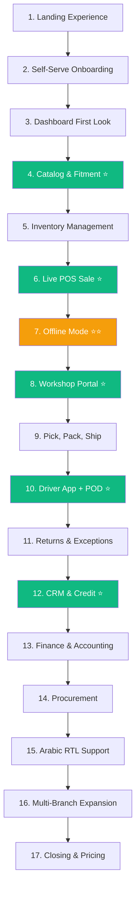

# Partivo — Client Demo Playbook

> A structured, step-by-step guide for demonstrating the Partivo platform to prospective spare parts retailers. This document covers every scenario that should be shown, in the exact order that creates maximum impact.

---

## Demo Preparation Checklist

Before every demo, ensure the following are ready:

| Item | Status | Notes |
|---|---|---|
| Demo tenant created with realistic Arabic/English business name | ☐ | e.g., "قطع غيار المنصورة — Mansoura Auto Parts" |
| 2 branches configured (Main Warehouse + Retail Branch) | ☐ | With Arabic names and addresses |
| 50+ products loaded across multiple categories | ☐ | Include brands like Bosch, Denso, Monroe, locally known brands |
| 3–5 business clients (workshops) created | ☐ | With credit limits, contacts, addresses |
| Vehicle fitment data for 5+ popular cars | ☐ | Toyota Corolla, Hyundai Accent, Kia Cerato, Nissan Sunny, Chevrolet Lanos |
| Active inventory with varied stock levels | ☐ | Some items at 0 stock for shortage demo |
| 1 existing order in CONFIRMED status | ☐ | Ready for pick/pack/deliver flow |
| Cash session open on POS | ☐ | With opening cash entered |
| Driver account with trip assigned | ☐ | For Driver App demo |
| Mobile devices ready (POS tablet + Driver phone) | ☐ | Or emulators |
| Arabic language toggled to demo RTL | ☐ | |

---

## Demo Structure Overview

| # | Scenario Block | Duration | Wow Factor |
|---|---|---|---|
| 1 | Opening — The Landing Experience | 3 min | ⭐⭐⭐ |
| 2 | Self-Serve Onboarding | 3 min | ⭐⭐⭐⭐ |
| 3 | Tenant Admin — First Look & Dashboard | 3 min | ⭐⭐⭐ |
| 4 | Catalog & Vehicle Fitment Intelligence | 5 min | ⭐⭐⭐⭐⭐ |
| 5 | Inventory Management Across Branches | 4 min | ⭐⭐⭐⭐ |
| 6 | POS — Counter Sale (Live) | 5 min | ⭐⭐⭐⭐⭐ |
| 7 | POS — Offline Mode (The Killer Demo) | 3 min | ⭐⭐⭐⭐⭐ |
| 8 | B2B Commerce — Workshop Portal | 5 min | ⭐⭐⭐⭐⭐ |
| 9 | Order Fulfillment — Pick, Pack, Ship | 4 min | ⭐⭐⭐⭐ |
| 10 | Delivery — Driver App & Proof of Delivery | 4 min | ⭐⭐⭐⭐⭐ |
| 11 | Returns & Exception Handling | 3 min | ⭐⭐⭐ |
| 12 | CRM & Credit Control | 3 min | ⭐⭐⭐⭐ |
| 13 | Finance & Accounting | 3 min | ⭐⭐⭐ |
| 14 | Procurement — Purchase Orders | 3 min | ⭐⭐⭐ |
| 15 | Arabic Language & RTL Support | 2 min | ⭐⭐⭐⭐ |
| 16 | Multi-Branch Expansion | 2 min | ⭐⭐⭐⭐ |
| 17 | Closing — Pricing & Next Steps | 3 min | — |
| | **Total** | **~55 min** | |

---

## Scenario 1: Opening — The Landing Experience

**Goal**: Show the prospect that Partivo is a professional, modern platform — not a janky spreadsheet replacement.

### Steps

| Step | Action | What to Say |
|---|---|---|
| 1 | Open the Landing Portal in a browser | *"This is the public face of Partivo — the website your workshops and customers will see."* |
| 2 | Scroll through the Hero section | *"Everything here is customizable — your business name, your branding, your message."* |
| 3 | Show the Features section | *"These are the core modules you get out of the box — POS, Inventory, Logistics, Finance."* |
| 4 | Show the Pricing section | *"Our pricing is transparent. No hidden fees, no per-transaction charges."* |
| 5 | Toggle to Arabic language | *"Notice how the entire site flips to Arabic — right-to-left layout, Arabic text, everything."* |
| 6 | Show the About / Ecosystem animation | *"This is the ecosystem your business runs on. All of these modules talk to each other."* |

**Key Talking Point**: *"This is what your workshops see when they visit your portal. It looks like you built it yourself — but you didn't. It's ready in minutes."*

---

## Scenario 2: Self-Serve Onboarding

**Goal**: Demonstrate that getting started requires zero IT expertise and takes minutes, not months.

### Steps

| Step | Action | What to Say |
|---|---|---|
| 1 | Click "Get Started" on the Landing Portal | *"Let me show you how fast you can go from zero to operational."* |
| 2 | Fill in business name, email, phone, password | *"This is all you need. No meetings, no contracts, no setup fees."* |
| 3 | Submit the registration form | *"Done. Your account is created."* |
| 4 | Show the success message | *"You now have a tenant, a default branch, an admin account, and a trial subscription. All automatic."* |
| 5 | Log in to the new Tenant Admin | *"Let's see what was created for you."* |

**Key Talking Point**: *"Your competitors need 3 months and a consultant to get set up. You need 3 minutes."*

> **Note**: For the rest of the demo, switch to the **pre-configured demo tenant** so all data is already populated.

---

## Scenario 3: Tenant Admin — First Look & Dashboard

**Goal**: Show the command center. Make the prospect feel the power of seeing their entire business in one screen.

### Steps

| Step | Action | What to Say |
|---|---|---|
| 1 | Open the Tenant Admin Dashboard | *"This is your command center. Everything happening in your business — right now."* |
| 2 | Point to the KPI cards | *"Inventory value across all branches. Today's sales. Pending orders. Active deliveries."* |
| 3 | Show the sales revenue chart | *"Revenue trends — daily, weekly, monthly. You'll see which branches are performing."* |
| 4 | Point to the sidebar navigation | *"Inventory, Sales, Customers, Procurement, Logistics, Finance, CRM — every module is one click away."* |
| 5 | Show the user profile / branch indicator | *"You're logged in as the Owner of [Business Name], looking at [Branch Name]."* |

**Key Talking Point**: *"This replaces the 5 different apps and 3 spreadsheets you're using today. One login. One screen. Everything."*

---

## Scenario 4: Catalog & Vehicle Fitment Intelligence

**Goal**: This is the single most impressive feature for a spare parts retailer. Spend time here.

### Steps

| Step | Action | What to Say |
|---|---|---|
| 1 | Navigate to Inventory page | *"Let's look at your product catalog."* |
| 2 | Show the product list with brands, categories, and images | *"Every product is already in the system — names, brands, categories, even Arabic names."* |
| 3 | Click on a product to show the detail view | *"Part number, brand, category, alternative part numbers — all linked."* |
| 4 | Scroll down to show the Vehicle Fitment section | *"Here's the magic."* |
| 5 | Show the fitment list: "This brake pad fits Toyota Corolla 2014–2019, Hyundai Accent 2016–2020..." | *"Your staff doesn't need to memorize this. The system knows."* |
| 6 | Go to the POS Product Search screen | *"Let me show you what this means for your counter staff."* |
| 7 | Type a vehicle: Select "Toyota" → "Corolla" → "2017" | *"A customer walks in and says 'I need brake pads for my Corolla 2017.'"* |
| 8 | Show the filtered results — only compatible parts | *"These are the only parts that fit. Your staff can't sell the wrong part — even if they're new."* |
| 9 | Compare: search the same product by part number and by barcode | *"Three ways to find the same part: vehicle, part number, or just scan the barcode."* |

**Key Talking Point**: *"How many returns do you process because your staff sold the wrong part? 10% of sales? 20%? With fitment intelligence, that drops to nearly zero."*

**Pause for reaction. This is the moment the prospect realizes Partivo understands their business.**

---

## Scenario 5: Inventory Management Across Branches

**Goal**: Show real-time stock visibility across multiple locations.

### Steps

| Step | Action | What to Say |
|---|---|---|
| 1 | Navigate to Inventory page, Branch filter → "All Branches" | *"You're looking at stock across every branch. One screen."* |
| 2 | Point to a product with stock in Branch A but 0 in Branch B | *"This brake pad has 45 units in your warehouse, but zero in the retail branch."* |
| 3 | Show the Allocated column | *"12 units are allocated — that means they're already reserved for confirmed orders. Only 33 are truly available."* |
| 4 | Click "View Ledger" on a product | *"Every single stock change is recorded — who changed it, when, why, and which sale or order caused it."* |
| 5 | Show a stock adjustment: add 10 units with reason "Count Correction" | *"Your warehouse staff did a count and found 10 extra units? Log it here. Reason codes ensure accountability."* |
| 6 | Show the Branch Transfer feature | *"Branch B is running low? Request a transfer from the warehouse. Your manager approves it. Stock moves digitally — and then physically."* |

**Key Talking Point**: *"Right now, how do you know what's in your second branch? You call them? With Partivo, you never call again."*

---

## Scenario 6: POS — Counter Sale (Live)

**Goal**: Demonstrate a complete sale from product search to receipt in under 60 seconds.

### Steps

| Step | Action | What to Say |
|---|---|---|
| 1 | Open the POS App (tablet or emulator) | *"This is what your counter staff uses every day."* |
| 2 | Show the active cash session indicator | *"A cash session is open — they started their shift, declared the opening cash."* |
| 3 | Tap "New Sale" | *"Customer walks in."* |
| 4 | Search for a product — type "brake" | *"Your staff types the product name..."* |
| 5 | Show results with stock levels and prices | *"...sees what's in stock and the selling price."* |
| 6 | Tap "Add" on brake pads, then search and add an oil filter | *"Two items in the cart."* |
| 7 | Show the Cart: line items, quantities, VAT, total | *"Review the cart. Adjust quantities if needed."* |
| 8 | Tap a customer from the customer search (optional) | *"Link this sale to a registered customer if you want — or skip for a walk-in."* |
| 9 | Tap "Checkout" | *"Time to pay."* |
| 10 | Select "CASH", enter tendered amount (e.g., 500 for a 425 total) | *"Customer hands you 500 pounds. Change: 75 pounds."* |
| 11 | Tap "Complete Sale" | *"Done. Receipt generated. Inventory deducted. Payment recorded. Time elapsed: less than 30 seconds."* |
| 12 | Show the receipt | *"Print it, share it via WhatsApp, or email it."* |

**Key Talking Point**: *"That sale — from 'what do you need?' to receipt — took 30 seconds. The inventory was deducted automatically. The cash is tracked. The tax is calculated. No separate accounting step needed."*

**Optional Bonus**: Show a **split payment** — CASH + CARD — to demonstrate flexibility.

---

## Scenario 7: POS — Offline Mode (The Killer Demo)

**Goal**: This is the single most convincing scenario for the Egypt/GCC market. Prove that internet failure doesn't stop sales.

### Steps

| Step | Action | What to Say |
|---|---|---|
| 1 | **Turn off the device's WiFi/data** (do it visually, let the prospect see) | *"I'm going to turn off the internet. Watch what happens."* |
| 2 | Show the sync status indicator changes to ⚠️ **Pending** | *"The app knows it's offline. But it doesn't stop."* |
| 3 | Complete a full sale — search product, add to cart, checkout, CASH payment | *"Same flow. Same speed. Everything works."* |
| 4 | Complete a second sale (different product) | *"I can keep selling all day without internet."* |
| 5 | Show the sales history — both offline sales appear | *"Both sales are recorded locally."* |
| 6 | **Turn WiFi back on** | *"Now let's reconnect."* |
| 7 | Watch the sync indicator change to 🔄 **Syncing...** then ✅ **Synced** | *"The sales are automatically uploaded to the server. Inventory updated. Cash session updated. Accounting updated."* |
| 8 | Switch to the Tenant Admin Dashboard (desktop browser) | *"Look — both sales now appear in your admin panel. As if they were made online."* |

**Key Talking Point**: *"In Egypt, internet goes down 3 times a day. In a traditional system, that means 3 times a day you can't sell. With Partivo, you never stop. NEVER."*

**This scenario alone closes deals. Let it breathe.**

---

## Scenario 8: B2B Commerce — Workshop Portal

**Goal**: Show the prospect that their workshops can order online — 24/7 — through a portal that looks like it was custom-built for them.

### Steps

| Step | Action | What to Say |
|---|---|---|
| 1 | Open the Customer Portal in a new browser tab | *"Now let me show you what your workshops see."* |
| 2 | Show the branded landing page with the dealer's name | *"This is YOUR portal, with YOUR branding. Your workshops access this URL."* |
| 3 | Log in as a workshop user | *"This is Ahmed's Workshop. He's one of your B2B clients."* |
| 4 | Show the catalog — browse by category | *"Ahmed can browse your entire catalog by category."* |
| 5 | Use the Vehicle Fitment search: Toyota Corolla 2017 | *"Or he can search by vehicle — 'I'm fixing a Corolla 2017, show me what you have for it.'"* |
| 6 | Show the pricing — point out it's workshop-specific | *"Notice the prices? These are Ahmed's negotiated prices. Another workshop might see different prices."* |
| 7 | Add products to cart | *"He adds what he needs."* |
| 8 | Show the cart with subtotal, VAT, and total | *"Clear totals. No ambiguity."* |
| 9 | Proceed to checkout — select delivery address | *"He picks his delivery address — you have it on file."* |
| 10 | Place the order | *"Order placed. Status: PENDING."* |
| 11 | **Switch to the Tenant Admin Portal** | *"Now let's see what you see."* |
| 12 | Show the new order appearing in the Orders list | *"Ahmed's order just appeared. Status: PENDING. One click to confirm."* |
| 13 | Confirm the order | *"Status: CONFIRMED. A pick list is automatically created for your warehouse staff."* |

**Key Talking Point**: *"Right now, Ahmed calls you, WhatsApps you, or drives to your shop. With this, he orders at midnight while you're sleeping. When you arrive in the morning, the orders are ready to process."*

---

## Scenario 9: Order Fulfillment — Pick, Pack, Ship

**Goal**: Show the end-to-end warehouse fulfillment flow.

### Steps

| Step | Action | What to Say |
|---|---|---|
| 1 | Navigate to Warehouse → Pick Lists | *"Your warehouse staff opens their queue."* |
| 2 | Show the pick list created from the order we just confirmed | *"This pick list was auto-generated. It tells your staff exactly what to pick, from which bin location."* |
| 3 | Mark items as PICKED | *"Staff walks to the shelf, picks the item, marks it done."* |
| 4 | Show a shortage scenario — one item has 0 stock | *"This item is out of stock. The system flags it as a SHORTAGE."* |
| 5 | Show the Substitution option | *"Your staff can suggest a substitute — 'We don't have this Bosch pad, but we have the equivalent Brembo.' The system tracks the price difference."* |
| 6 | Show packing: group picked items into a Pack and seal it | *"Items go into a box. Seal the pack. It gets a tracking ID."* |
| 7 | Navigate to Logistics → Create Trip | *"Now we dispatch. Create a delivery trip."* |
| 8 | Assign the driver and vehicle | *"Assign your driver — Hassan — and his van."* |
| 9 | Add the order as a trip stop | *"Ahmed's Workshop is Stop #1."* |
| 10 | Show the trip: PLANNED with stop details | *"Trip is planned. Hassan will see it on his phone."* |

**Key Talking Point**: *"From order confirmation to dispatching a driver — every step is tracked, every item is accounted for. No paper pick lists. No 'I forgot to load it.'"*

---

## Scenario 10: Delivery — Driver App & Proof of Delivery

**Goal**: Show the complete last-mile delivery experience with proof capture.

### Steps

| Step | Action | What to Say |
|---|---|---|
| 1 | Open the Driver App on a phone | *"This is what Hassan sees on his phone."* |
| 2 | Show the assigned trip with stop list | *"His trip is ready. 3 stops today. First: Ahmed's Workshop."* |
| 3 | Tap "Start Trip" | *"Hassan starts his route."* |
| 4 | Tap "Mark Arrived" on Ahmed's stop | *"He's at the workshop. Arrival time recorded."* |
| 5 | Tap "Complete Delivery" | *"Time to confirm delivery."* |
| 6 | Fill in Proof of Delivery: | |
| | — Enter signer name: "Ahmed Mohamed" | *"Who received it?"* |
| | — Draw a signature on the canvas | *"Ahmed signs on the phone."* |
| | — Take a photo (simulate with camera) | *"Photo of the delivered goods."* |
| | — GPS automatically captured | *"GPS coordinates recorded — we know exactly where this delivery happened."* |
| 7 | Submit the proof | *"Done. Delivery confirmed with signature, photo, GPS, and timestamp."* |
| 8 | **Switch to Tenant Admin → Order detail** | *"Look at Ahmed's order now."* |
| 9 | Show the order status changed to DELIVERED with proof | *"Status: DELIVERED. Signature attached. Photo attached. GPS coordinates. Timestamp."* |

**Key Talking Point**: *"Ahmed says 'I never received my order'? Here's his signature. Here's the photo. Here's the GPS showing your driver was at his workshop at 2:47 PM. Disputes are over."*

---

## Scenario 11: Returns & Exception Handling

**Goal**: Show that the system handles the bad days, not just the good ones.

### Steps

| Step | Action | What to Say |
|---|---|---|
| 1 | In the Driver App, on a different stop, tap "Report Failure" | *"What if the customer isn't there?"* |
| 2 | Select exception type: "CUSTOMER_UNAVAILABLE" | *"Hassan reports: customer unavailable."* |
| 3 | Enter description | *"He adds notes: 'Workshop closed, phone not answering.'"* |
| 4 | Submit the exception | *"Stop marked as FAILED."* |
| 5 | Switch to Tenant Admin → Delivery Exceptions | *"You see the exception immediately."* |
| 6 | Show resolution options | *"You can: reschedule delivery, create a return to warehouse, or contact the customer."* |
| 7 | Navigate to Returns module | *"Now let's say a workshop received the wrong part."* |
| 8 | Show a return request: reason "WRONG_ITEM", status "REQUESTED" | *"The return flows through: Requested → Approved → Received → Inspected → Completed."* |
| 9 | Show that inventory is automatically restored when return completes | *"When the item is received and inspected, stock goes back up automatically."* |

**Key Talking Point**: *"Every business has returns. The question is: do you track them properly? With Partivo, every return has a reason, a status, and a financial trail."*

---

## Scenario 12: CRM & Credit Control

**Goal**: Show B2B relationship management and the automatic credit block feature.

### Steps

| Step | Action | What to Say |
|---|---|---|
| 1 | Navigate to CRM → Business Clients | *"Here are your B2B workshops."* |
| 2 | Open "Ahmed's Workshop" profile | *"Everything about Ahmed in one screen."* |
| 3 | Show the Credit Account section | *"Ahmed has a credit limit of 50,000 EGP. Current balance: 42,000 EGP."* |
| 4 | Point out the balance approaching the limit | *"He's 84% of his limit."* |
| 5 | **Show what happens when Ahmed tries to place an order that exceeds 50,000** | *"Watch this."* |
| 6 | Attempt to place an order on the Customer Portal for 12,000 EGP | |
| 7 | Show the error: "This order exceeds your credit limit" | *"BLOCKED. Automatically. No one needs to remember. No one needs to check a spreadsheet."* |
| 8 | Navigate to CRM → Leads | *"You can also track potential new clients."* |
| 9 | Show the Opportunity pipeline | *"Your sales team manages the B2B sales pipeline here — which workshops are you trying to onboard?"* |
| 10 | Show the Activity Timeline | *"Every call, every meeting, every note — logged against the client."* |

**Key Talking Point**: *"How much money have you lost because you extended credit to a workshop that didn't pay? Partivo stops that — automatically."*

---

## Scenario 13: Finance & Accounting

**Goal**: Demonstrate financial control and compliance readiness.

### Steps

| Step | Action | What to Say |
|---|---|---|
| 1 | Navigate to Finance → Chart of Accounts | *"Your general ledger accounts are pre-configured."* |
| 2 | Show the account hierarchy (Assets, Liabilities, Revenue, Expenses) | *"Standard double-entry accounting. Ready for your accountant."* |
| 3 | Navigate to Journal Entries | *"Every sale, every purchase, every payment — automatically creates journal entries."* |
| 4 | Show a journal entry from the sale we completed earlier | *"Remember that POS sale? Here's the accounting entry: Debit Cash, Credit Revenue, Credit VAT Payable."* |
| 5 | Navigate to Tax Rates | *"Configure your VAT rate — 14% for Egypt, 15% for KSA."* |
| 6 | Show the Supplier Invoice Matching | *"When you receive goods, the system compares what you ordered vs. what you received vs. what the supplier invoiced."* |
| 7 | Navigate to POS → Close Cash Session | *"End of day."* |
| 8 | Show the cash reconciliation: expected vs. actual | *"Declare your closing cash. The system tells you if there's a surplus or shortage."* |
| 9 | Show the Z-Report generation | *"Z-Report generated: total sales, total payments by type, opening, closing, difference."* |

**Key Talking Point**: *"Your accountant will love you. Every transaction is already in the journal. VAT is calculated automatically. End-of-day reconciliation takes 2 minutes instead of 2 hours."*

---

## Scenario 14: Procurement — Purchase Orders

**Goal**: Demonstrate complete supplier management and goods receiving.

### Steps

| Step | Action | What to Say |
|---|---|---|
| 1 | Navigate to Procurement → Suppliers | *"Here are your suppliers."* |
| 2 | Show a supplier with linked products and cost prices | *"Each product knows which supplier it comes from and at what cost."* |
| 3 | Navigate to Purchase Orders → Create New | *"Time to order stock."* |
| 4 | Select supplier, select branch, add 3 products with quantities | *"You're ordering 100 brake pads, 50 oil filters, and 25 belts."* |
| 5 | Show the PO total and confirm | *"PO created. Status: DRAFT. Send it to your supplier."* |
| 6 | Change status to ORDERED | *"Now you're waiting for delivery."* |
| 7 | Show the Goods Receiving flow | *"Goods arrive. Let's receive them."* |
| 8 | Enter received quantities (90 brake pads instead of 100) | *"You ordered 100, received 90. The system tracks the partial receipt."* |
| 9 | Show that PO status changes to PARTIALLY_RECEIVED | *"Status: Partially Received. You still have 10 outstanding."* |
| 10 | Show that inventory was automatically updated | *"Inventory increased by 90 units at this branch. Ledger entry created."* |

**Key Talking Point**: *"No more 'I think we ordered those last month.' No more mystery stock. Every unit is traced from supplier PO through to customer sale."*

---

## Scenario 15: Arabic Language & RTL Support

**Goal**: Demonstrate that Partivo is built for the MENA market, not just translated.

### Steps

| Step | Action | What to Say |
|---|---|---|
| 1 | Toggle language to Arabic on the Tenant Admin | *"Let me switch to Arabic."* |
| 2 | Show the entire interface flip to RTL | *"Notice — the sidebar moves to the right. Text aligns right. Numbers stay correct."* |
| 3 | Show product names in Arabic | *"تيل فرامل بوش — Bosch Brake Pads. Both languages, always."* |
| 4 | Show an invoice in Arabic | *"Your customers get invoices in Arabic. Professional."* |
| 5 | Toggle back to English | *"Switch anytime. Your staff can each use their preferred language."* |

**Key Talking Point**: *"This is not Google Translate slapped on an English product. Arabic is built into every screen, every field, every document."*

---

## Scenario 16: Multi-Branch Expansion

**Goal**: Demonstrate that scaling is effortless.

### Steps

| Step | Action | What to Say |
|---|---|---|
| 1 | Navigate to Branch Management | *"You have 2 branches right now."* |
| 2 | Click "Create Branch" | *"Let's add a third."* |
| 3 | Fill in name, Arabic name, address | *"Branch name: Nasr City Store."* |
| 4 | Save | *"Done."* |
| 5 | Show that the new branch appears in all filters (Inventory, Sales, POS) | *"Your catalog is already available. Your POS can log in to this branch. Your staff just needs to stock the shelves."* |
| 6 | Create a user for the new branch with Clerk role | *"Hire a clerk, give them an account, scope them to this branch. They can only see THIS branch's data."* |

**Key Talking Point**: *"Opening a new branch in your current system means weeks of setup. In Partivo? 60 seconds. The catalog, the POS, the inventory — it's all ready."*

---

## Scenario 17: Closing — Pricing & Next Steps

**Goal**: Convert the demo into a commitment.

### Steps

| Step | Action | What to Say |
|---|---|---|
| 1 | Return to the Landing Portal pricing section | *"Let me show you the investment."* |
| 2 | Walk through the tiers: Free, Pro, Enterprise | *"Start free. Upgrade when you're ready."* |
| 3 | Emphasize the Free tier | *"No risk. No credit card. Just start."* |
| 4 | Hand them a device with the POS App open | *"Try it. Make a sale."* |
| 5 | Offer next steps: | |
| | — Self-serve: Sign up now, start trial | |
| | — Guided: Schedule onboarding session | |
| | — Enterprise: Custom proposal meeting | |

**Key Talking Point**: *"You've seen the catalog, the POS, the portal, the delivery tracking, the accounting. What took me 45 minutes to show you would take your current system 6 months to build — if it could do it at all."*

---

## Scenario Flow Diagram

---

## Demo Tips

### Do's
- ✅ **Use realistic Arabic data** — real Egyptian car models, real brand names, realistic prices in EGP.
- ✅ **Let the prospect touch the device** during the POS demo.
- ✅ **Physically turn off WiFi** during the offline demo — don't just describe it.
- ✅ **Pause after the fitment search** and the offline demo — let the reaction sink in.
- ✅ **Ask questions**: "How do you handle this today?" — let them feel the pain before showing the solution.
- ✅ **Show the cross-module connection** — a sale in POS updates inventory AND accounting AND Z-report.

### Don'ts
- ❌ Don't start with features. Start with the problem.
- ❌ Don't rush through offline mode — it's the closer.
- ❌ Don't skip Arabic — it's a differentiator, not a checkbox.
- ❌ Don't show the Platform Admin portal — it's internal, not relevant to the prospect.
- ❌ Don't demo with empty data — the prospect needs to see realistic operations.
- ❌ Don't use technical jargon (API, multi-tenant, NestJS) — speak in business outcomes.

---

## Shortened Demo Versions

### 15-Minute Express Demo
For trade show booths, quick meetings, or follow-up calls:

| Order | Scenario | Duration |
|---|---|---|
| 1 | Dashboard overview | 1 min |
| 2 | Vehicle Fitment Search | 3 min |
| 3 | Live POS Sale | 3 min |
| 4 | Offline Mode | 3 min |
| 5 | Workshop Portal + Order | 3 min |
| 6 | Pricing & Close | 2 min |

### 30-Minute Standard Demo
For scheduled prospect calls:

| Order | Scenario | Duration |
|---|---|---|
| 1 | Landing + Onboarding | 3 min |
| 2 | Dashboard | 2 min |
| 3 | Fitment Intelligence | 4 min |
| 4 | POS Sale + Offline Mode | 6 min |
| 5 | Workshop Portal | 4 min |
| 6 | Pick/Pack/Deliver with POD | 5 min |
| 7 | CRM & Credit Block | 3 min |
| 8 | Arabic RTL | 1 min |
| 9 | Pricing & Close | 2 min |
