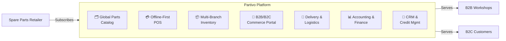
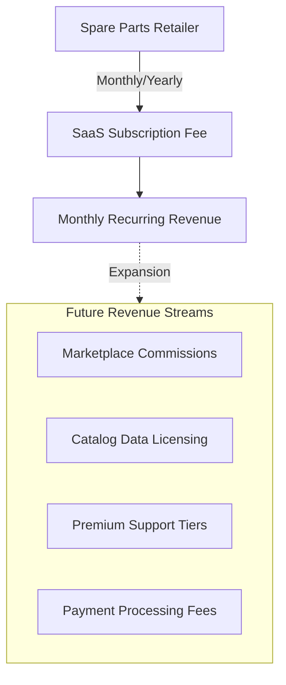
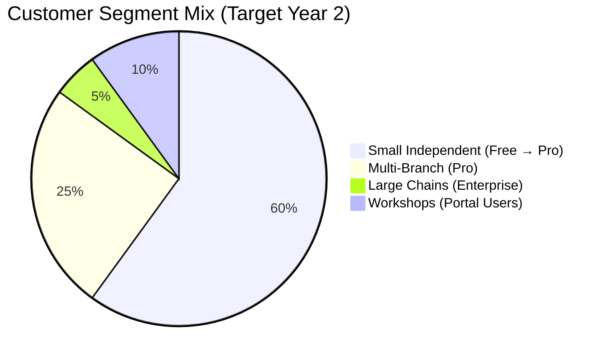

# Partivo — Business Overview

## Executive Summary

Partivo is a vertical, multi-tenant Software-as-a-Service (SaaS) platform purpose-built for the car spare parts retail industry. It provides multi-branch retailers with an integrated digital operating system covering catalog management, inventory control, point-of-sale, B2B/B2C commerce, logistics, CRM, and financial management — all from a single subscription.

The platform eliminates the chaos of an industry that still runs on paper, WhatsApp, and memory by delivering a **data-rich, cloud-native solution** where retailers do not enter data — they subscribe, choose from a preloaded global parts catalog, and start selling immediately.

Partivo's primary geographic focus is **Egypt and the GCC**, the world's fastest-growing automotive aftermarket regions, where the retail spare parts sector is highly fragmented, underserved by technology, and ripe for digital transformation.

---

## Problem Statement

### Industry Pain Points

The car spare parts retail industry is one of the most fragmented and operationally inefficient sectors in the Middle East and North Africa (MENA) region.

| Problem | Impact |
|---|---|
| **No standardized catalogs** | Retailers manually track thousands of SKUs in spreadsheets, notebooks, or memory. Product data is inconsistent, duplicated, and error-prone. |
| **Fitment blindness** | Counter staff cannot reliably verify which parts fit which vehicles. This leads to high rates of wrong-part sales. |
| **No real-time stock visibility** | Branch managers do not know their actual stock levels. Dead stock accumulates. Fast-moving items stock out without warning. |
| **Paper-based operations** | Sales, invoicing, and accounting are done manually. Cash reconciliation is guesswork. |
| **No digital presence** | Retailers have no online catalog, no e-commerce capability, and no way for workshops to browse or order digitally. |
| **Fragmented IT** | Those who have attempted digitization use disconnected tools — a basic POS here, a spreadsheet there — with no integration. |

### Business Consequences

- **30–40% wrong-part return rates** in shops without fitment data.
- **Revenue leakage** from untracked cash sales, stock shrinkage, and pricing inconsistencies across branches.
- **Customer trust erosion** — workshops switch suppliers over repeated wrong-part deliveries.
- **Inability to scale** — opening a new branch means rebuilding all systems from scratch.
- **Zero data intelligence** — retailers have no analytics on what sells, what doesn't, and why.

---

## Solution Overview

Partivo delivers a unified platform that replaces fragmented, manual operations with an integrated digital system.

### Core Platform Components



| Component | What It Does |
|---|---|
| **Global Parts Catalog** | Preloaded, normalized product database with vehicle fitment intelligence. Retailers select products — they don't enter data. |
| **Offline-First POS** | Mobile/tablet app for high-speed counter sales. Works fully offline with automatic sync when connectivity returns. |
| **Multi-Branch Inventory** | Real-time stock visibility across all locations. Automated ledger tracking, inter-branch transfers, and stock adjustments. |
| **B2B/B2C Commerce Portal** | Tenant-branded online storefront. Workshops browse the catalog, check stock, view their pricing tier, and place orders directly. |
| **Delivery & Logistics** | Driver app with trip planning, proof of delivery (signature, photo, GPS), exception handling, and fleet management. |
| **Accounting & Finance** | Double-entry bookkeeping, tax filing, supplier invoice matching, and multi-currency support. |
| **CRM & Credit Management** | Sales pipeline, lead tracking, activity logging. B2B credit limits with automatic order blocking when limits are exceeded. |

### Key Differentiator: The Catalog Moat
Partivo's deepest competitive advantage is its **preloaded, continuously enriched global parts catalog** with vehicle fitment mappings. Competitors ship empty databases. Partivo ships with data.

---

## Target Market

### Geographic Focus

#### Primary: Egypt
- **Market Size**: Egypt has an estimated 50,000+ spare parts retail outlets, the vast majority of which are undigitized.
- **Growth Driver**: Egypt's vehicle fleet is aging rapidly (average vehicle age: 15+ years), driving sustained demand for aftermarket parts.
- **Digital Readiness**: Rising smartphone and mobile payment adoption (Paymob, Fawry) creates infrastructure for SaaS adoption.
- **Regulatory**: Growing formalization and VAT compliance requirements push retailers toward proper digital record-keeping.

#### Secondary: Gulf Cooperation Council (GCC)
- **Markets**: Saudi Arabia (KSA), United Arab Emirates (UAE), Kuwait, Bahrain, Qatar, Oman.
- **Market Size**: The GCC automotive aftermarket is valued at $15B+ and is expected to grow 5–7% annually.
- **Growth Driver**: Large vehicle fleets, extreme operating conditions (heat, sand), and high service frequency.
- **Digital Readiness**: Near-universal smartphone penetration, established card and digital payment infrastructure (Stripe, Tabby).
- **Regulatory**: VAT and e-invoicing mandates (KSA ZATCA) make compliant digital systems a necessity.

### Why MENA First
1. **Highest pain**: These markets have the most manual, fragmented retail operations.
2. **Lowest competition**: No purpose-built vertical SaaS exists for spare parts retail in this region.
3. **Language advantage**: Partivo is built bilingual (Arabic RTL + English) from day one — not bolted on later.
4. **Payment infrastructure**: Integrated support for both Stripe (international) and Paymob (Egypt-specific).

---

## Value Proposition

### For the Retailer (Tenant)

| Value | How Partivo Delivers |
|---|---|
| **Day-one productivity** | Preloaded catalog means no months of data entry before going live. |
| **Eliminate wrong-part returns** | Vehicle fitment intelligence ensures the right part is sold for the right car. |
| **Never lose a sale to stockouts** | Real-time inventory across branches with automated reorder intelligence. |
| **Professional online presence** | Every tenant gets a branded commerce portal — workshops can browse and order 24/7. |
| **Branch expansion in hours** | New branches inherit the catalog, POS, and systems instantly. No IT rebuild. |
| **Operate through internet outages** | Offline-first POS with guaranteed sync ensures zero revenue loss. |
| **Financial clarity** | Integrated accounting, cash session reconciliation, and automated Z-reports. |

### For the Workshop (B2B Customer)

| Value | How Partivo Delivers |
|---|---|
| **Self-service ordering** | Browse catalog, check stock, place orders — no phone calls needed. |
| **Accurate fitment** | Confidence that ordered parts will fit the vehicle being serviced. |
| **Transparent pricing** | Client-specific pricing tiers automatically applied. |
| **Order tracking** | Real-time order status from placement through delivery. |

---

## Competitive Positioning

### Landscape

| Competitor Type | Examples | Weakness vs. Partivo |
|---|---|---|
| **Generic POS** | Loyverse, Vend, Square | No catalog intelligence. No fitment data. No automotive specialization. |
| **Generic ERP** | Odoo, ERPNext | Require massive customization. No preloaded data. Expensive to deploy. |
| **Automotive Catalogs** | TecDoc, PartsLink24 | Data only — no POS, no inventory, no commerce. |
| **Custom Solutions** | Local developers | Expensive, on-premise, non-scalable, no shared data benefit. |
| **Marketplaces** | PartsAvatar, RockAuto | Compete with the retailer rather than enabling them. |

### Partivo's Unique Position

```
Partivo = Shopify (Commerce) + Square (POS) + TecDoc (Catalog) + SAP B1 (ERP)
          — purpose-built for spare parts retail.
```

**No other product on the market combines all of these:**
1. ✅ Preloaded, fitment-mapped parts catalog.
2. ✅ Offline-capable mobile POS.
3. ✅ Multi-branch inventory with ledger tracking.
4. ✅ Tenant-branded B2B/B2C commerce portal.
5. ✅ Integrated logistics (driver app, proof of delivery).
6. ✅ Full accounting with multi-currency and VAT.
7. ✅ Native Arabic RTL support.

---

## Revenue Model

### SaaS Subscription
Partivo operates on a **recurring subscription revenue model**. Tenants pay a monthly or yearly fee that gives them access to the platform, all modules, and ongoing updates.

### Revenue Architecture



### Payment Infrastructure
| Provider | Region | Methods |
|---|---|---|
| **Stripe** | GCC, International | Cards, Bank Transfers |
| **Paymob** | Egypt | Cards, Mobile Wallets, Fawry |

### Billing Features (Implemented)
- Automated invoice generation with sequential numbering.
- Trial-to-paid conversion flow.
- Dunning management with exponential backoff retries.
- Grace periods before suspension.
- Upgrade/downgrade with proration support.
- Webhook-based payment event processing (idempotent).

---

## Pricing Strategy

Partivo employs a **tiered pricing model** designed to capture retailers at every stage of growth.

### Tier Structure

| Tier | Target | Price Point | Core Capabilities |
|---|---|---|---|
| **Free** | Solo retailers, evaluation | $0/mo | Single branch, limited products, basic POS, catalog access. Designed to onboard users with zero friction and convert via feature limits. |
| **Pro** | Growing multi-branch retailers | Mid-range/mo | Multiple branches, full inventory, B2B commerce portal, logistics, CRM. The workhorse tier — designed to be the default for serious retailers. |
| **Enterprise** | Large retail chains, franchises | Custom | Unlimited branches, dedicated support, custom integrations, API access, SLA guarantees. Sold via direct sales engagement. |

### Pricing Levers
- **Billing Cycle**: Monthly and Yearly (with annual discount incentive).
- **Currency**: Plans support multiple currencies (USD, EGP, SAR) to match local market pricing.
- **Feature Gating**: The `Plan` model stores `features` (JSON) and `limits` (JSON) fields that control:
  - `maxUsers` — Maximum number of staff accounts.
  - `maxBranches` — Maximum number of branch locations.
  - `maxProducts` — Maximum products in local inventory.
  - `maxOrders` — Maximum monthly order volume.
- **Usage Metrics**: The `UsageMetric` model tracks actual tenant consumption for upsell triggers.

### Conversion Strategy
```
Free (friction-free entry) → Hit feature limits → Upgrade prompt → Pro subscription
Pro (scaling operations)   → Need enterprise features → Sales engagement → Enterprise contract
```

### Localized Pricing
Plans support bilingual metadata (`name`, `nameAr`) for the Landing Portal pricing display, allowing market-specific plan names and descriptions in both English and Arabic.

---

## Customer Segments

### Segment 1: Small Independent Retailers (1–2 branches)
- **Profile**: Family-owned shops, 1–3 staff, 500–2,000 SKUs.
- **Current State**: Paper-based or basic spreadsheet tracking.
- **Entry Point**: **Free tier** — immediate value from catalog and basic POS.
- **Upgrade Trigger**: Adding a second branch or needing B2B client management.
- **Revenue Potential**: Low individual ARPU, but highest volume segment.

### Segment 2: Growing Multi-Branch Retailers (3–10 branches)
- **Profile**: Regional players with dedicated staff, 3,000–15,000 SKUs.
- **Current State**: Fragmented systems — different POS per branch, no centralized inventory.
- **Entry Point**: **Pro tier** — unified inventory, multi-branch POS, commerce portal.
- **Upgrade Trigger**: Need for logistics, CRM, and advanced analytics.
- **Revenue Potential**: Core revenue segment. Highest conversion rate and LTV.

### Segment 3: Large Retail Chains (10+ branches)
- **Profile**: Established chains, potentially multi-city operations, 20,000+ SKUs.
- **Current State**: Custom-built or generic ERP (Odoo, SAP). Dissatisfied with cost and rigidity.
- **Entry Point**: **Enterprise tier** — requires direct sales, custom onboarding, API integration.
- **Upgrade Trigger**: N/A — enters at top tier.
- **Revenue Potential**: Highest ARPU, longest sales cycle, highest retention.

### Segment 4: B2B Workshops (End Customers of Tenants)
- **Profile**: Automotive repair shops and service centers that buy parts regularly from retailers.
- **Current State**: Order via phone/WhatsApp. No visibility into supplier stock or pricing.
- **Entry Point**: Free — access through the tenant's **Customer Portal**.
- **Revenue Impact**: Not direct payers, but their adoption drives tenant retention and order volume.
- **Strategic Value**: Network effects — the more workshops use the portal, the harder it is for the retailer to leave Partivo.

### Segment Summary



---

## Key Metrics to Track

| Metric | Definition | Target |
|---|---|---|
| **MRR** | Monthly Recurring Revenue | Primary financial KPI |
| **Free → Pro Conversion** | % of free tenants upgrading within 90 days | > 15% |
| **Net Revenue Retention** | Revenue from existing tenants after churn and expansion | > 110% |
| **Tenant Churn** | Monthly tenant cancellation rate | < 3% |
| **Time to First Sale** | Days from registration to first POS sale | < 3 days |
| **Workshop Adoption** | Average B2B portal users per tenant | > 10 workshops |
| **Offline Sync Reliability** | % of offline events synced without error | > 99.9% |
